# Batch Pipeline

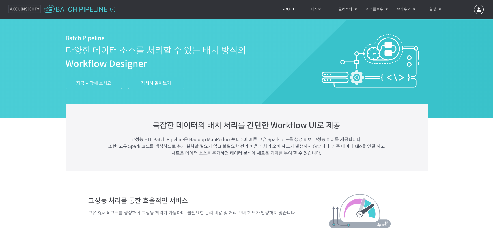

## 소개

Batch Pipeline은 대규모 데이터를 안정적으로 처리하고 Job 스케줄링과 모니터링 기능을 제공하는 솔루션입니다. 복잡한 데이터의 배치 처리를 간단한 Workflow UI로 제공합니다. Drag & Drop으로 설계하는 Workflow, 배치 작업의 통합적인 실행/제어 기능과 직관적인 DashBoard를 제공합니다.

## 제공 기능

Drag & Drop으로 손쉽게 Oozie 기반의 워크플로우를 작성할 수 있다.

1. **컴포넌트 제공 및 스케줄 관리**
   - 다양한 하둡 에코 작업 / 시스템 작업을 컴포넌트 형태로 표현. 시작 시각, 종료 시각, 스케줄 주기 설정 용이.
1. **데이터 조회 및 분석 작업 지원**
   - 워크플로우 작성과 함께 인터렉티브하게 데이터 확인 가능.
1. **변수 처리 지원**
   - 일반/날짜 파라미터, 데이터 셋 등 다양한 동적 변수 지정 가능.
1. **모니터링 제공**
   - 배치 작업 별 상태 및 실행 정보를 직관적인 UI로 제공.
1. **다양한 관리 도구**
   - HDFS, Hive, S3 등 다양한 브라우저와 관리 기능 제공.

## 데모

### 사용 데이터

- **사용자 주문 정보**: 상품을 주문한 사용자 정보. `orders.csv`
- **상품 정보**: 상품의 정보와 상품을 판매하는 쇼핑몰 정보. `goods.csv`

#### 사용자 주문 정보

상품을 주문한 사용자 정보가 담겨 있다.

| user_id | goods_id | age |
|---|---|---|
| 사용자 고유 식별자 | 주문한 상품의 고유 식별자 | 사용자 나이 |

- 사용자 나이 범위: 15 ~ 45
- 나이가 45인 경우 45세 이상

#### 상품 정보

상품의 정보와 상품을 판매하는 쇼핑몰 정보가 담겨 있다.

| goods_id | category | price | image_type | image_width | image_height | shop_id | name | group | style | timestamp |
|---|---|---|---|---|---|---|---|---|---|---|
| 상품 교유 식별자 | 상품 카테고리 | 상품 가격 | 상품 이미지 확장자 | 상품 이미지 너비 | 상품 이미지 높이 | 쇼핑몰 고유 식별자 | 쇼핑몰 이름 | 쇼핑몰이 등록한 연령대 | 쇼핑몰이 등록한 스타일 | 상품 정보 등록 시간 |

- 상품 카테고리: 상의, 바지, 스커트, 원피스, 비치웨어, 아우터, 악세사리, 슈즈, 가방, 패션소품, 피트니스, 란제리&파자마
- 이미지 확장자: jpg, gif, png
- 쇼핑몰 연령대: 10대, 20대 초반, 20대 중반, 20대 후반, 30대 초반, 30대 중반, 30대 후반
- 쇼핑몰 스타일: 페미닌, 모던시크, 심플베이직, 러블리, 유니크, 미시스타일, 캠퍼스룩, 빈티지, 섹시글램, 스쿨룩, 로맨틱, 오피스룩, 럭셔리, 헐리웃스타일

### 결과 데이터셋

사용자, 주문, 상품, 쇼핑몰 정보를 처리하여 얻고자 하는 데이터 형태는 다음과 같다.

| user_id | age | category | price | group | style | age_group |
|---|---|---|---|---|---|---|
| 사용자 고유 식별자 | 사용자 나이 | 상품 카테고리 | 상품 가격 | 쇼핑몰이 등록한 연령대 | 쇼핑몰이 등록한 스타일 | 사용자 연령대 |

### 워크플로우 생성

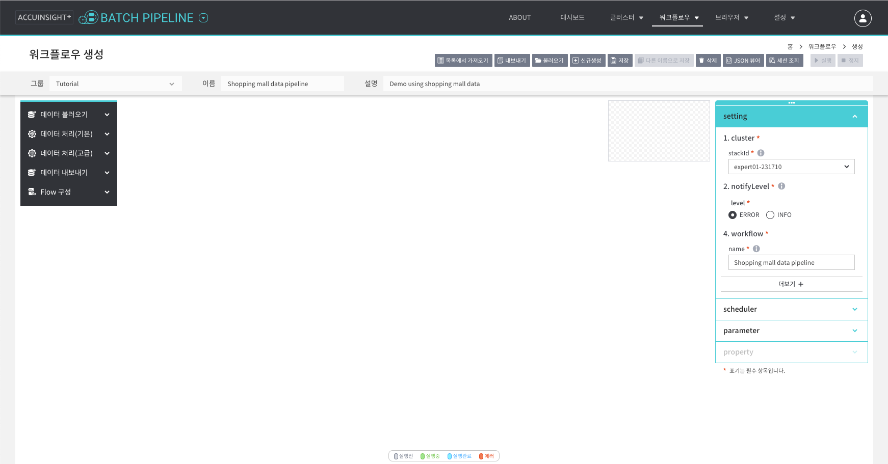

1. 워크플로우 생성
   - `상단 메뉴 → 워크플로우 → 생성`
1. 워크플로우 정보 입력
   - 그룹: `Tutorial`
   - 이름: `Shopping mall data pipeline`
   - 설명: `Demo using shopping mall data`
1. 클러스터 선택
   - `우측 메뉴 → setting → cluster`: 클러스터 선택. 

### ETL 추가

#### 노드 추가

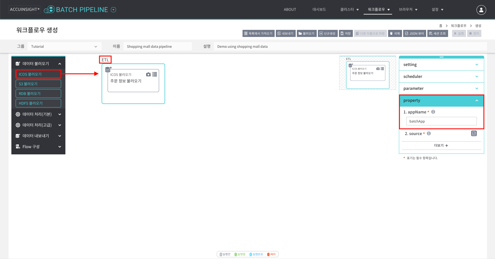

1. `좌측 메뉴 → 데이터 불러오기 → ICOS 불러오기`
   - 캔버스로 **드래그앤드롭**하여 노드를 추가한다.
1. ETL 설정
   - 생성된 **ETL 글씨를 클릭하고** 우측 메뉴에서 변수를 설정한다.
   - `우측 메뉴 → property → appName`: 앱 이름 설정. (예: `batchApp`)

#### 데이터 불러오기 설정

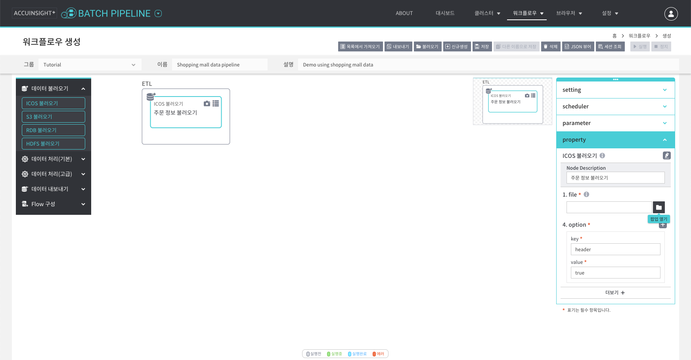

ICOS 불러오기 노드를 클릭하고 우측 메뉴에서 변수를 설정한다.

- Node description: `주문 정보 불러오기`.
- file: 폴더 아이콘 버튼 클릭한다.

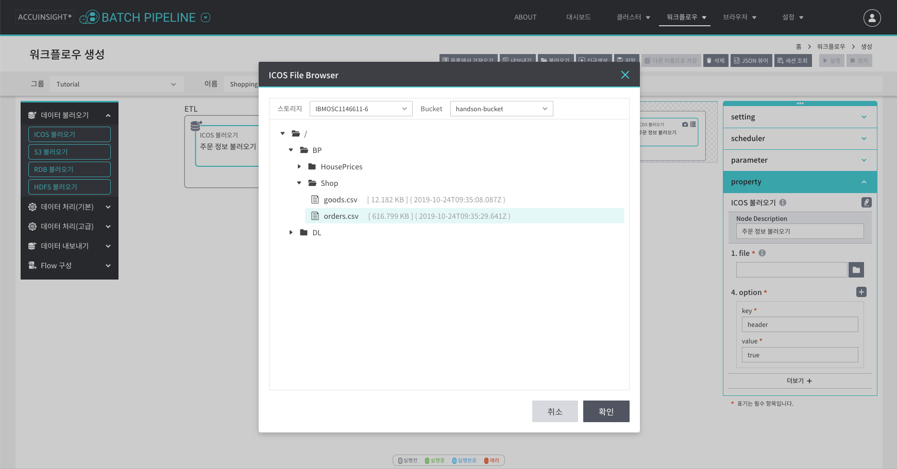

스토리지에서 파일을 선택한다.

- 스토리지: `IBMOSC1146611-6`
- Bucket: `handson-bucket`
- 경로: `/BP/Shop/orders.csv`

#### 데이터 자동 파싱

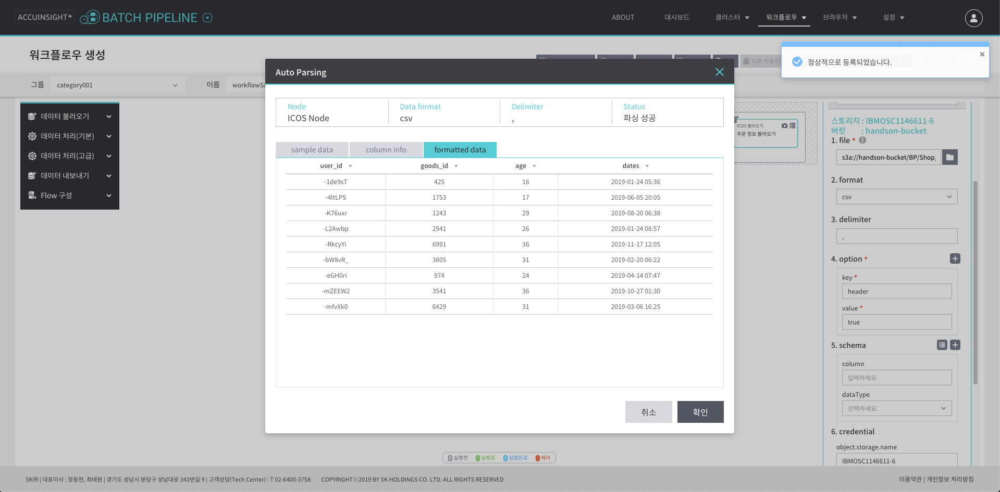

- schema: 자동 파싱 열기 버튼을 클릭한다.

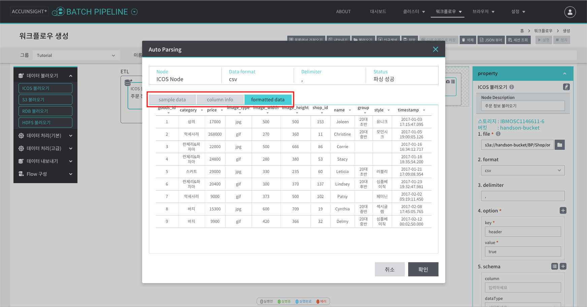

파싱이 완료되면 워크플로우를 **저장**한다.

### 상품 정보 불러오기 추가

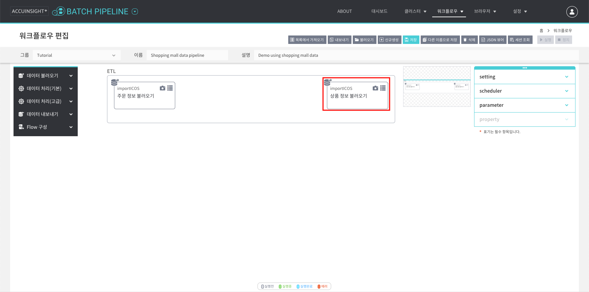

상품 데이터도 같은 방법으로 불러온다.

1. `ICOS 불러오기` 노드 추가
1. 파일 선택
   - 스토리지: `IBMOSC1146611-6`
   - Bucket: `handson-bucket`
   - 경로: `/BP/Shop/goods.csv`
1. 자동 파싱 확인

### 결측값 제거

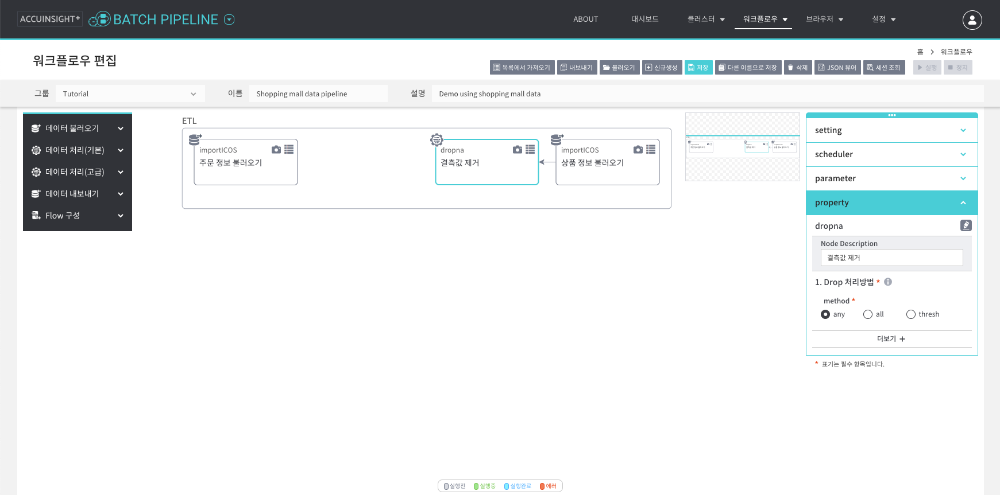

상품 정보 중에 결측값이 있으면 제거한다.

1. `좌측 메뉴 → 데이터 처리(기본) → dropna`
   - 노드 이름: `결측값 제거`
1. `상품 정보 불러오기` 노드와 연결.
1. `dropna` 노드에서 컬럼을 선택한다.
    - Drop 처리 방법: any

### 데이터 결합

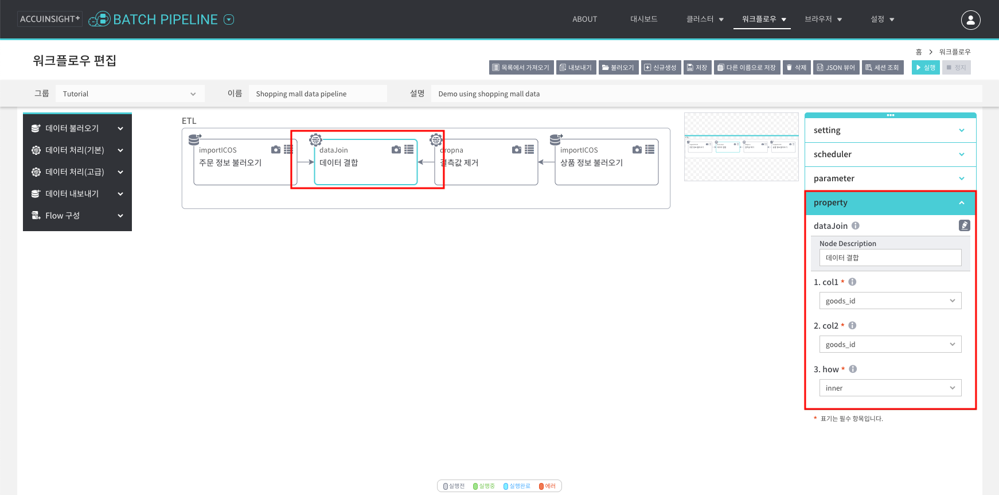

`주문 정보 불러오기`와 `결측값 제거` 노드를 결합하여 데이터셋을 하나로 만든다.

1. `좌측 메뉴 → 데이터 처리(기본) → dataJoin`
   - 노드 이름: `데이터 결합`
1. `주문 정보 불러오기`와 `결측값 제거`를 `dataJoin` 노드와 연결.
1. `dataJoin` 노드 설정
    - col1: goods_id
    - col2: goods_id
    - how: inner

### 컬럼 선택

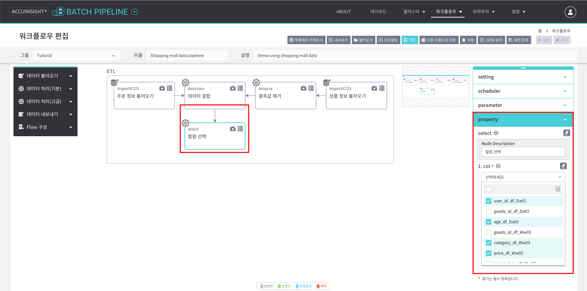

결합한 데이터에서 필요한 컬럼만 선택한다.

1. `좌측 메뉴 → 데이터 처리(기본) → select`
   - 노드 이름: `컬럼 선택`
1. `데이터 결합` 노드와 연결.
1. 컬럼 선택
   - user_id
   - age
   - category
   - price
   - group
   - style

### 컬럼 이름 변경

컬럼 이름 자동 변경 기능을 사용한다.

1. `좌측 메뉴 → 데이터 처리(기본) → withColumnRenamed`
   - 노드 이름: `컬럼 이름 변경`
1. `컬럼 선택` 노드와 연결.
1. 전체 컬럼 불러오기 버튼 클릭

### 연령대 분류

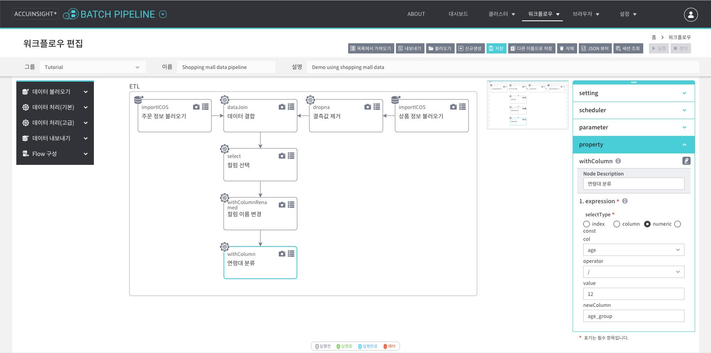

사용자 연령 범위(15 ~ 45)를 단위 구간으로 나누어 새로운 컬럼(`age_group`)으로 저장한다.

1. `좌측 메뉴 → 데이터 처리(기본) → withColumn`
   - 노드 이름: `연령대 분류`
1. `컬럼 이름 변경` 노드와 연결.
1. `expression` 설정을 다음과 같이 한다.
   - selectType: `numeric`
   - col: `age`
   - operator: `/`
   - value: `12`
   - newColumn: `age_group`

### 캐스팅

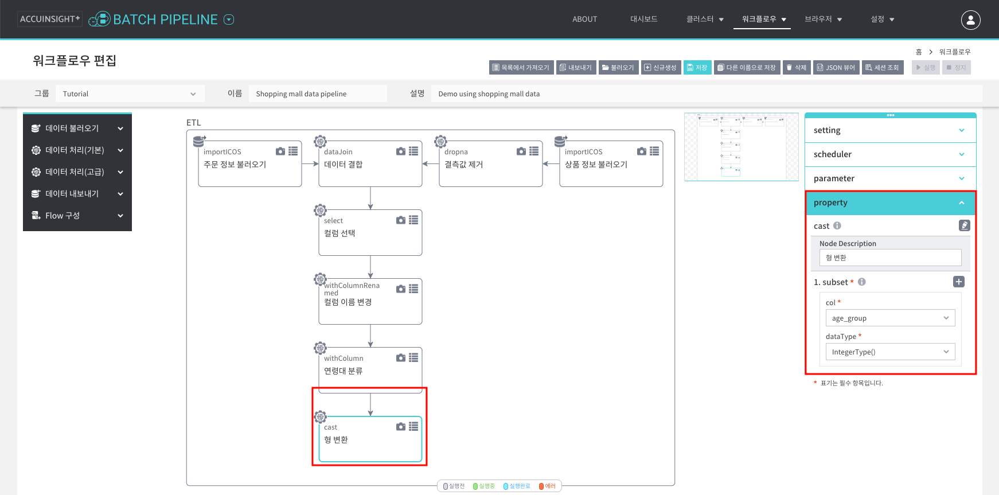

사용자 연령대(`age_group`) 값을 정수로 표현한다.

1. `좌측 메뉴 → 데이터 처리(기본) → cast`
   - 노드 이름: `형 변환`
1. `연령대 분류` 노드와 연결.
1. `subset` 설정을 다음과 같이 한다.
   - col: `age_group`
   - dataType: `IntergerType()`

### 데이터 내보내기

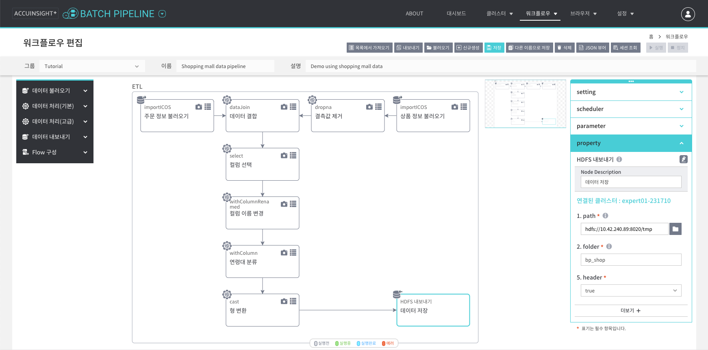

HDFS에 데이터셋을 저장한다.

1. `좌측 메뉴 → 데이터 내보내기 → HDFS 내보내기`
   - 노드 이름: `데이터 저장`
1. `형 변환` 노드와 연결.
1. path: 폴더 아이콘 버튼 클릭 후 스토리지에서 저장할 위치를 선택한다.
   - 경로: `hdfs://10.42.240.89:8020/tmp`
1. folder: 새로 생성할 폴더 이름
   - 이름: `bp_shop`

Hadoop으로 처리한 데이터는 자동으로 파일명이 지정된다.  
(예: `part-00000-f57ca98e-3c25-4479-aa8e-334dc6850638-c000.csv`)

### 실행

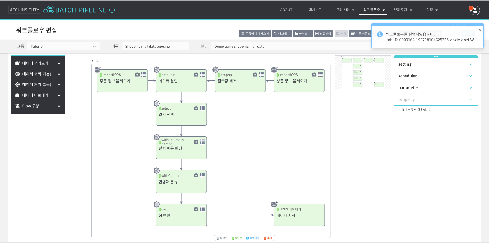

워크플로우를 저장하고 실행 버튼을 클릭한다. 워크플로우가 실행되며 노드 색깔이 초록색으로 바뀐다.

### 완료

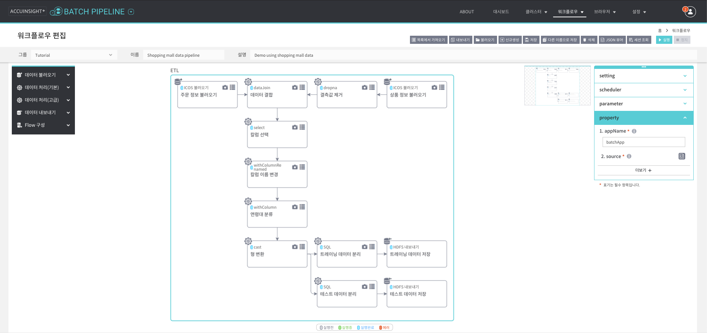

워크플로우 실행이 완료되어 노드 상태가 `실행완료`로 바뀌었다.

### 데이터 확인

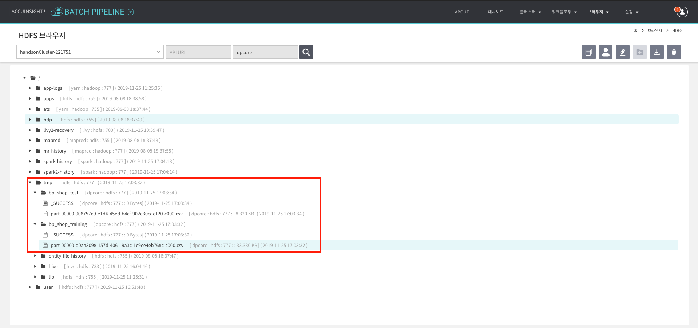

HDFS 브라우저에서 생성된 데이터셋을 확인한다.

- 클러스터: `expert01-231710`
- 경로: `/tmp/bp_shop/part-000.csv` (파일 이름은 Hadoop이 자동으로 생성하여 저장한다.)

파일을 더블 클릭하여 샘플 데이터를 미리 보거나 다운로드 버튼을 사용하여 로컬에 저장한다.

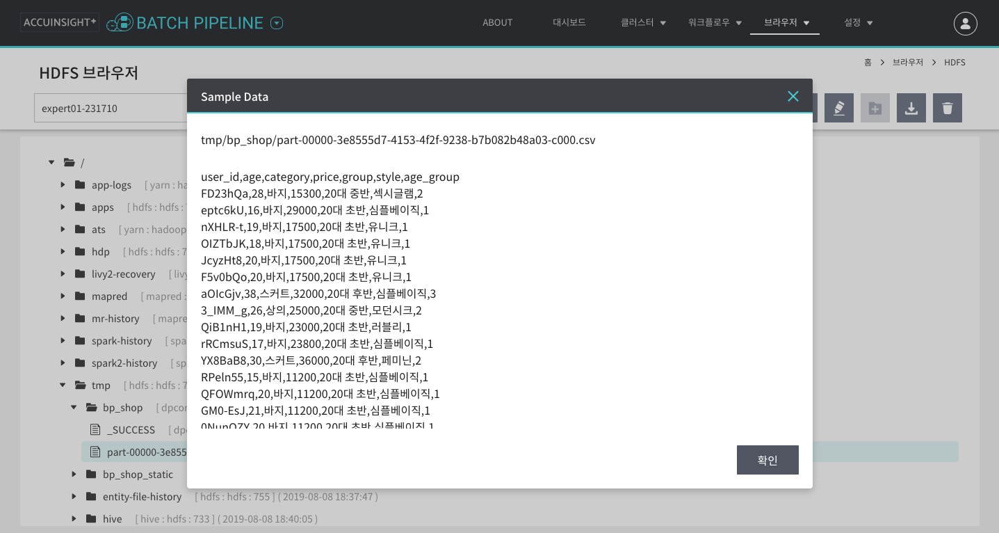