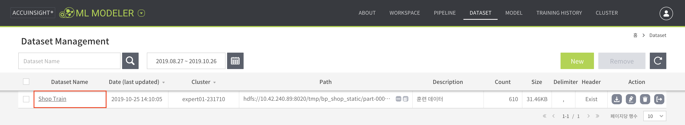
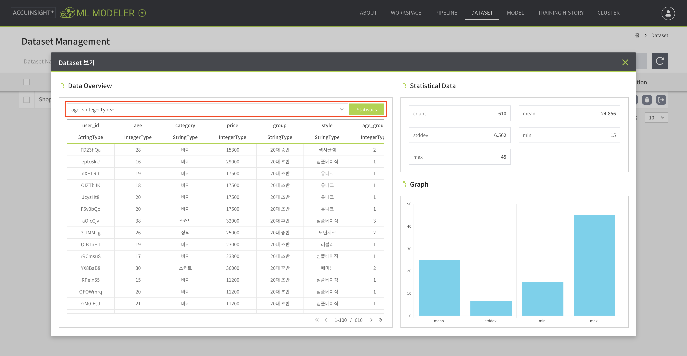
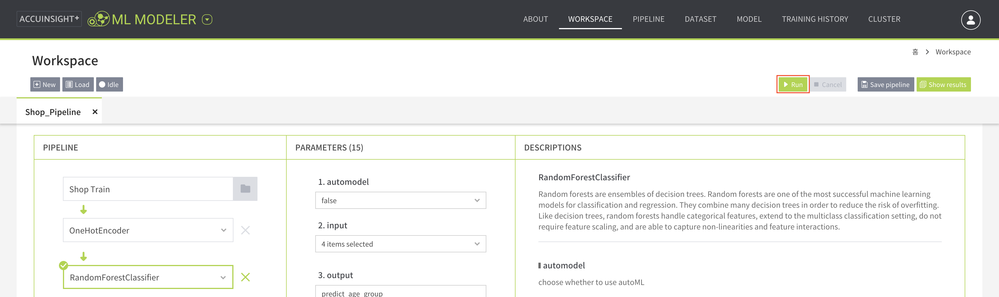
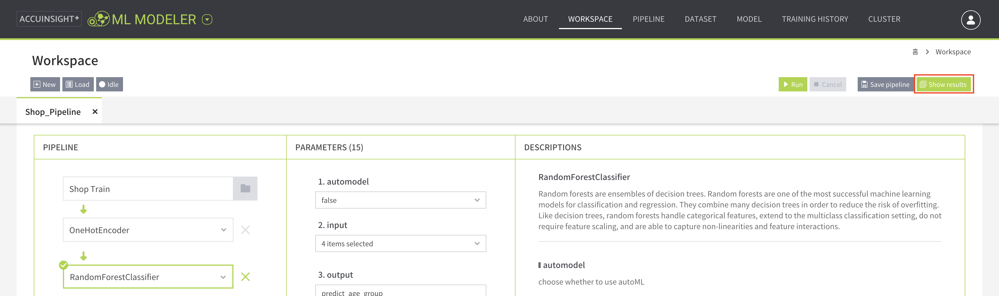
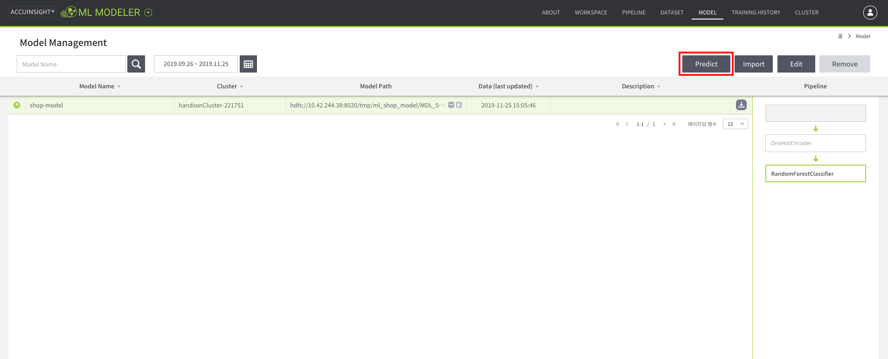
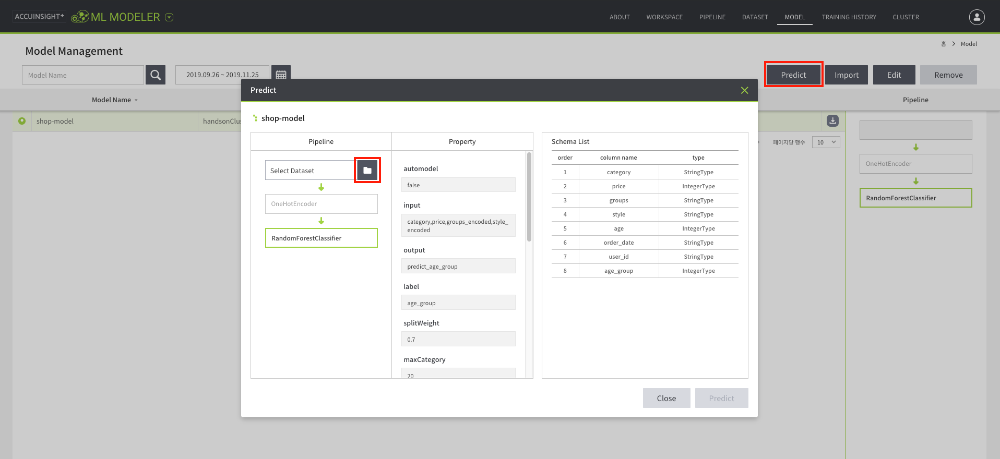
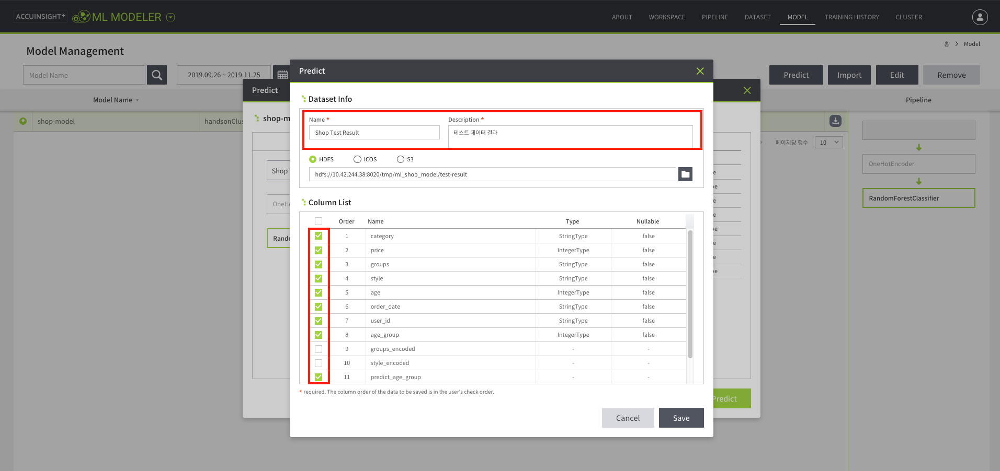
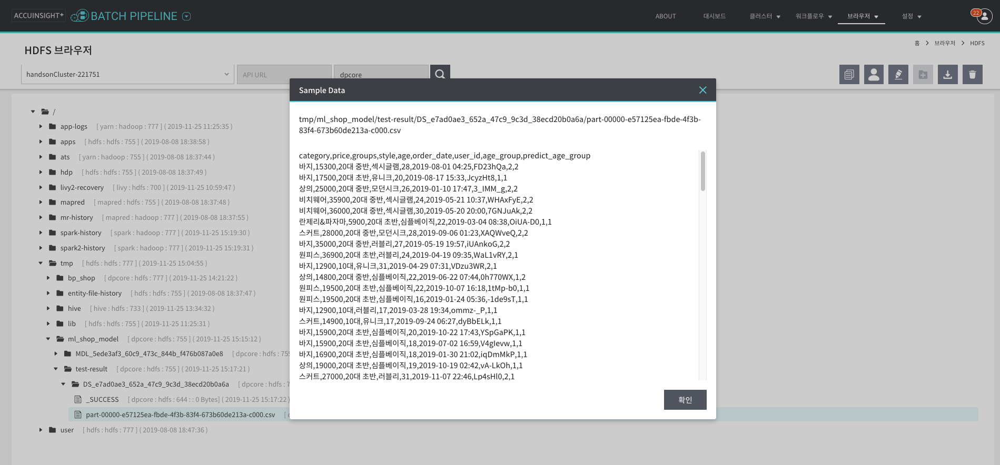

# ML Modeler

## 소개

ML Modeler는 머신러닝을 코딩없이 사용할 수 있는 웹 기반 분산 병렬 모델링 도구입니다.

## 특징

1. **손쉬운 머신러닝 모델 구축**
   - 시간 및 장소 상관없이 몇 분 안에 모델을 구축. 데이터 형식 제한 웹 서비스로 프로덕션 환경 배포 가능.
1. **M/L 알고리즘 적용 용이성**
   - GUI로 Feature Engineering, 머신러닝 알고리즘 설계 및 분석 용이
1. **간단한 머신러닝 모델 구축 및 대용량 분산처리**
   - Auto Model으로 분류 알고리즘의 매개변수 자동으로 탐색하여 최적의 결과 빠른 도출. SparkML 알고리즘(Transformation, Classification, Regression, Clustering)으로 대용량 분산처리.
1. **분석 모델 관리 편의성**
   - 데이터 셋 / 파이프라인 / 모델 통합 관리. 학습된 모델 저장 및 실 데이터 예측.

## 제공 기능

1. **Workspace Canvas**
   - 머신러닝과 Feature Engineering 조합하여 파이프라인 설계.
1. **Auto Model**
   - 분류 알고리즘의 최적 매개변수 자동 탐색으로 빠른 결과 도출.
1. **데이터 / 모델 / 파이프라인 관리**
   - 데이터 원본 및 알고리즘 적용 가능. 데이터 셋 / 학습 모델 / 파이프라인 저장 관리 기능.

## 데모

사용자가 주문한 상품의 정보로 쇼핑몰 연령대 분류

### 사용 데이터셋

- BP 결과 데이터셋

| user_id | age | category | price | group | style | age_group | dates |
|---|---|---|---|---|---|---|---|
| 사용자 고유 식별자 | 사용자 나이 | 상품 카테고리 | 상품 가격 | 쇼핑몰이 등록한 연령대 | 쇼핑몰이 등록한 스타일 | 사용자 연령대 | 주문 날짜 |

### 데이터셋 불러오기

1. `상단 메뉴 → DATASET`
1. ML Modeler를 생성할 때 필요한 데이터셋을 추가한다.

#### 데이터셋 정보 저장

Batch Pipeline에서 만든 데이터를 불러온다.

- HDFS 경로 입력: 
  - 경로: `/tmp/bp_shop/training.csv` 
- Dataset Name: `Shop Train`
- Header exists: `TRUE`
- Delimiter: `,`
- Description: `훈련 데이터`

#### 데이터셋 목록

추가한 데이터셋의 이름을 클릭해 데이터셋을 확인한다.

#### 데이터셋 미리보기

간단한 데이터셋의 통계를 확인할 수 있다.

### 파이프라인 생성

1. `상단 메뉴 → WORKSPACE`
1. Workspace 메뉴에서 파이프라인을 생성한다.

#### 데이터셋 선택

Pipeline에서 등록한 데이터셋을 선택한다.

#### 알고리즘 추가: OneHotEncoder

`OneHotEncoder를` 추가한다.  
  - input: `group, style`
  - output: `group_encoded,style_encoded`
  - dropLast: `true`

**원-핫 인코딩**은 문자열로 이루어진 값을 컴퓨터가 이해하기 쉽도록 숫자로 바꾸는 방법이다.  
`group`과 `style` 컬럼에 있는 카테고리 정보들을 0과 1로 이루어진 배열로 변환한다.  

#### 알고리즘 추가: RandomForestClassifier

`RandomForestClassifier를` 추가한다. `age_group`을 기준으로 라벨링을 한다.

  - automodel: `false`
  - input: `category, price, group_encoded, style_encoded`
  - output: `predict_age_group`
  - label: `age_group`
  - 나머지 기본 설정 그대로

### 파이프라인 저장

**Save pipeline** 클릭 후 `shop_pipeline`으로 저장

### 파이프라인 실행

우측 상단 **Run** 버튼을 클릭하여 모델을 생성한다.

#### 클러스터 선택

클러스터를 선택한다.

#### 모델 저장 경로 선택

새 폴더를 만들어서 모델 저장 경로를 선택한다.

- 경로: `/tmp/model`

#### 파이프라인 실행 및 모델 생성

`Run` 버튼을 눌러 파이프라인을 실행한다.  

파이프라인이 실행되어 작업창 위에 로딩 이미지가 나타난다.   
이 예제는 1분 남짓한 시간이 걸린다.

### 결과

우측 상단 **Show results** 버튼을 클릭해서 결과를 확인한다. 

Model Description 탭에서 Feature Importances 정보를 확인한다.  
4가지 컬럼 중에서 `price`의 중요도가 높은 것을 확인할 수 있다.

### 모델 확인

1. `상단 메뉴 → MODEL`
    - 생성한 모델 목록을 확인한다.
1. 목록에서 모델을 선택하고 `Predict` 버튼을 클릭하면 생성한 모델을 활용해 머신러닝 작업을 실행할 수 있다.

### 파이프라인 확인

Pipeline 메뉴에서 저장한 파이프라인을 확인한다.

### 훈련 기록 확인

Training History 메뉴에서 모델 학습 기록들을 확인한다.

### 데이터 예측하기

Dataset 메뉴에서 테스트 데이터셋을 생성한다.
  - 경로: `/tmp/bp_shop/test.csv`
  - Dataset Name: `Shop Test`
  - Description: `테스트 데이터`

Model 메뉴에서 생성한 모델을 확인하고 Predict 버튼을 선택한다.

Select Dataset 옆의 폴더 아이콘을 눌러 사전에 등록한 테스트 데이터 셋을 선택한다.
Predict 버튼을 누른다.

  - Name: 예측 결과 이름 `Shop Test Result`
  - Description: 예측 결과 설명 `테스트 데이터 예측 결과`
  - HDFS 경로: 예측 결과 데이터를 저장할 장소, model 경로에 새로운 폴더 생성 `/tmp/model/test-result`
  - Coulumn List: 예측 결과 중 저장할 칼럼을 선택 가능 
    - category
    - price
    - groups
    - style
    - age
    - order_date
    - user_id
    - age_group
    - predict_age_group

### 예측 결과 확인하기

Batch Pipeline 서비스의 HDFS 브라우저에서 결과 데이터를 확인한다.

- 경로: `/tmp/model/test-result/DS_/part-0000` (폴더와 파일 이름은 자동으로 생성하여 저장된다.)

파일을 더블 클릭하여 샘플 데이터를 미리 보거나 다운로드 버튼을 사용하여 로컬에 저장한다.

