# Batch Pipeline 튜토리얼

  ## 튜토리얼 내용

   > 집 값을 예측하기 위한 ML 모델을 만들기 위해  House Prices 데이터를 BatchPipeline 서비스를 활용해 전처리 하고 HDFS에 저장한다. 
   >
   > 실제 kaggle의 Competition중 [House Prices: Advanced Regression Techniques](https://www.kaggle.com/c/house-prices-advanced-regression-techniques/notebooks) 의 데이터를 활용하고 NoteBooks중 [Serigne](https://www.kaggle.com/serigne)의 [Stacked Regressions : Top 4% on LeaderBoard](https://www.kaggle.com/serigne/stacked-regressions-top-4-on-leaderboard) 를 참고함
   >
   > 

  ## 튜토리얼 데이터

   * [train.csv](https://www.kaggle.com/c/house-prices-advanced-regression-techniques/download/train.csv)

    81개의 컬럼 중 10개의 컬럼을 사용할 예정

| 컬럼 명      | 내 용                |
| ------------ | -------------------- |
| Id           | 집의 고유번호        |
| SalePrice    | 판매가격             |
| YearBuilt    | 지어진 년도          |
| 1stFlrSF     | 1층 면적             |
| 2ndFlrSF     | 2층 면적             |
| GarageCars   | 차고 면적            |
| PoolArea     | 수영장 면적          |
| Street       | 집 앞 거리 포장 유형 |
| Neighborhood | 지역                 |
| KitchenQual  | 주방 상태            |

  ## 데이터 전처리 시나리오
     1. importICOS 노드를 활용해 ICOS에서 데이터를 불러온다.
     2. filter 노드를 활용해 Outliers를 제거한다.
     3. SQL 노드를 통해 제거된 OutLiers를 확인한다.
     4. select 노드를 활용해 원하는 컬럼을 선택한다.
     5. fillna 노드를 활용해 null 데이터를 채워넣는다.
     6. customCode 노드를 활용해 문자를 치환한다.
     7. cast 노드를 활용해 특정 컬럼의 데이터 타입을 변경한다.
     8. withColumn 노드를 활용해 새로운 컬럼을 만든다.
     9. exportHDFS 노드를 활용해 데이터를 HDFS로 내보낸다.
     10. 워크플로우를 저장하고 실행해 로그를 확인한다.
     11. 결과파일을 확인한다.
     
  ## 최종 워크플로우 모습
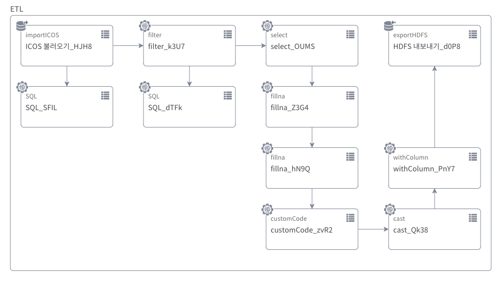
  ## 데이터 전처리 진행

> ### 1. importICOS 노드를 활용해 ICOS에서 데이터를 불러온다.

#### 워크플로우 생성 화면으로 이동 

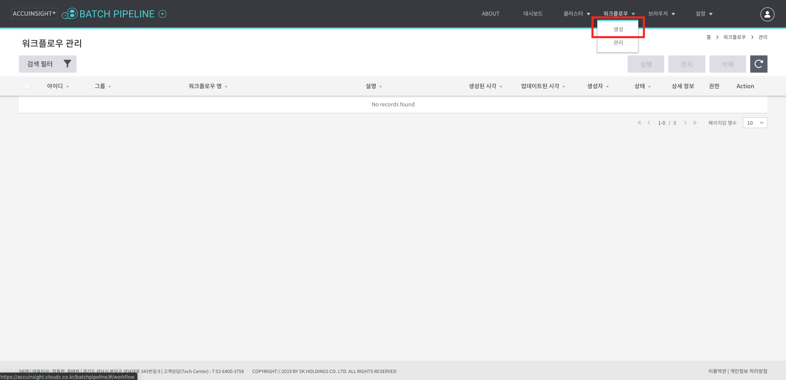

워크플로우 텝에 생성버튼을 클릭한다.

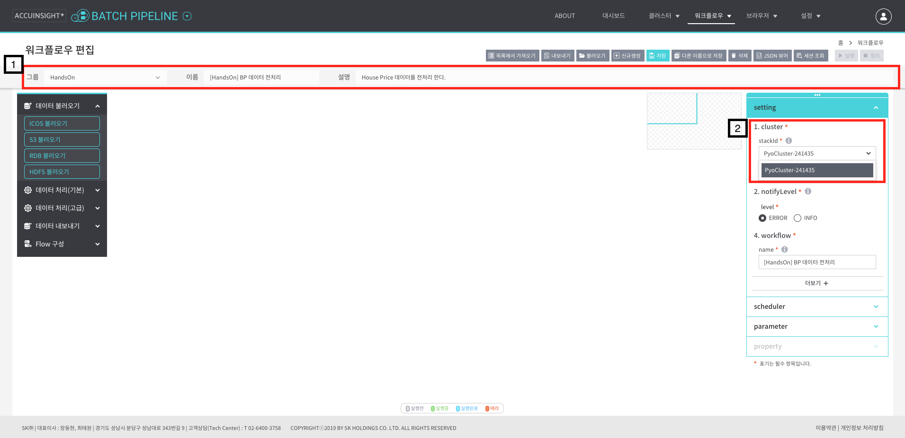

1. 해당 워크플로우의 그룹, 이름 및 설명을 입력한다.
2. Setting 텝에서 `Cluster` 를 설정해준다.(이 설정은 데이터 스냅샷등의 기능을 위해 세팅되고 실제로는 멀티클러스터 기능을 제공하고 있어, 워크플로우를 실행할 때 어떤 클러스터에서 실행할지 선택할 수 있다.)

---

---

#### 데이터 로딩

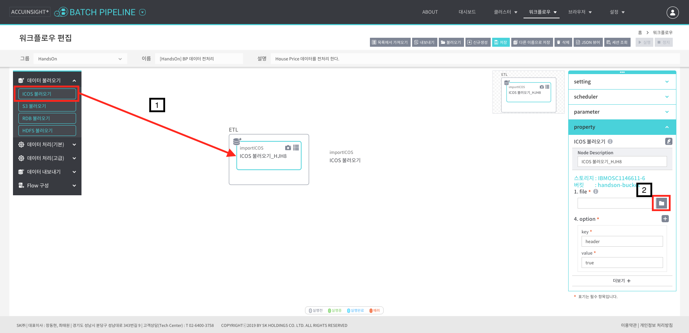

1. 데이터 불러오기 텝에서 `ICOS불러오기 노드`를 드래그 & 드랍해서 캔버스에 옮긴다.
2. `ICOS불러오기 노드`를 클릭한 후 file속성의 `팝업열기` 버튼을 클릭한다.

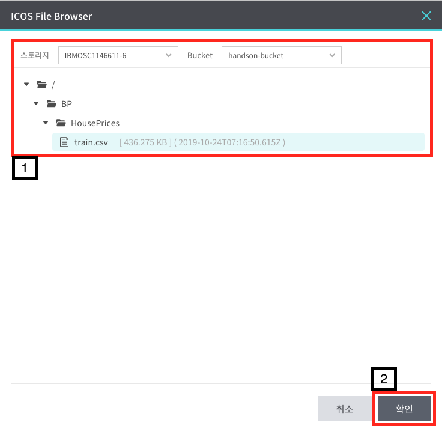

1. 스토리지(`IBMOSC1146611-6`), Bucket(`handoff-bucket`)을 선택하고 `/BP/HousePrices/train.csv` 파일을 선택한다.
2. `확인` 버튼을 누른다.

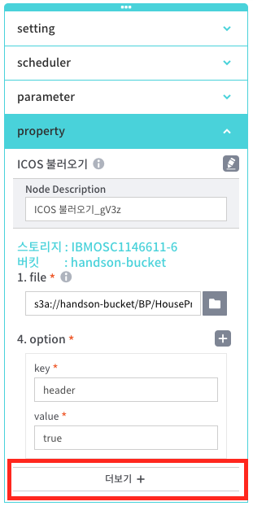

ICOS 속성텝에서 `더보기` 버튼을 클릭한다.

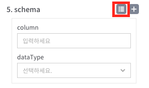

5번 Schema 속성에서 `자동파싱 열기` 버튼을 클릭한다. 

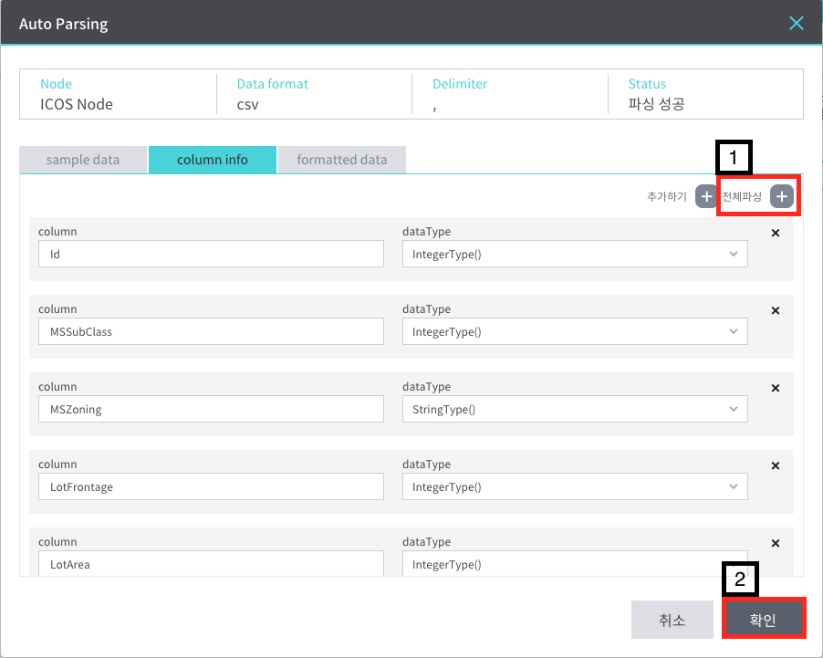

1. column info 텝에서 `전체파싱` 버튼을 눌러 모든 데이터를 대상으로 자동파싱을 진행한다.
   * 처음 자동으로 파싱될 때는 sample 데이터(약 100건)만 이용해서 파싱한다. 

2. `확인 ` 버튼을 누른다.

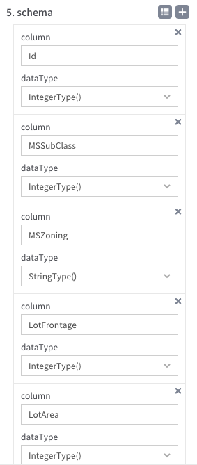

파싱된 컬럼정보를 확인할 수 있고 수정할 수 있다.

---

---

> ### 2. filter 노드를 활용해 Outliers를 제거한다.

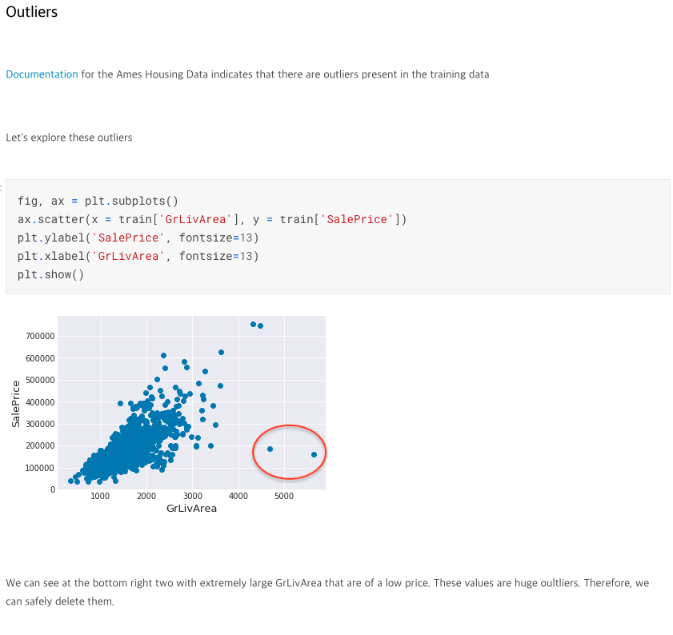

이 데이터에서 SalePrice와 GrLivArea의 xy차트를 확인해 보면 2개의 outlier가 있음을 확인할 수 있다.

#### filter노드 생성

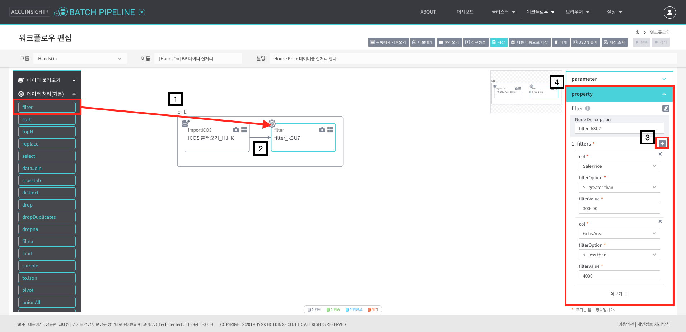

1. 데이터 처리(기본) 텝에서 `filter` 노드를 선택해 캔버스에 드래그 & 드랍 한다.
2. 처음 만들었던 `Importicos` 노드와 `filter` 노드를 연결한다.
3. filter 속성의 `추가` 버튼을 눌러 조건을 한개 더 추가한다.
4. `SalePrice > 30000`  조건과 `GrLivArea < 4000` 조건을 추가해준다. 

---

---

> ### 3. SQL 노드를 통해 제거된 OutLiers를 확인한다.

#### SQL 노드 생성

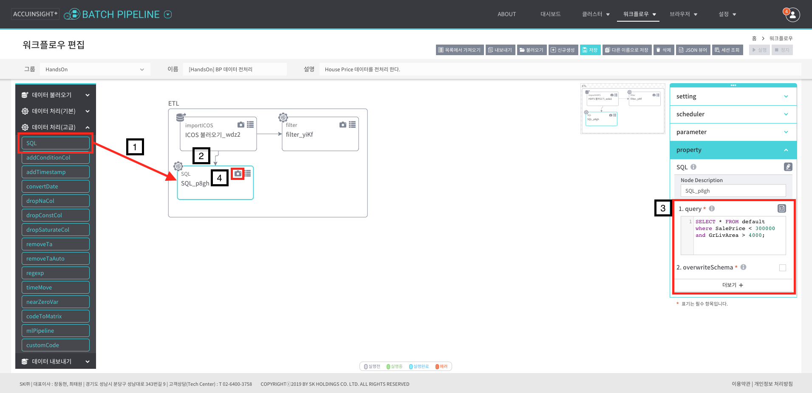

1. `데이터 처리(고급)` 텝에서 `SQL` 노드를 드래그 & 드랍해서 캔버스에 옮긴다.
2. `ImportICOS 노드` 와 연결해준다.
3. `SQL 노드` 를 클릭후 활성화된 속성값에 query를 입력해 준다. 
   * `SELECT * FROM default where SalePrice < 300000 and GrLivArea > 4000;`
4. 노드 상단의 데이터 스냅샷 버튼을 클릭한다.

#### outliers 확인

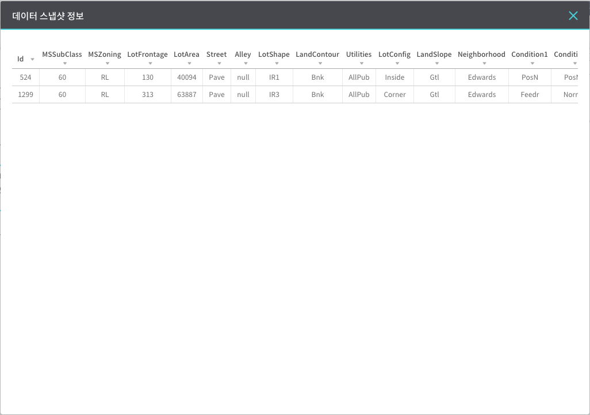

2건의 outlier를 확인할 수 있다.

#### SQL 노드 Copy

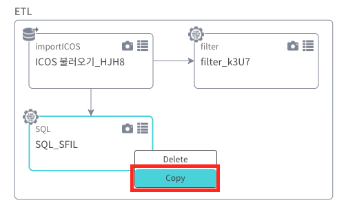

처음 만들었던 `SQL노드` 를 마우스 우클릭해 Copy한다.

#### Filter와 연결된 SQL노드의 스냅샷 확인

`filter 노드` 에 새로은 `SQL 노드` 를 연결해 데이터 스냅샷 버튼을 클릭한다.

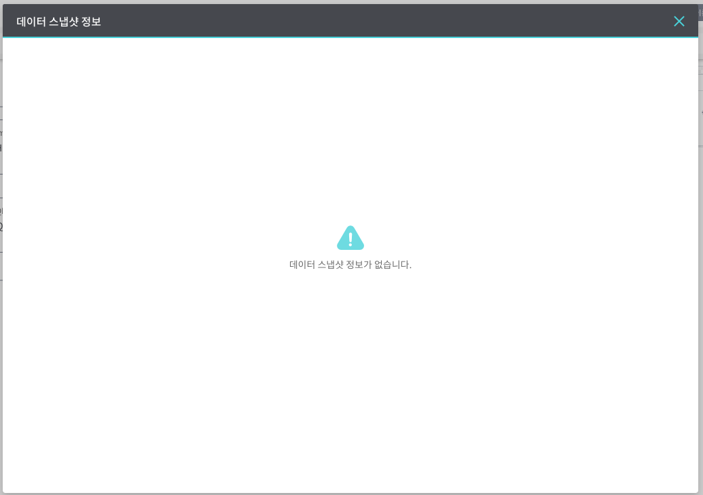 

2건의 outlier가 제거됐음을 확인 할 수 있다.

---

---

> ### 4. select 노드를 활용해 원하는 컬럼을 선택한다.

#### select 노드 생성

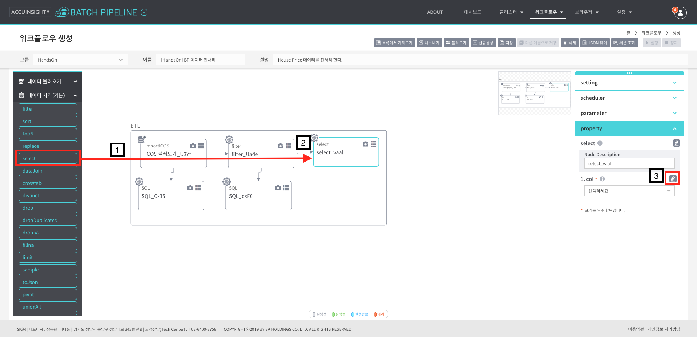

1. 데이터 처리(기본) 텝에 `select 노드` 를 드래그 & 드랍해 캔버스에 옮겨 놓는다.
2. `filter 노드` 와 연결해준다.
3. `select 노드` 의 `col 속성` 에  `수정` 버튼을 클릭한다.

#### 스키마 정보 설정

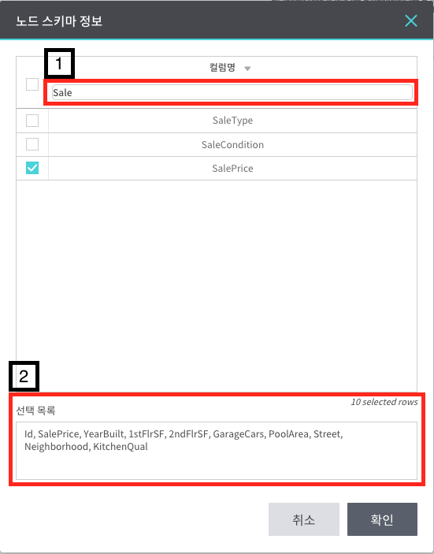

1. 원하는 컬럼명을 검색한다.
2. 이 예제에서는 총 10개의 컬럼을 사용한다.
   * `SalePrice, Id, YearBuilt, 1stFlrSF, 2ndFlrSF, GarageCars, PoolArea, Street, Neighborhood, KitchenQual`

#### select 노드의 스냅샷과 스키마 확인

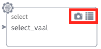

`스냅샷 버튼`과 `스키마 버튼`을 눌러 데이터와 스키마 정보를 확인한다.

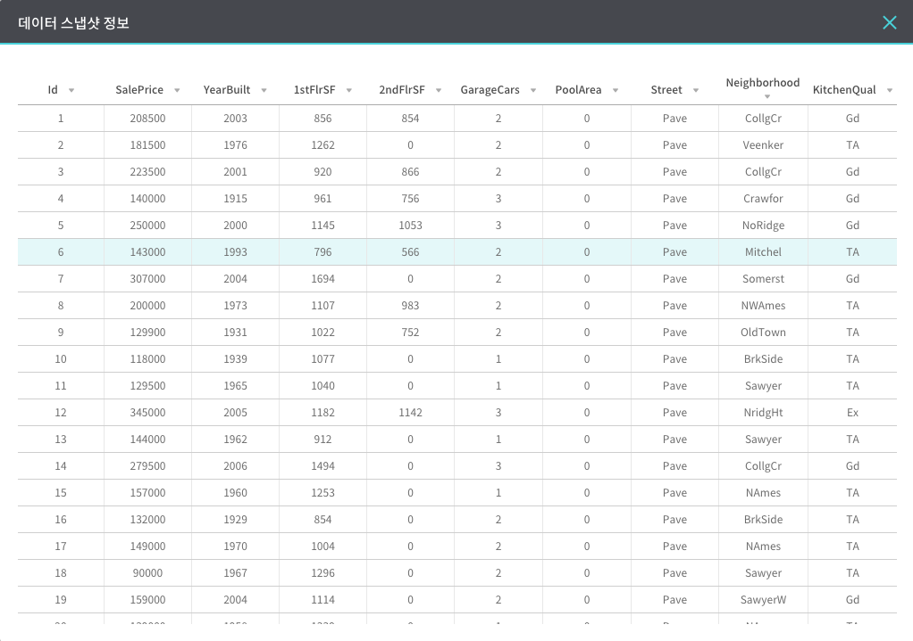

총 10개의 컬럼이 선택되어 있음을 확인 할 수 있다.

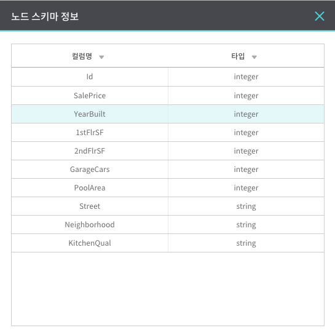

각 컬럼의 스키마 정보를 확인 할 수 있다.

---

---

> ### 5. fillna 노드를 활용해 null 데이터를 채워넣는다.

#### fillna 노드 생성 ( integer 컬럼용)

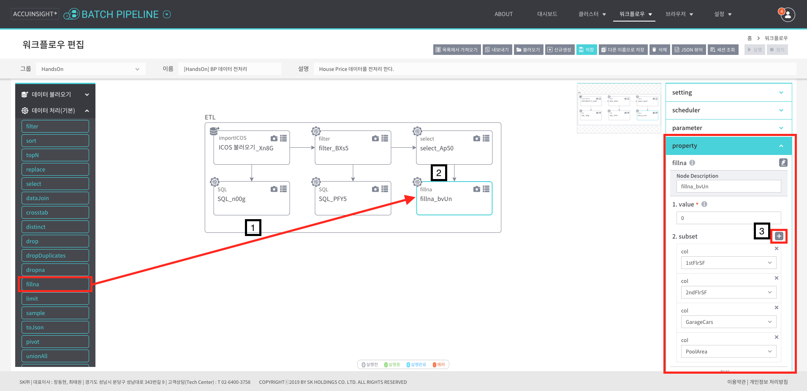

1. 데이터 처리하기(기본) 텝에 있는 `fillna 노드` 를 드래그 & 드랍해 캔버스에 옮긴다.
2. `select 노드` 와 연결해 준다.
3. `fillna 노드` 속성에 더보기 버튼을 눌러 `subset 속성` 옆에 있는 `추가 버튼` 을 눌러 4개의 컬럼에 대한 null처리를 진행한다. (null -> 0)
   *  `1stFlrSF, 2ndFlrSF, GarageCars, PoolArea `

#### 두번째 fillna 노드 생성 (String 컬럼용)

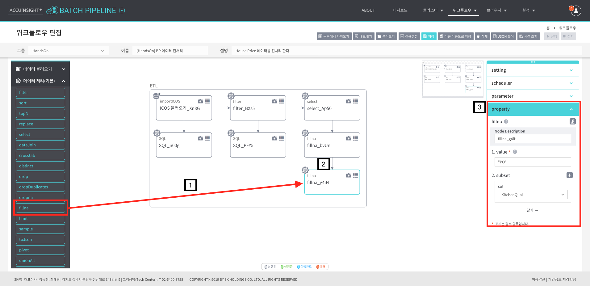

1. `fillna 노드` 를 드래그 & 드랍해 캔버스에 옮긴다.
2. `fillna 노드` 와 연결해 준다.
3. 1개의 컬럼에 대한 null처리를 진행한다. (null -> "PO")
   *  `KitchenQual `

---

---

> ### 6. customCode 노드를 활용해 문자를 치환한다.

#### customCode 노드 생성

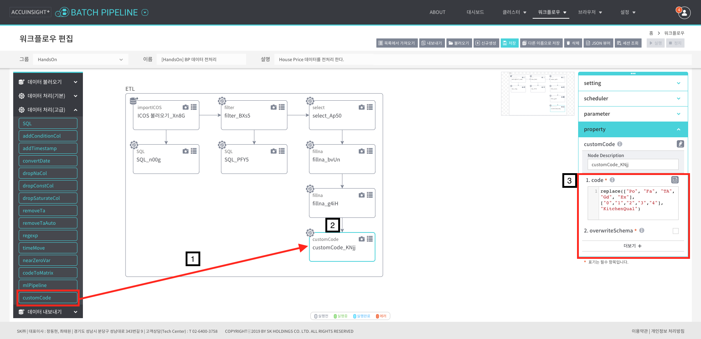

1. 데이터 처리하기(고급) 텝에 있는 `customCode 노드` 를 드래그 & 드랍해 캔버스에 옮긴다.
2. `fillna 노드` 와 연결해준다.
3. `customCode 노드` code 속성에 pySpark기준 Dataframe에 사용가능한 함수를 입력한다.
   * `replace(["Po", "Fa", "TA", "Gd", "Ex"], ["0","1","2","3","4"], "KitchenQual")`

#### customCode 전 데이터

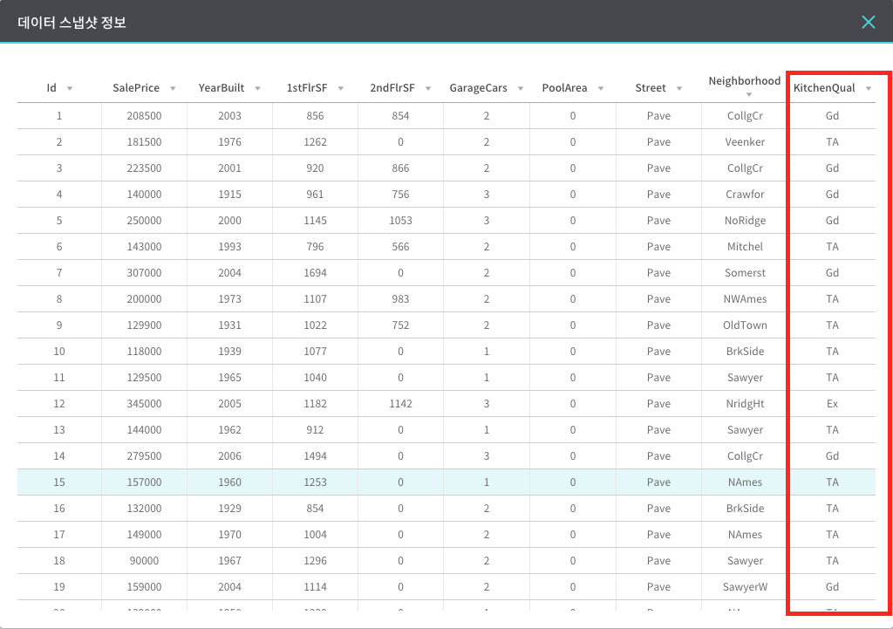

#### customCode 후 데이터

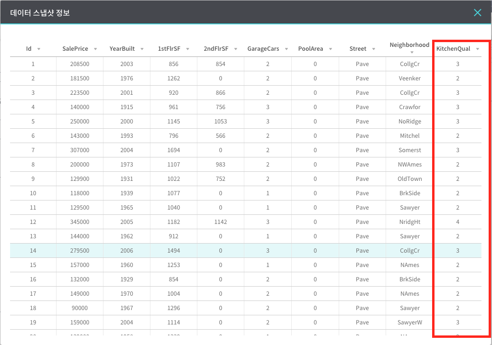

---

---

> ## 7. cast 노드를 활용해 특정 컬럼의 데이터 타입을 변경한다.

#### castNode 생성

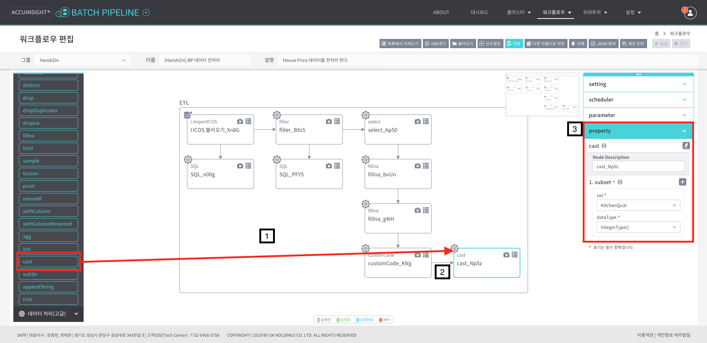

1. 데이터 처리하기(기본) 텝에 있는 `cast 노드` 를 드래그 & 드랍해 캔버스에 옮긴다.
2. `customCode 노드` 와 연결해준다.
3. `cast 노드` 의 subset 속성에서 `col`을 KitchenQual, `dataType`을 IntegerType()으로 설정해 준다.

#### 변경되기 전 스키마 정보 확인

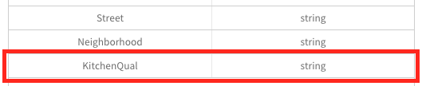

#### 변경된 후 스키마 정보 확인

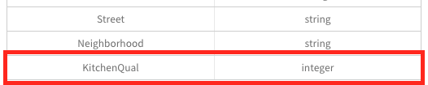

---

---

> ### 8. withColumn 노드를 활용해 새로운 컬럼을 만든다.

* `1stFlrSF` 컬럼과 `2ndFlrSF` 컬럼을 더해 집의 총 생활면적을 구한다.

#### withColumn 노드 생성

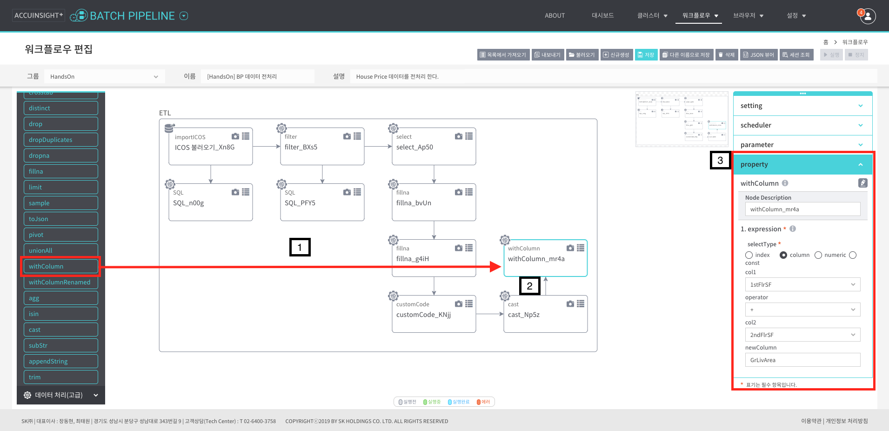

1. 데이터 처리하기(기본) 텝에 있는 `withColumn 노드` 를 드래그 & 드랍해 캔버스에 옮겨 넣는다.
2. `cast 노드` 와 연결해준다. 
3. `withColumn 노드` 의 속성값을 설정해 준다.
   * selectType : column
   * col1 : 1stFlrSF
   * operator : +
   * col2 : 2ndFlrSF
   * newColumn : GrLivArea

#### withColumn 노드 스냅샷 확인

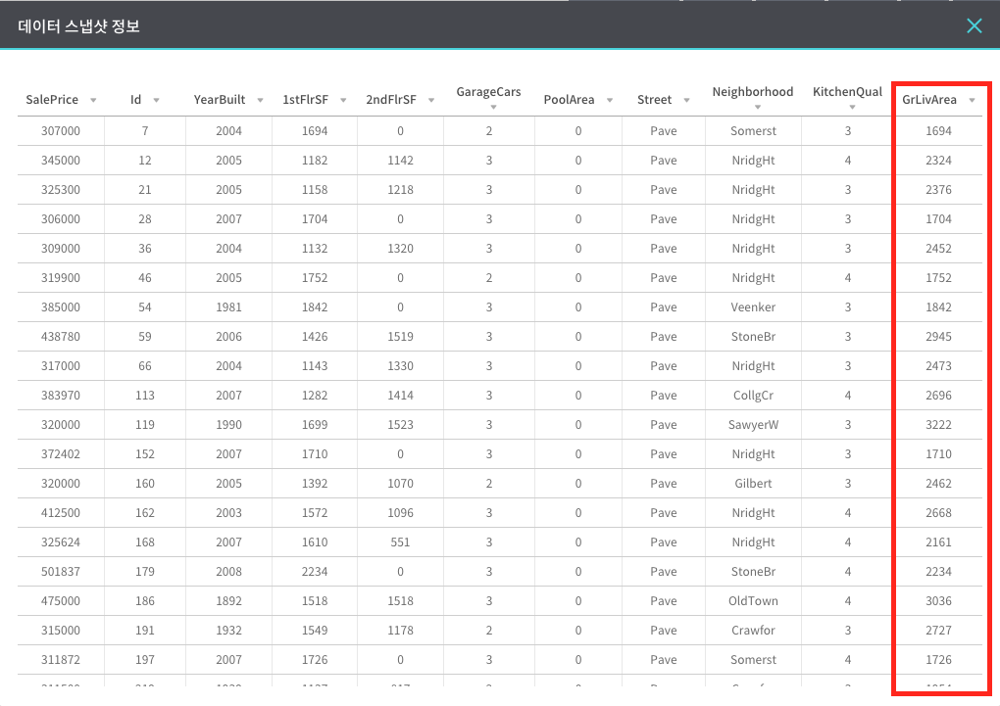

---

---

> ### 9. exportHDFS 노드를 활용해 데이터를 HDFS로 내보낸다.

#### exportHDFS 노드 생성

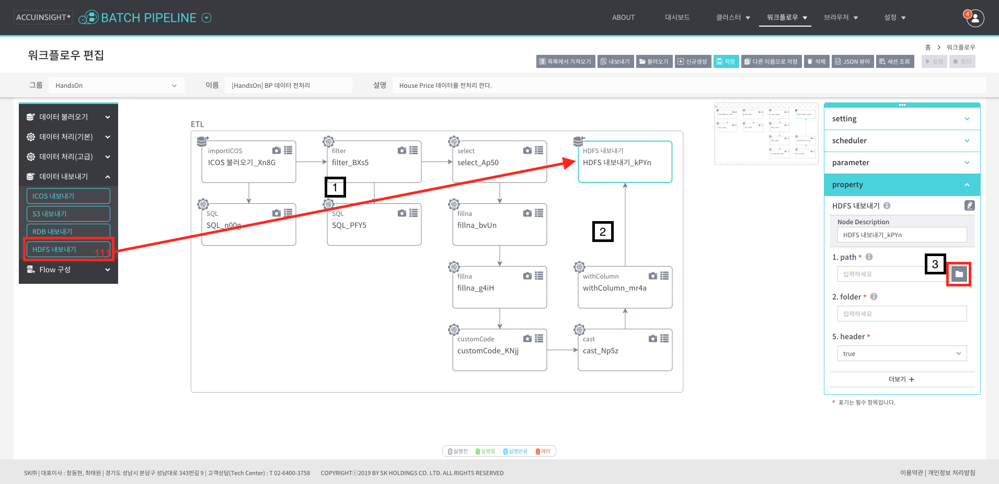

1. 데이터 내보내기 텝에 `HDFS 내보내기 노드` 를 드래그 & 드랍해 캔버스에 옮긴다.
2. `withColum 노드` 와 연결해 준다.
3. `HDFS 내보내기 노드 ` 의 `path 속성` 의 `팝업열기 버튼` 을 클릭한다.

#### HDFS File Browser를 통해 저장할 위치를 선택한다.

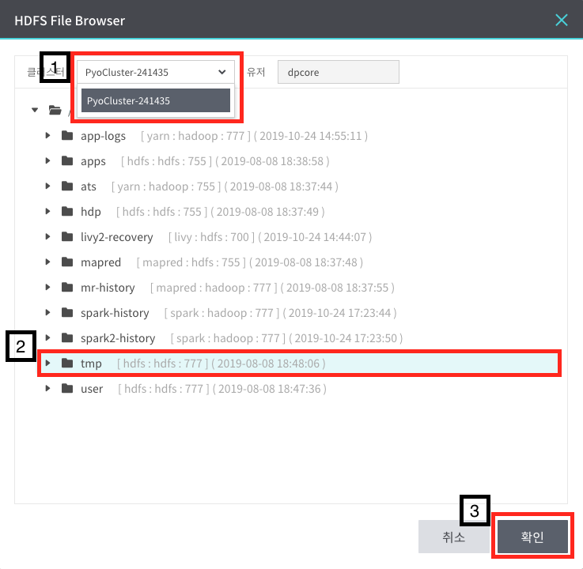

1. 보유하고 있는 클러스터중 원하는 클러스터를 선택한다.
2. 원하는 저장위치를 선택한다. ( `tmp 디렉토리` )

3. `확인 버튼`을 클릭한다.

#### HDFS 내보내기 노드의 속성값을 설정한다.

`folder` 이름을 세팅한다.

---

---

> ### 10. 워크플로우를 저장하고 실행해 로그를 확인한다.

#### 워크플로우 저장

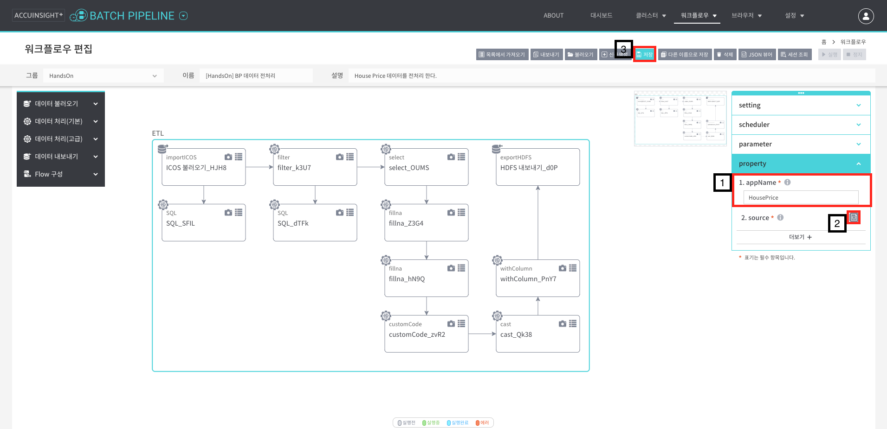

지금까지 만든 `ETL 노드 `의 공백을 클릭하면 `ETL 노드`의 속성값을 설정할 수 있다.

1. `appName 속성` 을 세팅한다 ( yarn application Name)
2. 지금까지 만든 `ETL 노드`는 pySpark 소스로 자동으로 생성되게 되고 `소스보기`버튼을 통해 소스를 볼 수 있다.
3. `저장`버튼을 클릭하면 워크플로우가 저장된다.

#### pySpark 소스 보기 팝업

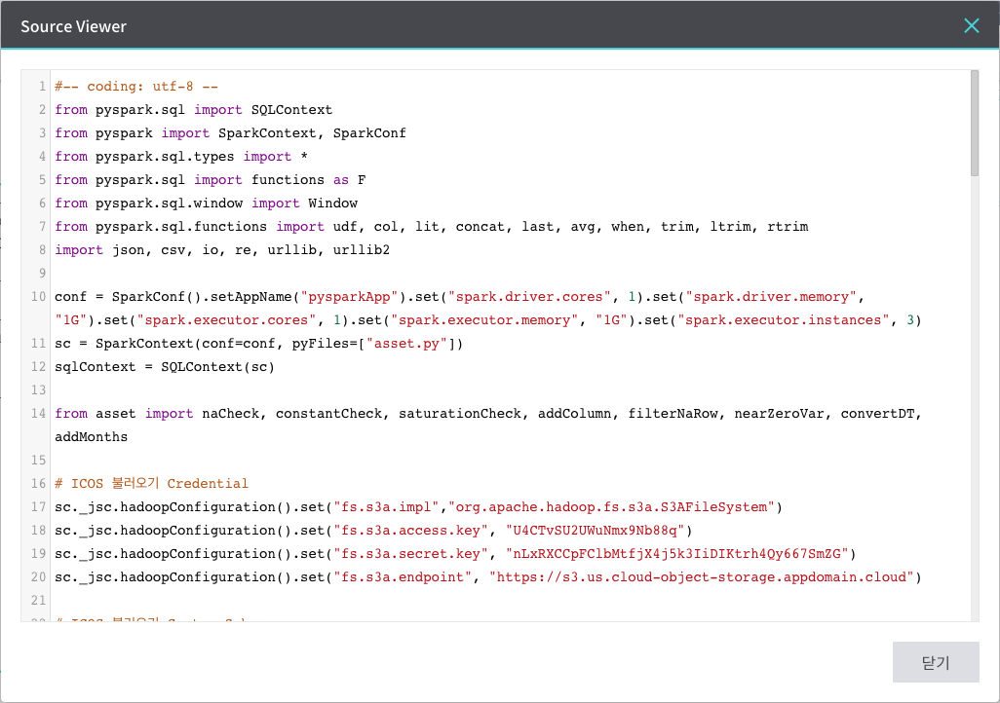

#### Kaggle 소스와 비교

BatchPipeline 서비스는 Null값을 손쉽게 처리할 수 있고 특히 위 kaggle의 전처리 과정들처럼 한줄 한줄 코딩할 필요가 없이 노드 단위로 연결만 해주면 자동으로 pySpark 코드가 생성된다.

#### 워크플로우 목록 확인, 실행

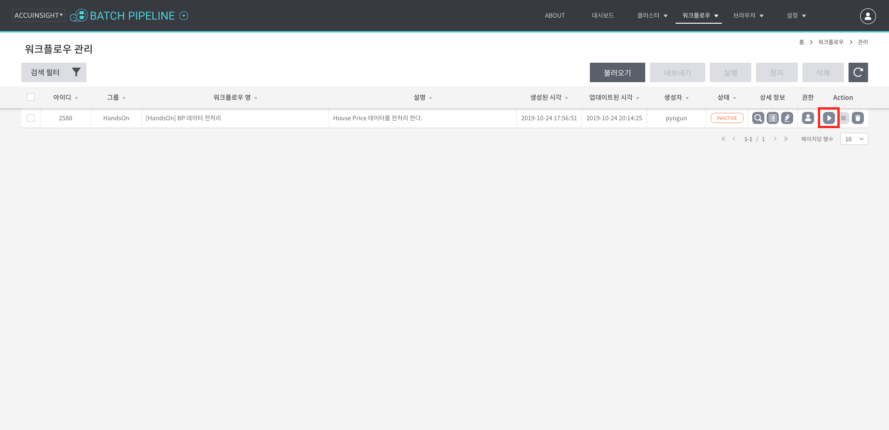

저장된 워크플로우를 확인하고 실행버튼을 클릭한다.

#### 실행할 클러스터 선택

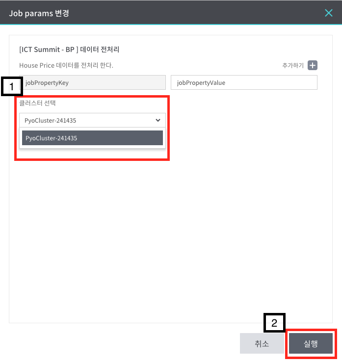

1. 본인이 가지고 있는 클러스터를 선택한다.
2. 실행한다.

#### 실행중인 상태 확인

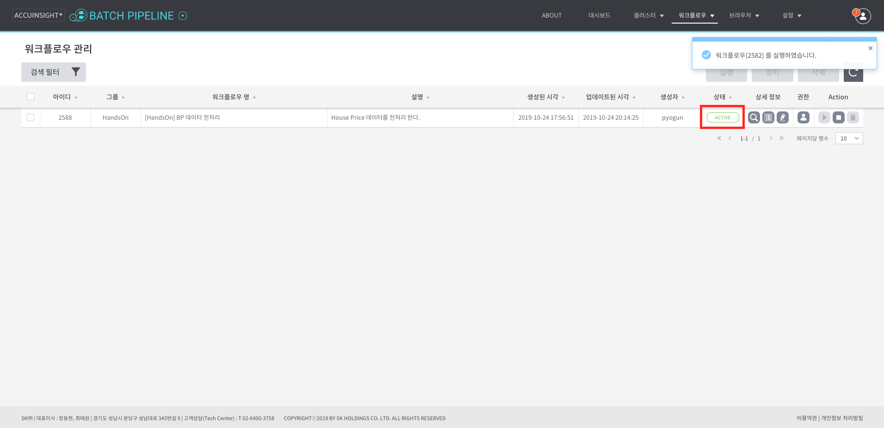

우측 상단에 워크플로우가 실행되었다는 팝업이 뜨고, 상태가 `ACTIVE`로 변경된다.

#### 정상 완료된 워크플로우 확인

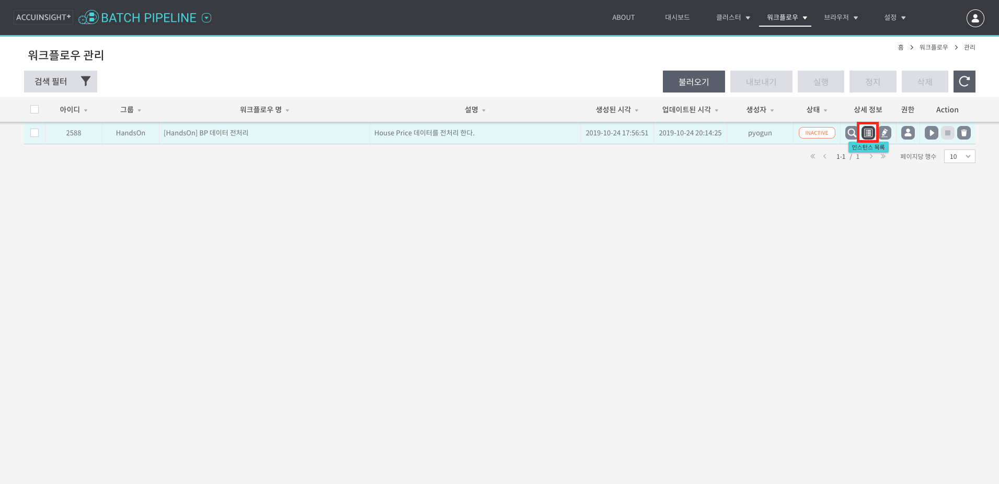

워크플로우의 상태가 다시 `INACTIVE`로 변경된다. 이때 실행이력과 워크플로우의 로그를 보기 위해 `인스턴스 목록`버튼을 클릭한다.

#### 인스턴스 목록 화면

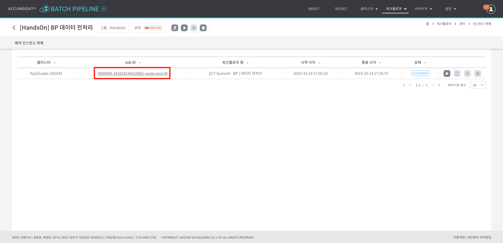

인스턴스 목록 화면은 해당 워크플로우가 실행될 때 마다 실행 이력이 쌓인다.

`Job ID`를 클릭해 실행된 잡의 정보를 확인할 수 있다.

#### Job Log 조회

인스턴스 상세 페이지에서 `ETL 노드`를 클릭하면 하단에 잡에 대한 정보인 `INFO`, 잡에대한 yarn application 로그인  `STD`, `ERR` 을 확인할 수 있다.

---

---

> ### 11. 결과파일을 확인한다.

#### HDFS 브라우저

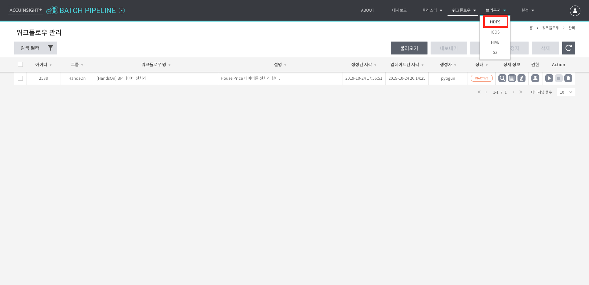

우측 상단에 `HDFS 브라우저`를 클릭한다.

#### 결과 파일 찾기

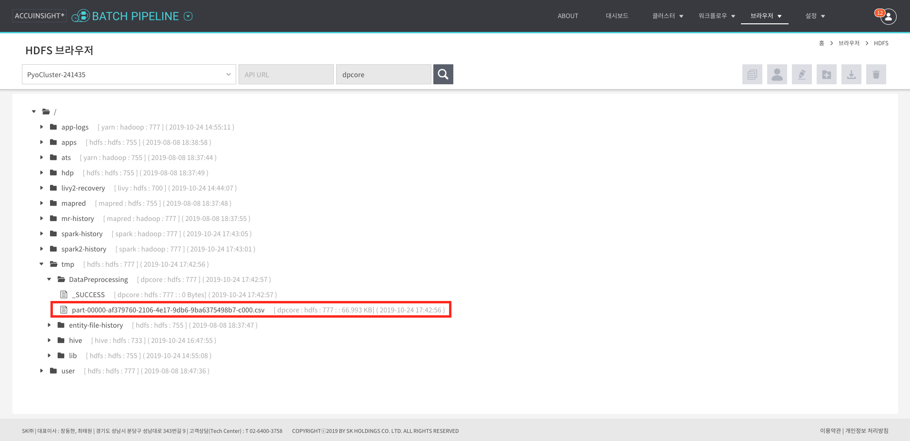

`HDFS 내보내기`노드에서 설정한 파일 경로를 찾아 정상적으로 파일이 생성되었는지 확인하고 `더블클릭`한다.

#### 결과 파일 샘플링 보기

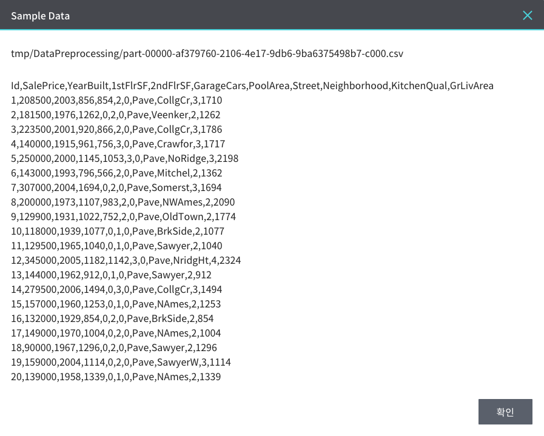

정상적으로 결과파일이 생성되고 내용도 일치함을 확인할 수 있다.
