# Demo Instruction
> 공유 오피스 분석 플랫폼 구축 프로젝트에 사용한 AccuInsight+ 서비스 Batch Pipeline, Data Insight를 공유오피스 분석 요건 45개 중 하나를 택해 실습해본다.

  

# AccuInsight+ Services
  
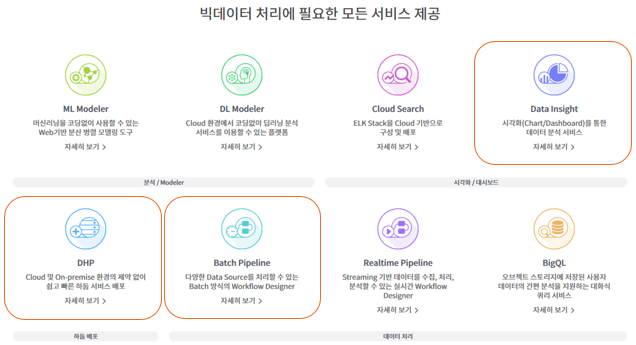

  
# Demo Outline
  
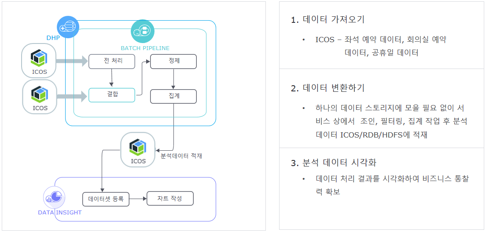

  
# Scenario : 회사별 일평균 좌석이용률

 

## 데이터 준비
> ICOS에 업로드된 데이터를 사용합니다.  
> 스토리지 : IBMOSC1146611-6  
> 버킷 : handson-bucket  

 

(1) Dataset 1 : 좌석 예약 데이터  

| column명 | column 설명 | Value Example |
|---|:---:|---|
| `bldg` | 빌딩명 | SKC 본사, 서린 빌딩, ... |
| `desk_type` | 좌석 유형 | 일반좌석, 스탠딩좌석, ... |
| `desk_id` | 각 좌석의 ID | 3a27b3bf-d8de-11e8-975a-0a9726611f46 |
| `dt` | 예약 날짜 | 20190803 |
| `com` | 회사명 | SK C&C, SK이노베이션, … |
| `age` | 나이대 | 20대,30대,... |

 

(2) Dataset 2 : 좌석 메타 데이터  

| column명 | column 설명 | Value Example |
|---|:---:|---|
| `bldg` | 빌딩명 | SKC 본사, 서린 빌딩, ... |
| `desk_type` | 좌석 유형 | 일반좌석, 스탠딩좌석, ... |
| `occupied` | 고정좌석 여부 | N, Y |
| `desk_id` | 각 좌석의 ID | 3a27b3bf-d8de-11e8-975a-0a9726611f46 |
| `dt` | 예약 날짜 | 20190803 |

 

## 데이터 처리  

 

### 데이터파일 2개 조인하여 ETL작업 수행하기  

 

 > ETL flow 구성내용 : ICOS에서 파일 불러오기 → 사용할 column만 선택 → 데이터 정제 → 통계 → join key 생성 → 2개 파일 join → 새로운 column 생성 → 불필요한 column 삭제 → null값 제거→ column명 rename → ICOS에 저장  

 

#### 생성 메뉴로 이동

 

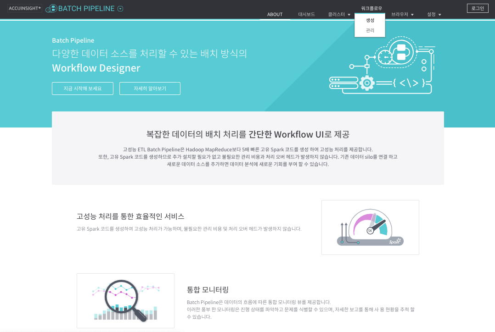

 

#### 데이터 로딩

 

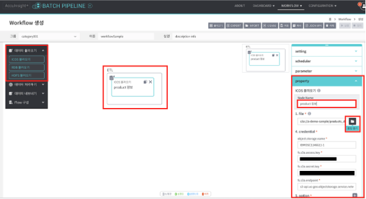

 

데이터 불러오기 그룹에서 ICOS 불러오기 노드를 캔버스 영역에 drag & drop하여 node 생성  
우측 property 패널  
- file : 불러오려는 ICOS 파일의 경로 지정
- option : 데이터에 header가 없는 경우 false로 변경
- schema : 자동 파일 열기  

 

column명 변경  (header)
> 좌석 예약 데이터 : bldg, desk_type, desk_id, dt, com, age  

 

동일한 방법으로 좌석 메타 데이터도 불러오기  
> 좌석 메타 데이터 : bldg, desk_type, occupied, desk_id, dt  

 

#### 필요한 컬럼 선택  

 

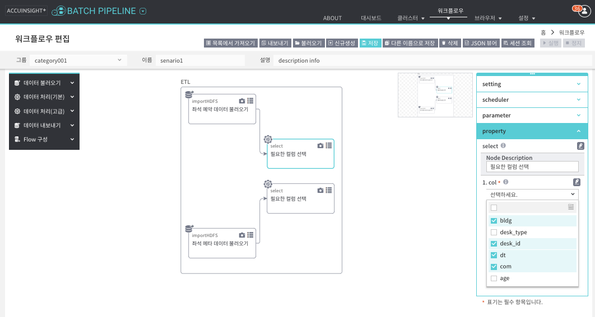

 

select 노드 drag & drop하여 생성  
우측 property 패널  
col checkbox에서 아래 5가지 column 체크  
- 좌석 예약 데이터 : bldg, desk_id, dt, com
- 좌석 메타 데이터 : bldg, occupied, desk_id, dt  

 

#### 데이터 정제

 

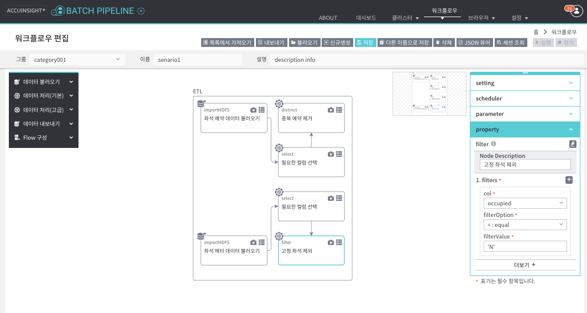

 

distinct 노드 drag & drop하여 좌석 예약 데이터에서 중복 예약 제거  
filter 노드 drag & drop하여 좌석 메타 데이터에서 고정 좌석 제외  
우측 property 패널  
- col : occupied
- filterOption : =:equal
- filterValue : 'N'  

 

#### 통계

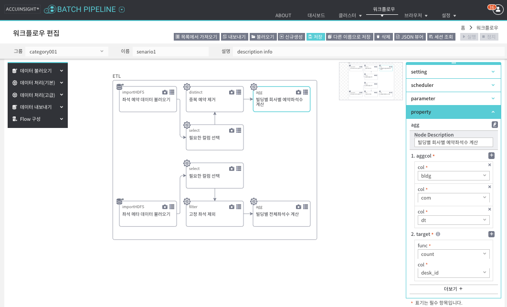

agg 노드 drag & drop하여 좌석 예약 데이터에서 빌딩별 회사별 예약좌석수 계산  
우측 property 패널  
- aggcol : bldg, com, dt
- target : func count, col desk_id  

agg 노드 drag & drop하여 좌석 메타 데이터에서 빌딩별 전체좌석수 계산  
우측 property 패널  
- aggcol : bldg, dt
- target : func count, col desk_id  

 

#### join key 생성

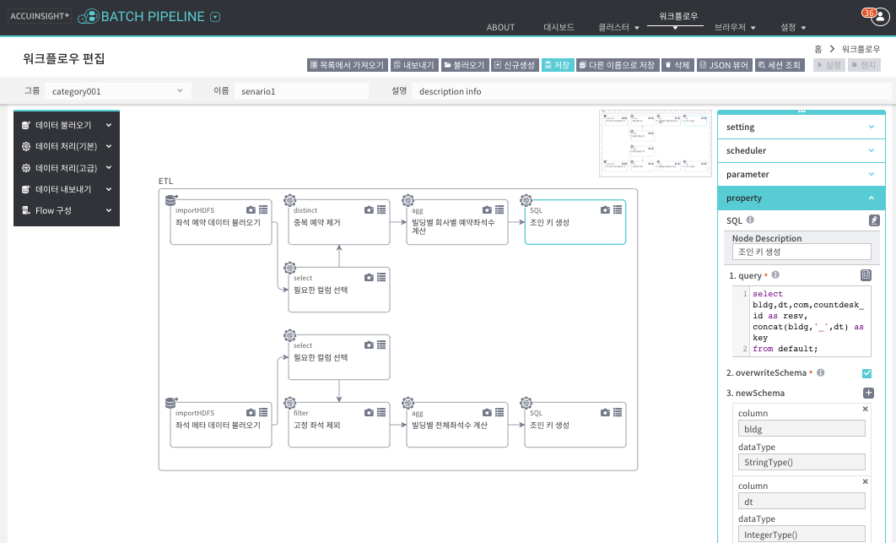

SQL 노드 drag & drop하여 좌석 예약 데이터에서 join key 생성  
우측 property 패널  
- query  

select bldg,dt,com,countdesk_id as resv, concat(bldg,'_',dt) as key
from default;
- overwriteSchema 체크 (SQL 결과로 데이터 변경)  

SQL 노드 drag & drop하여 좌석 메타 데이터에서 join key 생성  
우측 property 패널  
- query  

select countdesk_id as total, concat(bldg,'_',dt) as key
from default; 
- overwriteSchema 체크 (SQL 결과로 데이터 변경)  

 

#### 2개파일 조인

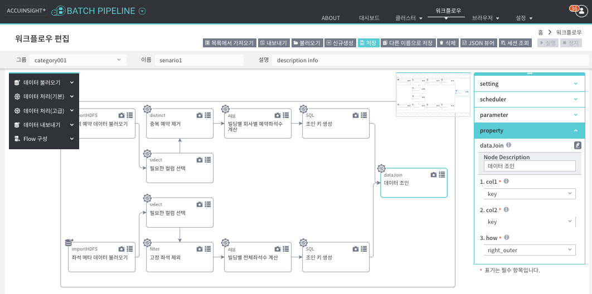

좌측의 데이터 처리하기 클릭  
열린 패널에서 dataJoin 노드 우측 캔버스에 drag & drop하여 생성  
우측 property패널  
- col1 : 좌석 예약 데이터의 key 선택  
- col2 : 좌석 메타 데이터의 key 선택  
- how : right_outer 선택 (col1,col2 순서가 바뀐 경우 left_outer 선택)  

 

#### 새로운 column 생성

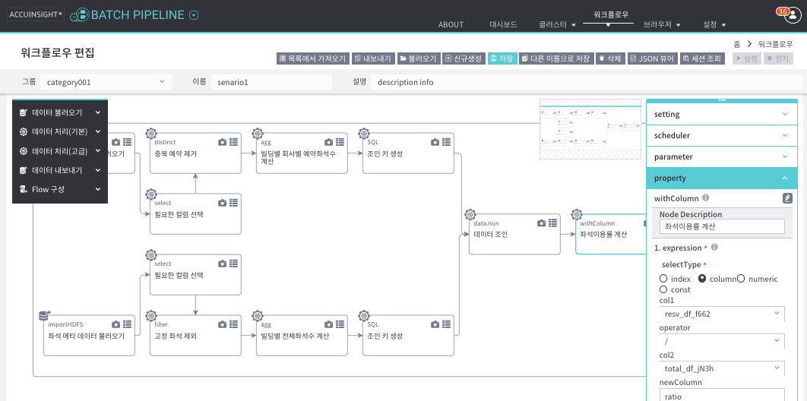

withColumn 노드 drag & drop하여 좌석이용률 계산  
우측 property 패널  
- selectType : column
- col1 : resv_dt_~
- operator : /
- col2 : total_dt_~
- newColumn : ratio  

 

#### 불필요한 column 삭제

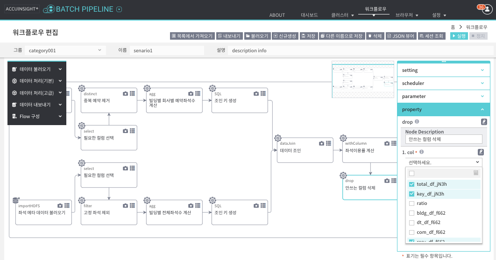

drop 노드 drag & drop하여 불필요한 데이터 삭제  
우측 property 패널  
- 좌석 예약 데이터의 resv_df_~
- 좌석 예약 데이터의 key_df_~
- 좌석 메타 데이터의 total_df_~
- 좌석 메타 데이터의 key_df_~  

 

#### null값 제거

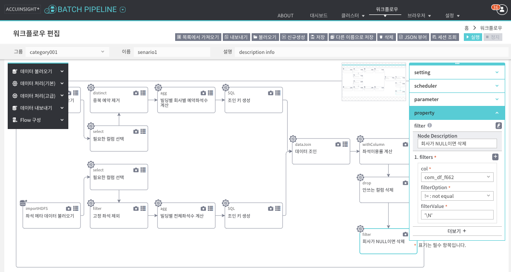

filter 노드 drag & drop하여 회사명이 '\N' 이거나 나이대가 '\N'이면 삭제  
우측 property 패널  
- col : com_df_~
- filterOption : !=:not equal
- filterValue : '\N'  

 

#### 컬럼명 변경

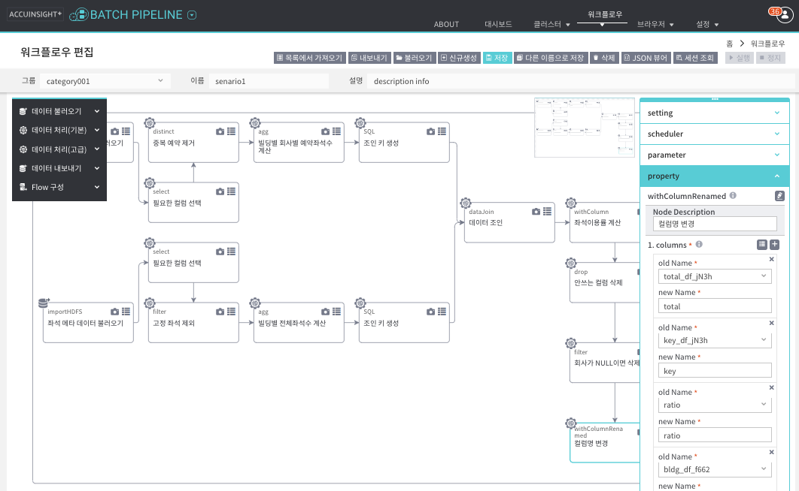

withColumnRenamed노드 drag&drop하여 생성  
우측 property 패널  
전체  컬럼 불러오기 아이콘을 통해 자동 파싱  

 

#### ICOS에 저장

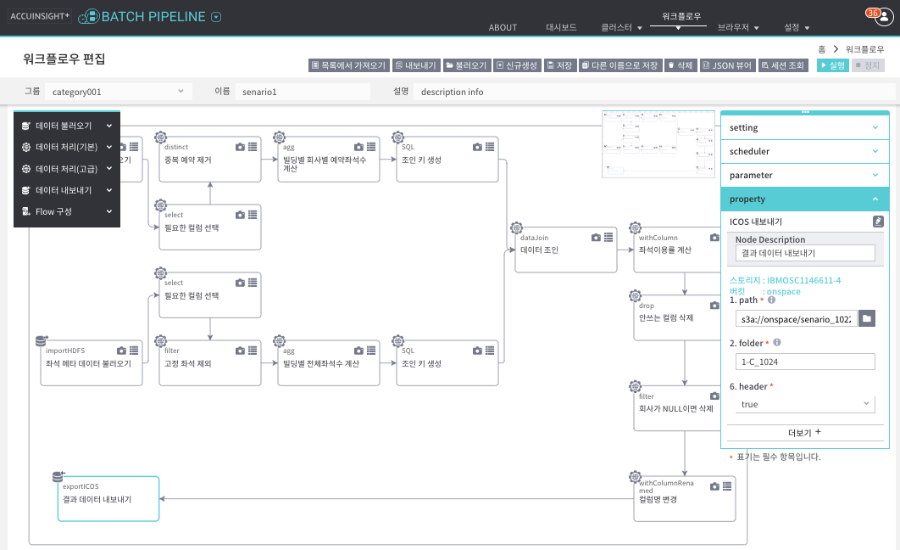

좌측 데이터 내보내기 클릭  
ICOS 내보내기 노드 drag & drop 하여 생성  
withColumnRenamed 노드에서 ICOS 내보내기노드로 연결  
우측 property 패널  
- path의 browse 아이콘을 클릭하여 열리는 팝업에서 저장할 디렉토리 위치 선택 후 확인 클릭 (ex. /tmp)  
- file에 생성할 디렉토리명 입력 (ex.modeling_data)  

 

#### 저장 및 실행
  
ETL 클릭 후 appName 입력

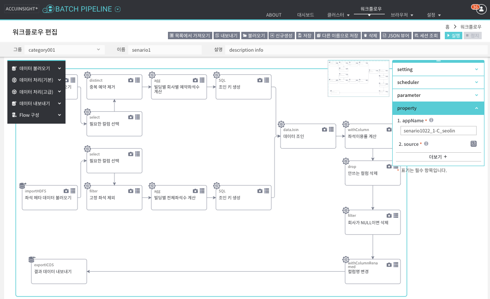

저장 클릭  
실행 클릭  

 

#### 워크플로우 상태 확인

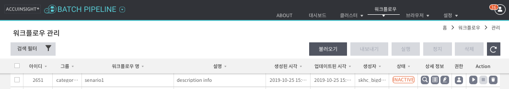

 workflow 관리 화면으로 이동하여 상태 확인  
이미 성공으로 종료되었거나 오류가 발생하여 종료된 경우 INACTIVE 상태  
상세정보 컬럼의 Instance목록 아이콘 클릭  

 

#### 실행결과 확인

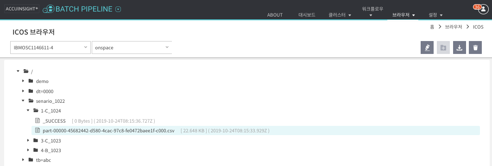

CONFIGURATION > ICOS BROWSER 메뉴로 이동  
지정했던 ICOS directory위치로 이동하여 내보내기로 생성한 디렉토리 하단의 part-00000-~파일 클릭  
우측 상단의 다운로드 버튼 클릭하여 파일내용 확인  

  

## 데이터 시각화 (Data Insight) 

 

### 데이터 준비

 

#### 데이터 셋 추가
데이터 셋 관리 페이지에서 데이터 셋 추가를 클릭하면 추가 페이지로 이동합니다.  

 

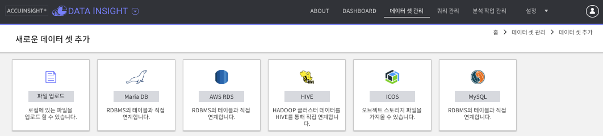

 

DataInsight 분석 및 시각화를 위해 MariaDB, ICOS, HIVE 등 다양한 종류의 데이터 셋을 추가할 수 있습니다.  
지원하는 Data Source 타입  
① 로컬 파일 : csv 타입 등 로컬에 있는 파일을 업로드  
② MariaDB : MariaDB 테이블 연동하여 데이터 업로드  
③ AWS RDS: AWS RDS 테이블 연동하여 데이터 업로드  
④ HIVE : 하둡 클러스터의 데이터를 hive를 통하여 업로드  
⑤ ICOS : IBM 오브젝트 스토리지의 파일을 업로드  
⑥ MySQL : MySQL 테이블을 연동하여 데이터 업로드  

 

데이터 셋 추가 : ICOS 선택  
이전에 Batch Pipeline 실행 결과 파일(ICOS) 선택  
스키마 편집  

 

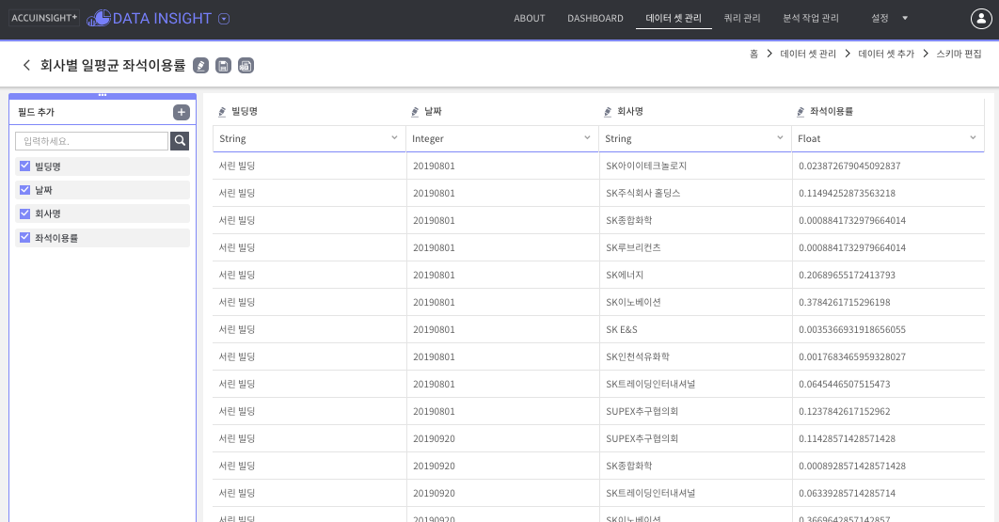

 

데이터 셋 이름 변경  
part-00000-~ -> 회사별 일평균 좌석이용률  
column명 변경  
- bldg -> 빌딩명
- dt -> 날짜
- com -> 회사명
- ratio -> 좌석이용률  

저장  

  

### 차트 작성

 

#### 분석 작업 관리
분석 작업 관리 페이지에서 분석 작업 생성을 클릭하면 추가 페이지로 이동합니다.  
차트 작성할 데이터 셋 적용  

 

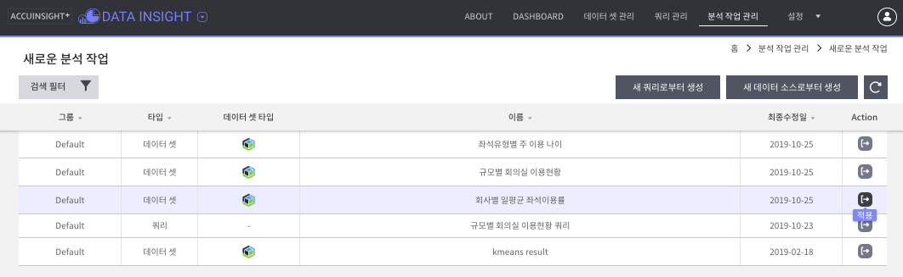

 

필터 추가  
- 이름 : 날짜
- 날짜 = 20190820  
  
분석 작업 차트 생성  
차트 생성 버튼 클릭  
  

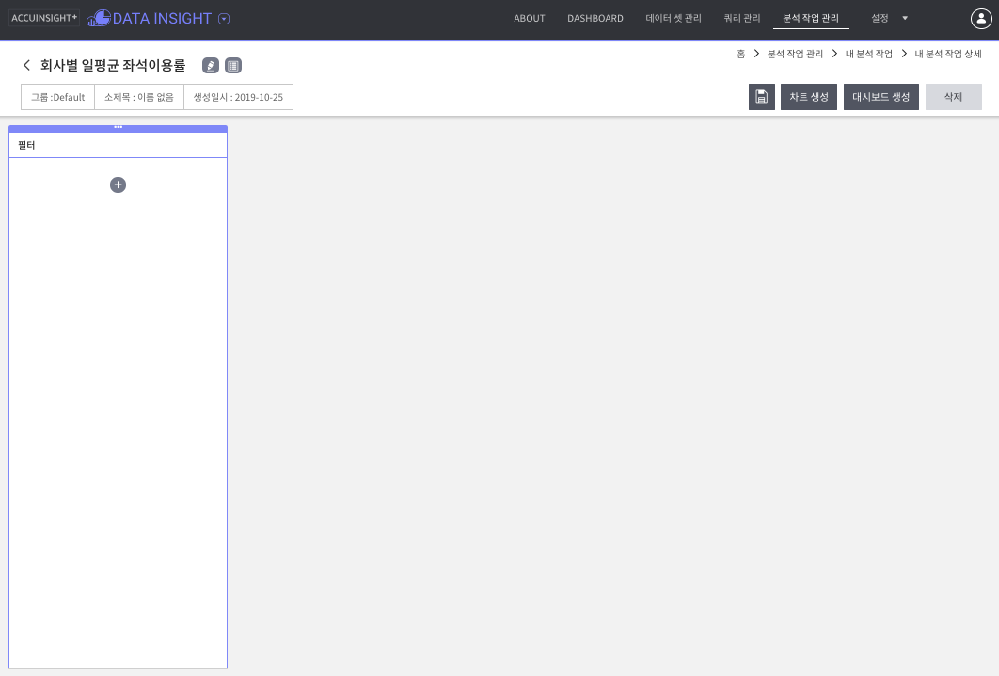

컬럼 스택 차트 선택  
Axis : 회사명  
Value : 좌석이용률  

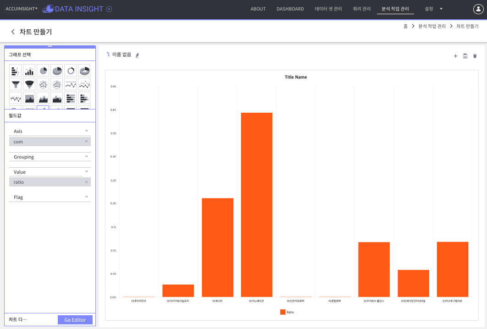
  
저장  
차트 생성 버튼 클릭  

파이 차트 선택  
Grouping : 회사명  
Value : 좌석이용률  

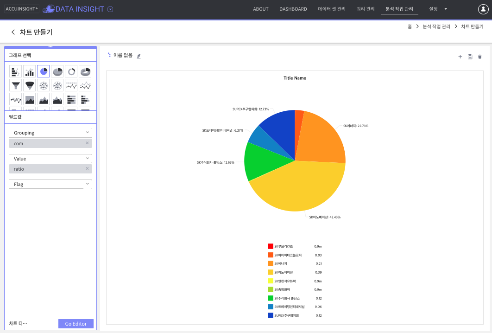

저장  
대시보드 생성 버튼 클릭  

  

### DASHBOARD

대시보드는 작업했던 분석 결과들을 보관하고 확인할 수 있는 공간입니다.  
분석 작업 만들기에서 대시보드 생성 버튼을 클릭하여 작업 결과물들을 대시보드에 보관할 수 있습니다  

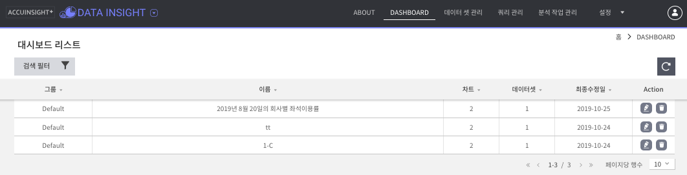

 

대시보드 이미지로 내보내기

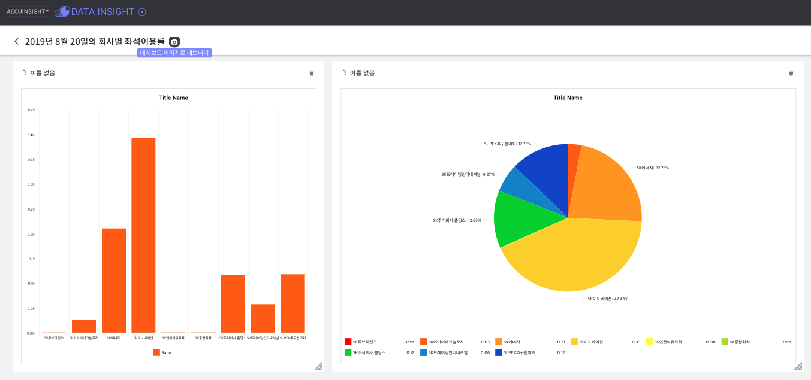

 

다운받은 이미지 확인 

