# DL Modeler 소개
DL Modeler는 분산 환경 하의 딥러닝 학습 및 모델 배포를 통한 예측 서비스를 제공합니다. 제공되는 Built-in 알고리즘 또는 직접 작성한 코드로 모델을 생성할 수 있습니다.

## 특징
(1) 규모에 관계없이 클라우드에서 딥 러닝 가속화
  - DL Modeler 는 클라우드 환경에서 프로그래밍을 하거나 제공되는 Built-in 알고리즘을 활용하여 딥 러닝 모델을 구축할 수 있습니다. 뿐만 아니라 분산 환경 하의 딥러닝 학습 및 모델 배포를 통해 보다 신속하게 설계, 개발 및 예측 서비스를 제공합니다.

(2) 완전 관리형 실행 지원
  - 데이터의 가공/학습부터, 모델의 배포/예측까지 딥 러닝 분석의 Life Cycle을 완전관리형으로 제공 합니다.

(3) Built-in 알고리즘을 활용한 딥 러닝 모델 구축
  - 저장된 데이터를 간편하게 탐색 및 시각화 할 수 있을 뿐 아니라, 내장 된 전처리 알고리즘 이용해 변환 후 제공되는 Built-in 딥 러닝 알고리즘 학습에 적용 할 수 있습니다.
 
(4) 단 한번의 클릭으로 모델 배포
  - 애플리케이션에 대한 인스턴스 생성, 모델 구축을 지원해 손 쉬운 모델 호스팅 및 예측을 수행합니다.

## 제공 기능
(1) 다양한 딥러닝 학습 방법 제공
  - Jupyter Notebook을 제공하여 직접 코드 작성 및 관리 가능하며, 제공되는 Built-in 알고리즘을 통해 클릭 몇 번 만으로 간편하게 학습 할 수 있습니다.  

(2) 데이터 전처리/최적화된 알고리즘 제공
  - 데이터 전처리 기능을 제공하며, 데이터 특성을 파악하여 최적의 알고리즘을 추천합니다.

(3) 효율적인 배포/예측 서비스 제공
  - 검증 작업을 통해 학습한 모델을 GPU 클라우드 자원에 효율적으로 분배하여 배포합니다. 배포된 모델로 예측을 수행할 수 있습니다.

(4) 데이터/학습/배포 관리
  - 데이터 셋, 학습 내역, 배포 관리 기능을 제공하여 작업을 쉽게 할 수 있습니다.

## 화면 구성
(1) 프로젝트
  - 프로젝트는 DL Modeler에서 분석 과제를 구분하는 기준이 됩니다. 프로젝트 생성 시 접근 가능한 사용자를 지정할 수 있습니다.

(2) 데이터
  - 학습/예측에 사용할 데이터를 업로드하고, 내장 알고리즘으로 데이터를 전처리 할 수 있습니다.

(3) 작업
  - 작업은 모델 학습 종류를 구분하는 기준이 됩니다. 작업에는 내장 알고리즘을 사용하는 basic 모드와 직접 학습 코드를 작성하는 custom 모드가 있습니다. 작업 생성 후 작업 안에서 모델 학습을 진행합니다.

(4) 배포
  - 학습 완료된 모델을 API로 배포합니다. 업로드한 데이터로 간단한 예측도 시각화 해서 볼 수 있습니다.
  
## 서비스 시작하기
(1) 메인 페이지 진입

  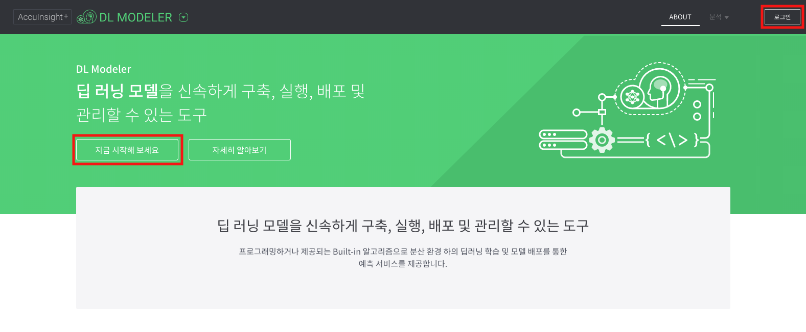
  - https://accuinsight.cloudz.co.kr/dlmodeler/#/intro
  - 메인 페이지 우측 상단의 로그인 버튼이나, 좌측에 있는 지금 '지금 시작해 보세요' 버튼을 클릭하면 로그인 화면으로 이동합니다.
  
(2) 로그인

  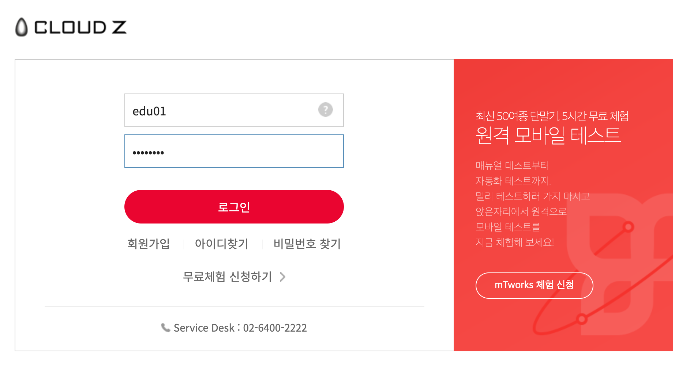
  - cloudz 포탈 로그인을 합니다.
  
  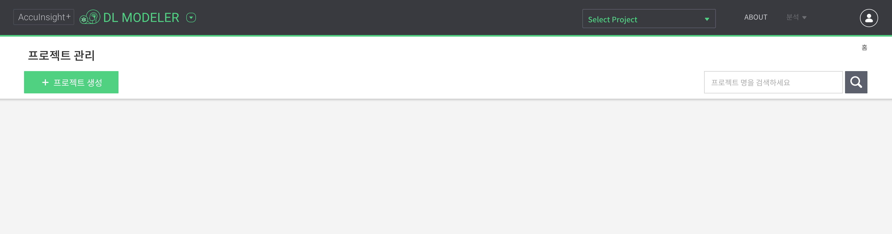
  - 로그인을 하면 자동으로 프로젝트 관리 페이지로 이동됩니다.
  - 자동으로 이동되지 않고 메인 페이지로 돌아갈 경우, 메인 페이지의 '지금 시작해 보세요' 버튼을 다시 클릭하면 이동됩니다.

# Intel image classification demo (DL Modeler)
## Demo Overview
6개의 카테고리로 구분된 풍경 이미지를 DL Modeler에 업로드하여, built-in 알고리즘 중 하나인 Image Classification을 이용해 GPU 분산 학습합니다. 학습이 완료되면, 학습 모델을 배포하여 새로운 이미지의 카테고리를 예측합니다. 딥 러닝 모델의 우수성을 더 잘 드러내기 위해 예측할 이미지는 데이터 전처리 기능으로 흑백, 상하 반전 처리하여 학습된 이미지와 다른 모양으로 만듭니다.

## 데이터 준비
(1) 데이터 설명
  - 이번 Demo에서 사용할 데이터는 Intel이 Kaggle에 공개한 Intel Image Classification 이미지 데이터입니다. (https://www.kaggle.com/puneet6060/intel-image-classification)
  
  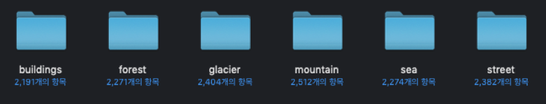
  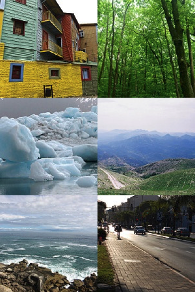
  - 150px X 150px 사이즈의 자연/풍경 이미지 약 25,000개로 구성된 데이터셋입니다.
  - Demo 학습에는 총 14,034개의 데이터가 있지만, 실습을 할 땐 59개 이미지만 학습 데이터로 사용하여 toy model을 만듭니다.
  - 이미지 카테고리는 총 6개(buildings, forest, glacier, mountain, sea, street)입니다.

(2) csv 파일 준비
  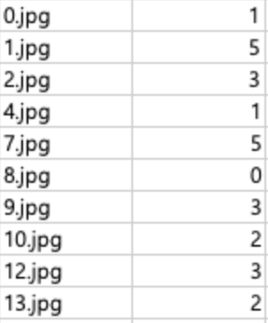
  - Image Classification의 학습 input으로 총 두 가지의 데이터가 필요합니다.
    - 학습에 사용할 이미지 파일
    - 학습 아미지 파일명과 label이 매핑되어 있는 csv 데이터
  - 학습 label 값은 정수만 가능하기 때문에, 정수 label과 카테고리를 나중에 다시 매핑해주는 작업이 필요합니다.
  - demo에서는 학습에 사용할 csv 파일이 미리 준비되어 있습니다. demo의 label csv 파일은 다음 표를 기준으로 제작되었습니다.
  
    | 카테고리 | 정수 label |
    | :---: | :---: |
    | forest | 0 |
    | buildings | 1 |
    | glacier | 2 |
    | street | 3 |
    | mountain | 4 |
    | sea | 5 |
    
    
  - 또한, 로컬 pc에서 아래 파이썬 파일을 이용해 csv파일을 생성할 수 있습니다. (label_generator.py)
  - 6번째 줄, image_path 변수에 csv로 라벨링할 이미지 데이터들의 경로를 넣어줍니다.
  - csv 파일은 이미지 경로와 같은 곳에 생성됩니다.
  - 파이썬 코드를 실행했을 때 같이 출력되는 (실제 카테고리)-(정수 label) 쌍은 잘 보관해 두었다가, 이후에 활용합니다.

```
#label_generator.py

import os
import csv

image_path = "." #image path

image_label_list = list()

label_dir = os.listdir(image_path)
label_dic = {i: label_dir[i] for i in range(len(label_dir))} #number label generating

for i in label_dic.keys():
    image_list = os.listdir(os.path.join(image_path, label_dic[i]))

    for j in range(len(image_list)):
        img_file = os.path.join(os.path.join(image_path, label_dic[i])) + "/" + image_list[j]
        if os.path.exists(img_file) and img_file.find('.DS_Store') == -1:  # filter .DS_Store
            image_label_list.append([image_list[j], i])

image_label_list.sort(key=lambda x: int(x[0].split('.')[0]))

print(label_dic)

#csv writing
with open(image_path + "/image_label.csv", 'w') as f:
    writer = csv.writer(f)

    for line in image_label_list:
        writer.writerow(line)

```

## 프로젝트
(1) 프로젝트 관리

  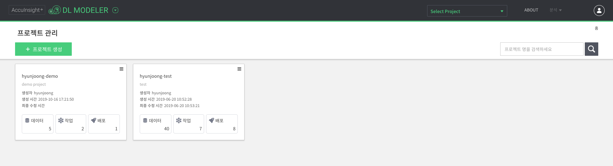
  - 로그인 후 이동되는 페이지입니다.
  - 프로젝트 관리 페이지에서는 프로젝트 생성/수정/삭제 작업이 가능합니다.
  - 프로젝트 관리 페이지에서 프로젝트 생성 버튼을 누르면 프로젝트를 생성 팝업이 뜹니다.

(2) 프로젝트 생성

   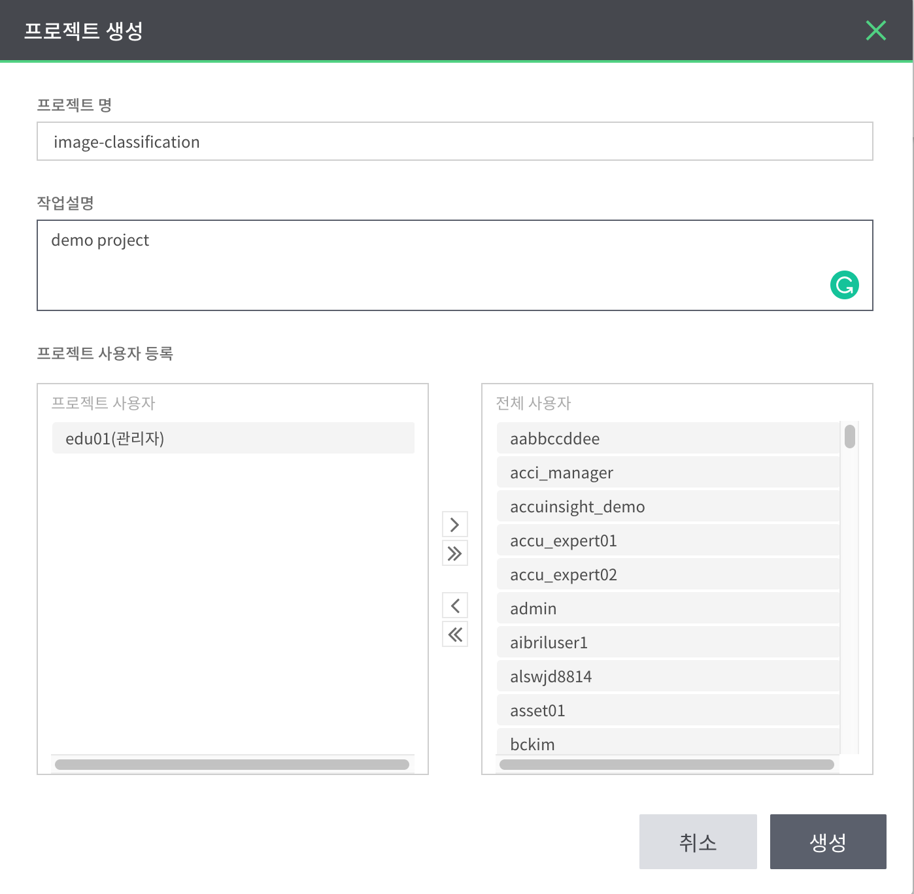
  - 프로젝트 생성 팝업에서 프로젝트명과 프로젝트 설명을 입력하고, 프로젝트에 접근할 사용자를 지정하면 생성 버튼이 활성화됩니다.
  - 모든 내용을 입력한 후 생성 버튼을 누르면 프로젝트가 생성됩니다.
  
(3) 프로젝트 진입

  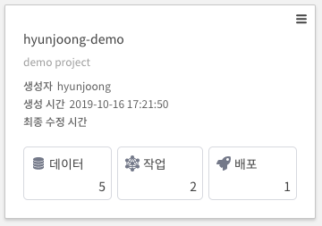
  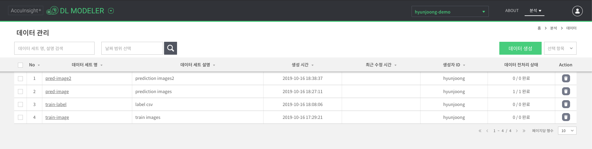
  - 생성된 프로젝트 카드의 버튼을 누르면 해당 프로젝트의 데이터/작업/배포 화면으로 이동할 수 있습니다. 화면 간 이동은 우측 상단 분석 탭에서 가능합니다.
  - 먼저, Demo에 사용할 데이터 업로드를 위해 데이터 버튼을 클릭하여 데이터 관리 화면으로 이동합니다.

## 데이터
(1) 데이터 세트

  - 데이터 세트는 직접 업로드하는 raw데이터와 raw데이터로 전처리해 만드는 데이터가 함께 보관되는 단위입니다. 그러므로, 데이터를 업로드하면 데이터 세트를 함께 만들게 됩니다.

(2) 데이터 업로드

  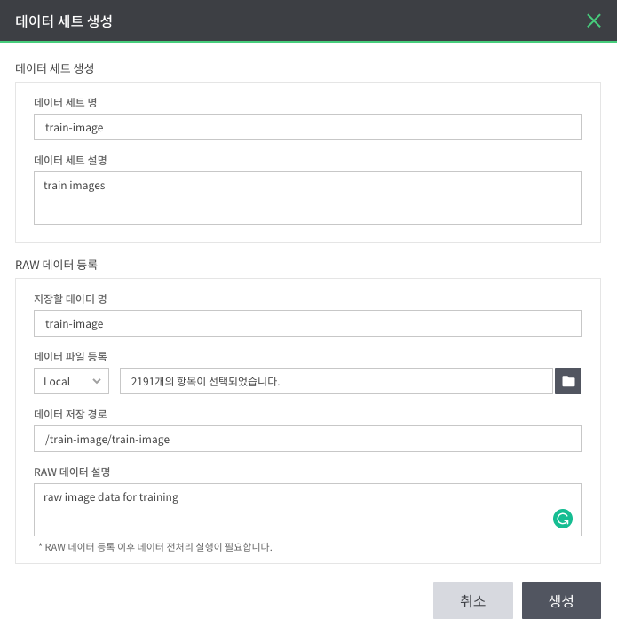
  
  - 데이터 관리 화면의 데이터 생성 버튼을 눌러 앞서 준비했던 데이터를 업로드합니다. 
  - 데이터 세트 명과 설명, 데이터 명과 설명을 입력하고, 데이터 파일을 등록합니다.
  - 파일 등록 시, 여러 개의 파일을 동시에 올릴 수 있습니다.
  - 데이터 저장 경로는 자동 생성되며, 생성 버튼을 누르면 raw 데이터가 업로드 되면서 데이터 세트가 생성됩니다. 이 과정을 반복하여 총 세 가지의 데이터 세트를 만듭니다. (학습 이미지, 예측 이미지, label csv)
  
  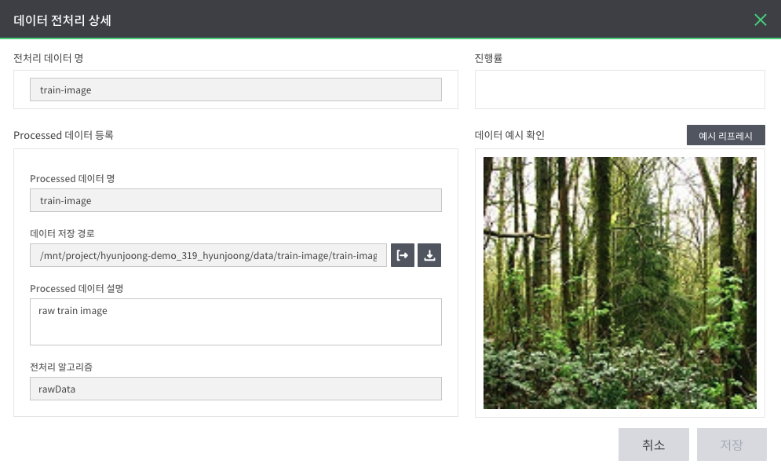
  - 생성된 이미지 데이터 세트의 이름을 누르면 전처리 상세 화면으로 진입할 수 있습니다.
  - 전처리 알고리즘이 rawData인 데이터명을 클릭하면 데이터 전처리 상세 팝업을 볼 수 있는데, 여기에서 업로드 된 데이터 예시를 확인할 수 있습니다. 예시 리프레시 버튼을 누를 때마다 데이터 중 하나를 랜덤으로 보여줍니다.
  
(3) 데이터 전처리

  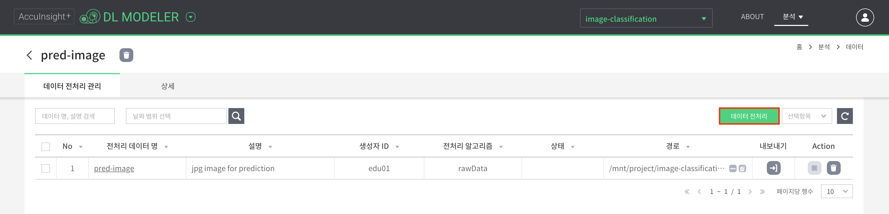
  - 예측에 사용할 이미지 데이터를 상하 반전/흑백 처리합니다. 전처리 상세 화면에서 데이터 전처리 버튼을 클릭합니다.
  
  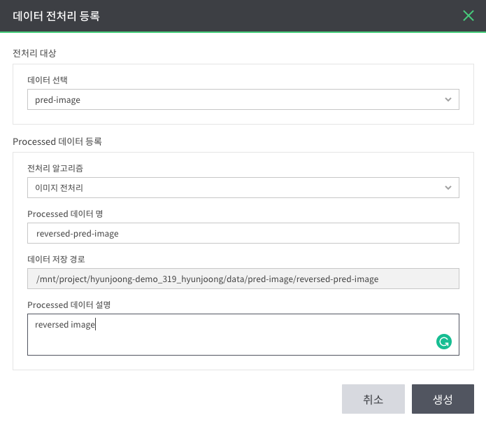
  - 데이터는 업로드 된 rawData를 선택히고, 전처리 알고리즘은 이미지 전처리로 선택합니다.
  
  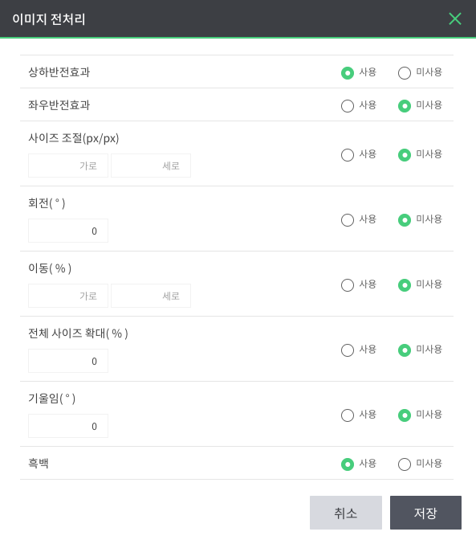
  - 알고리즘을 고르면 알고리즘과 연관된 팝업이 뜹니다. 이미지 전처리 팝업에서 상하 반전과 흑백 처리를 사용으로 선택 후 저장을 누릅니다.
  
  - 다시 원래 전처리 생성 팝업으로 돌아갑니다. Processed 데이터 명/ Processed 데이터 설명은 전처리 된 데이터가 가지게 될 이름과 설명입니다. 원하는 이름을 입력 후 생성을 누르면 전처리가 시작됩니다.
  - 전처리 진행 과정은 전처리 상세 페이지에서 확인할 수 있습니다. 전처리가 완료되면, rawData와 동일하게 데이터 전처리 상세 팝업에 진입하여 전처리 된 데이터 예시를 볼 수 있습니다.

## 학습
(1) 작업 생성

  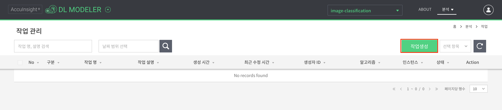
  - 우측 상단의 분석 탭에서 작업을 선택하면 작업 관리 화면으로 넘어갈 수 있습니다.
  
  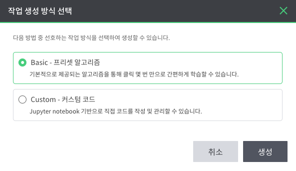
  - 작업 생성 버튼을 눌러 작업을 생성합니다. DL Modeler에 내장된 image classification 알고리즘으로 학습을 진행할 예정이므로 생성 방식으로는 Basic을 선택합니다.
  
  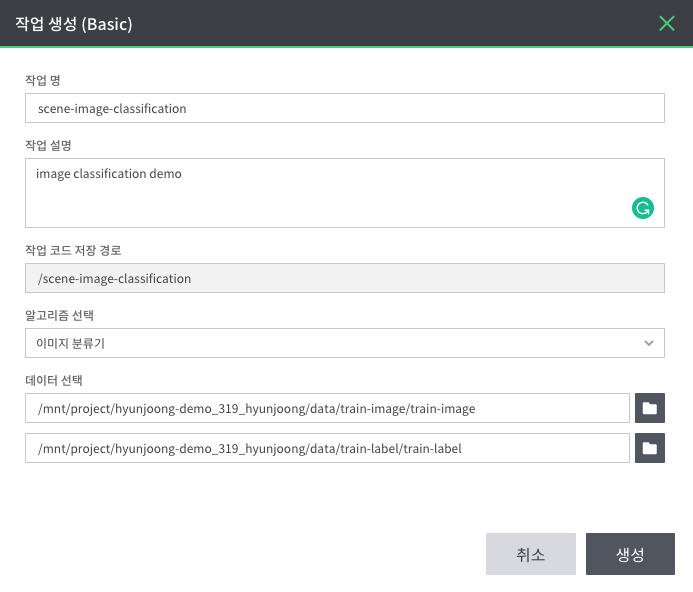
  - 그 다음 나오는 작업 생성(Basic) 창에서 작업 상세 정보를 입력합니다. 작업 명과 작업 설명을 원하는 대로 입력한 후, 이미지 분류 알고리즘을 선택합니다.
  - 알고리즘을 선택하면 그에 따라 데이터를 선택하는 부분이 바뀝니다. 데이터 탭에서 업로드해 두었던 학습 이미지와 label csv 파일을 선택한 수 생성을 누릅니다.
  - 내장 image classification 알고리즘은 tensorflow 기반으로 만들어졌으며, 학습 신경망 layer는 6개로 구성됩니다.

(2) 학습 생성

  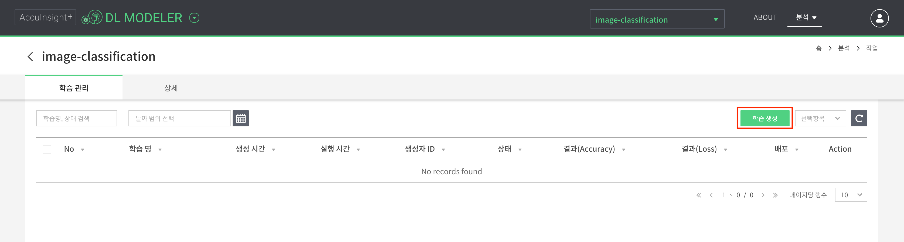
  - 작업 관리 화면에서 생성한 작업명을 클릭하면 작업 상세 화면이 나오는데, 이 화면에서 학습을 생성하고 관리할 수 있습니다.
  
  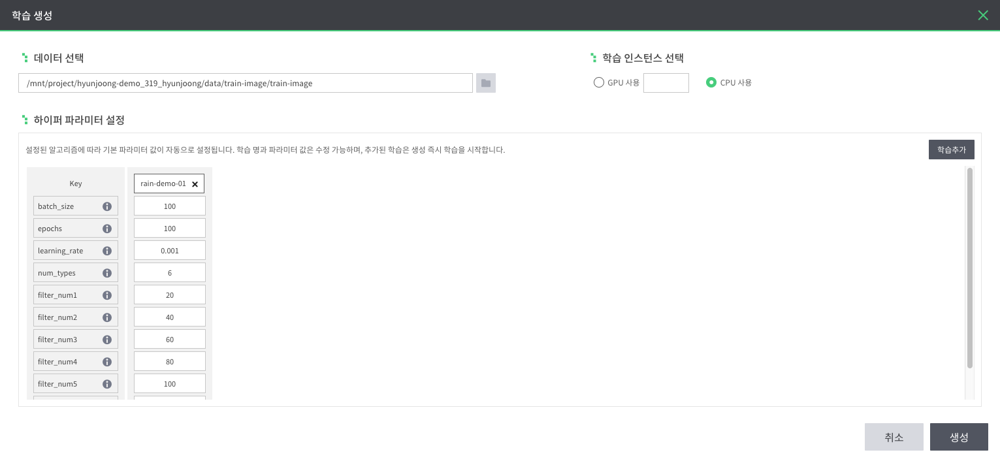
  - 학습 생성 버튼을 누르면 학습 생성 팝업이 나옵니다.
  - 학습에 사용할 인스턴스(cpu/gpu)를 선택합니다. gpu를 선택한 경우 gpu 개수도 같이 입력합니다.
  - 하이퍼파라미터는 자유롭게 설정하되, demo 이미지의 카테고리 수가 6개이므로 num_types는 6으로 설정해줍니다.
  - 학습 추가 버튼을 누르면 학습명과 하이퍼파라미터를 입력하는 칸이 늘어나며, 한 화면에서 여러 개의 학습을 동시에 생성할 수 있습니다.
  - 학습명 입력 칸에 학습명을 입력하고 생성을 누르면 학습이 진행됩니다.

(3) 학습 진행 확인

  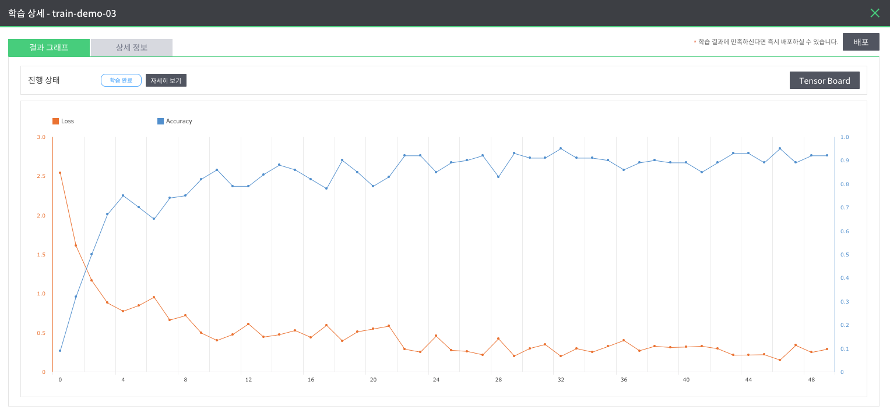
  - 학습 관리 화면에서 학습 명을 클릭하면 학습 상세 팝업이 뜹니다. 결과 그래프 탭에서 학습 진행 상황을 한 눈에 볼 수 있습니다.
  - 자세히 보기 버튼을 누르면 해당 학습에서 나오는 로그를 확인할 수 있습니다.
  - 배포 버튼은 학습 완료 후 모델이 생성되면 활성화됩니다.

## 배포
(1) 학습된 모델 배포

  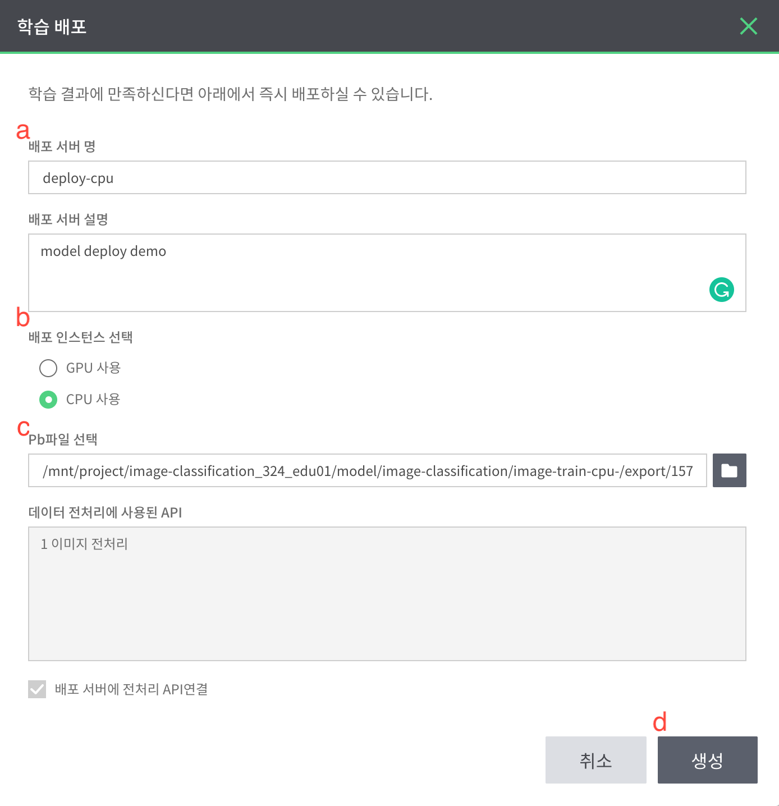
  - 학습 관리 화면의 배포 아이콘(로켓 모양)이나, 학습 상세 팝업에서 배포 버튼을 누르면 학습 배포 팝업이 나타납니다.
  - 배포 명과 배포 설명을 입력하고, 배포에 활용할 인스턴스와 Pb파일을 선택합니다. Pb파일은 학습의 결과로 생성된 모델 파일입니다.
  - 모든 내용을 입력한 후 생성 버튼을 누르면 배포 서버가 생성됩니다.
  
  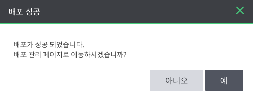
  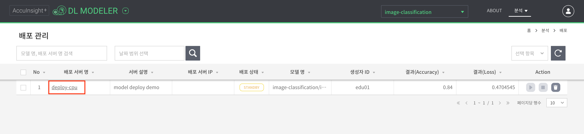
  - 배포된 서버는 배포 관리 화면에서 확인 가능합니다. 배포 관리 화면은 생성 후 나오는 배포 성공 팝업에서 예 버튼을 누르거나, 우측 상단의 분석 탭에서 배포를 선택하면 넘어갈 수 있습니다.
  
(2) 샘플 예측

  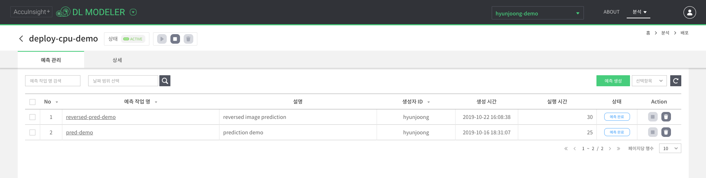
  - 배포 관리 화면에서, 배포 서버 명을 누르면 예측 관리 페이지가 보입니다. 이 페이지에서 해당 배포 서버에 대해 간단한 테스트를 해볼 수 있습니다.]
  
  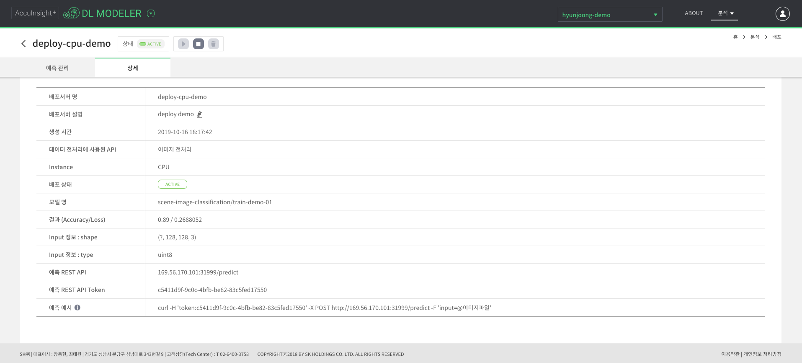
  - 상세 탭에서 해당 서버의 상세 정보를 볼 수 있는데, 서버에 API를 던지는 샘플도 여기에 소개됩니다.
  - 서버 주소와 api 토큰은 서버에 api 요청을 보낼 때 사용되니 기억해 둡니다.
  - 배포 서버 테스트를 위해, 예측 생성 버튼을 클릭합니다.
  
  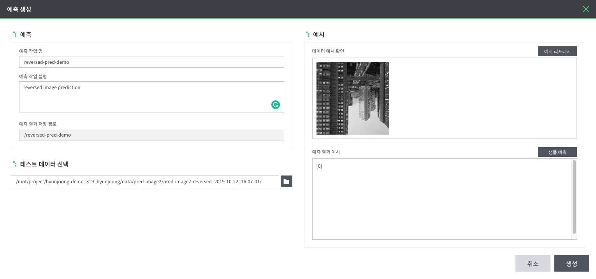
  - 테스트 데이터로는 전처리 해 두었던 (상하 반전/흑백) 테스트용 이미지 데이터를 선택합니다. 폴더를 선택하면 해당 폴더에 있는 모든 이미지로 예측 해볼 수 있습니다.
  - 예시 리프레시 버튼을 누르면 해당 폴더의 이미지가 랜덤으로 하나씩 보여지며, 샘플 예측 버튼을 누르면 샘플 이미지를 배포 서버가 어떻게 예측했는지 볼 수 있습니다. 이미지 분류 label을 정수로 넣었기 때문에, 정수로 결과를 반환합니다.
  - 예측 작업 명과 작업 설명을 입력하고 생성 버튼을 클릭하면 선택한 테스트 데이터로 예측을 진행합니다. 예측 결과는 예측 관리 화면에서 예측 작업 명을 누르면 볼 수 있습니다.

## 모델 활용
(1) 파이썬 작업 환경 세팅

  - DL Modeler에서 생성한 모델이 실제 분석 업무환경에서 어떻게 활용할 수 있는 지 간단히 보여드리려고 합니다.
  - Jupyter notebook에서 이미지 데이터를 가져와 배포한 모델에 API를 보내 분류 결과를 가져오고, 결과를 카테고리로 변환해 함께 출력하는 예시입니다.
  
  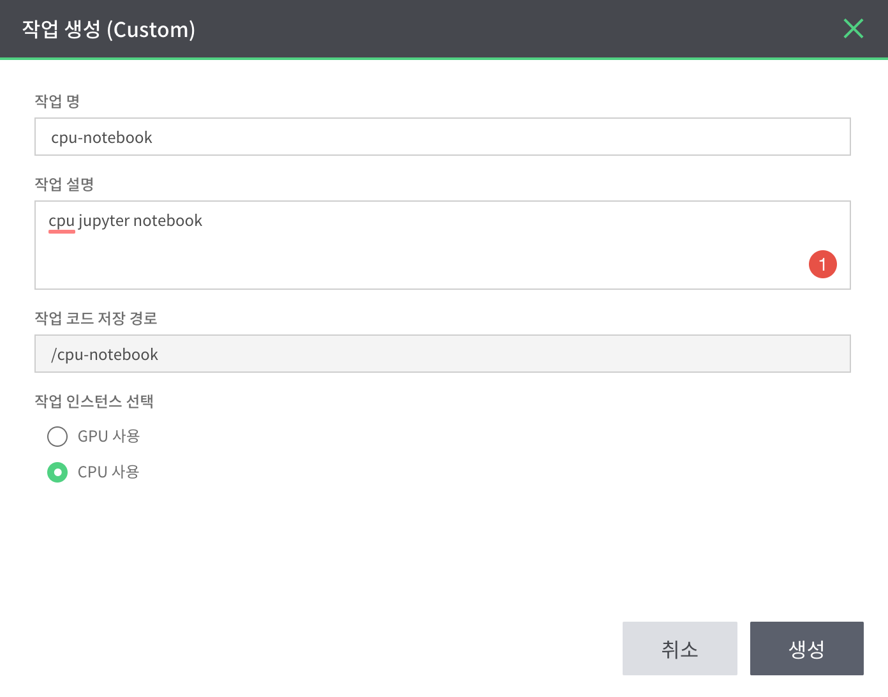
  - 작업 관리 화면으로 넘어와 custom 작업을 생성합니다. custom 작업은 jupyter notebook에 학습 코드를 직접 작성해 학습을 생성하는 기능을 제공합니다. 하지만 이번 demo에서는 jupyter notebook만 활용합니다. 작업 생성 방식에서 custom을 선택하면 위와 같은 팝업이 보입니다.
  
  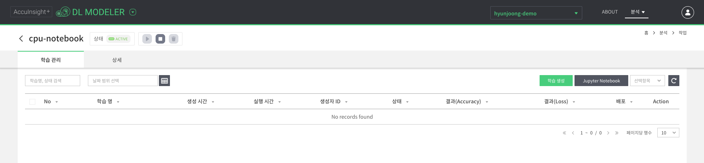
  - 작업 명과 작업 설명, jupyter notebook에 사용할 인스턴스를 선택한 후 생성 버튼을 누르면 jupyter notebook 환경이 생성됩니다. 생성된 작업 명을 클릭하여 학습 관리 페이지로 진입합니다.
  
  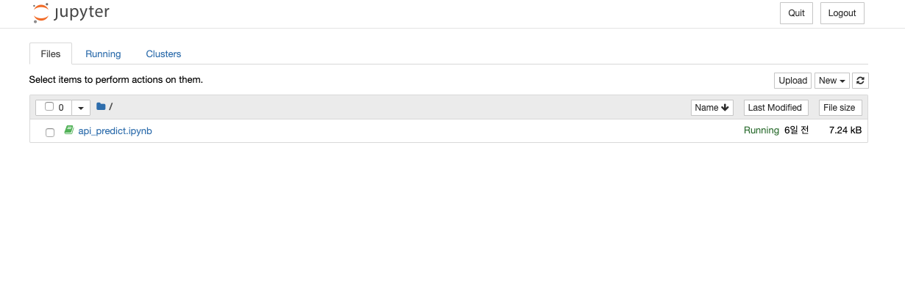
  - jupyter notebook 버튼을 누르면 인증 토큰이 뜨는데, 이를 복사한 후 Open을 클릭하여 노트북으로 진입합니다. 로그인은 토큰으로 하면 됩니다.
  
  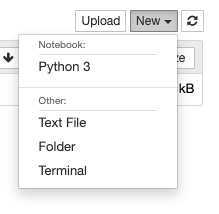
  - 파이썬3 노트북을 하나 만듭니다.
  
  
  - 사용할 라이브러리와 이미지 경로, API를 호출하는 함수를 만듭니다. API 호출 함수는 예측 관리 페이지의 상세 탭에 있는 curl API 예시를 파이썬 코드로 변환한 것입니다.
  
  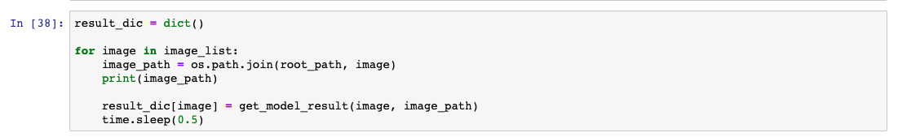
  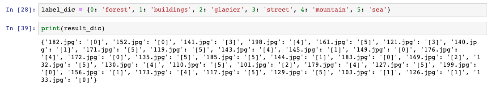
  - 이미지 명과 API를 호출해 얻은 분류 결과를 사전으로 매핑합니다. 그리고 정수로 반환되는 결과를 실제 카테고리로 매핑할 사전을 만듭니다.
  
  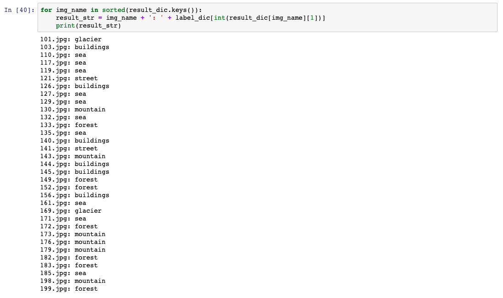
  - 분류 결과를 실제 카테고리로 변환해 본 결과입니다.
  
  - 로컬 환경에서 아래 파이썬 파일을 활용할 수 있습니다. jupyter notebook에서 만든 코드와 동일합니다. (api_prediction.py)
  - 비어있는 부분('' 처리된 부분)에 각각 image path, api token, api address를 넣어주면 코드가 동작합니다.
  
   ```
#api_prediction.py

import requests
import os
import time

root_path = '.' #pred image path
image_list = os.listdir(root_path)


def get_model_result(image, image_path):
    headers = {'token': ''} #api token
    files = {'input': (image, open(image_path, 'rb')), }

    return requests.post('', headers=headers, files=files).text #api address

result_dic = dict()

for image in image_list:
    image_path = os.path.join(root_path, image)
    # print(image_path)

    result_dic[image] = get_model_result(image, image_path)
    time.sleep(0.5)
    # print(image, result_dic[image])

# print(result_dic)
label_dic = {0: 'forest', 1: 'buildings', 2: 'glacier', 3: 'street', 4: 'mountain', 5: 'sea'}

for img_name in sorted(result_dic.keys()):
    result_str = img_name + ': ' + label_dic[int(result_dic[img_name][1])]
    print(result_str)

```

## 예측 결과 sample
(1) 제대로 예측한 이미지

  
  
  정답: buildings - 예측: [1] (buildings)

  
  
  정답: forest - 예측: [0] (forest)

(2) 잘못 예측한 이미지

  
  
  정답: sea - 예측: [2] (glacier)
  
  오답 원인 추정: 해파리 이미지가 유광인데, 이를 흑백으로 변환하면서 빙하의 특성과 비슷해졌음

  
  
  정답: mountain - 예측: [5] (sea)
  
  오답 원인 추정: 파란 하늘 부분이 상하 반전으로 아래로 내려가면서 언뜻 보면 바다처럼 보임

  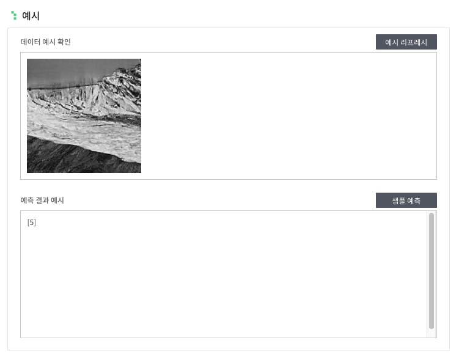
  
  정답: glacier - 예측: [5] (sea)
  
  오답 원인 추정: 원래는 호수 위 빙하 사진이지만, 흑백 처리+상하 반전으로 빙하 부분이 파도처럼 보임
