# 모델 1 생성

## 차례

1. [데이터셋 추가](README.md)
1. **모델 1 생성**
   1. 데이터셋 추가
   1. Random Forest Regressor
   1. 파이프라인 실행
   1. 결과 확인
1. [모델 2 생성](2.model.md)
1. [모델 3 생성 및 저장](3.model.md)
1. [모델 테스트](4.test.md)

---

## 파이프라인 생성

워크스페이스 페이지로 이동한다.  
`상단 메뉴 → WORKSPACE`

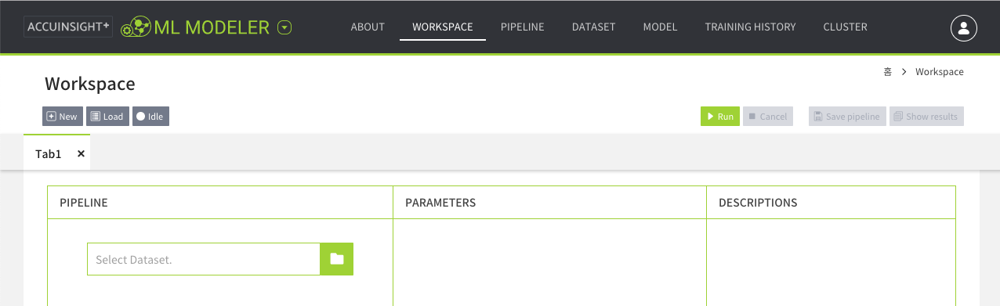

폴더 아이콘 버튼을 클릭한다.

## 데이터셋 불러오기

불러올 데이터셋의 `Apply` 버튼을 클릭한다.

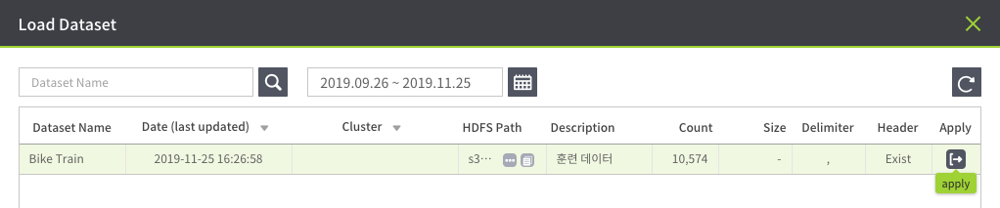

## Regressor 선택

알고리즘 목록에서 **Random Forest Regressor**를 선택한다. 

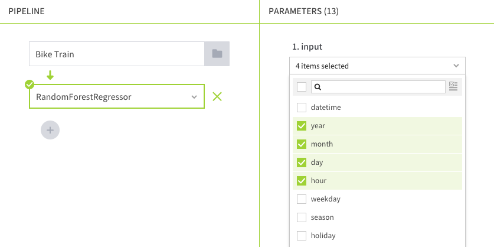

### 정보 입력

1. input
   - `year`
   - `month`
   - `day`
   - `hour`
1. output: `predict`
1. label: `count`

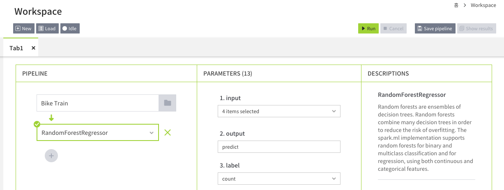

## 파이프라인 실행

파이프라인 실행을 위해 `우측 상단 → Run` 버튼을 클릭하면  
클러스터, 생성할 모델, 결과 데이터셋 정보를 입력할 수 있는 창이 뜬다.  

먼저 클러스터 선택 버튼을 클릭한다.

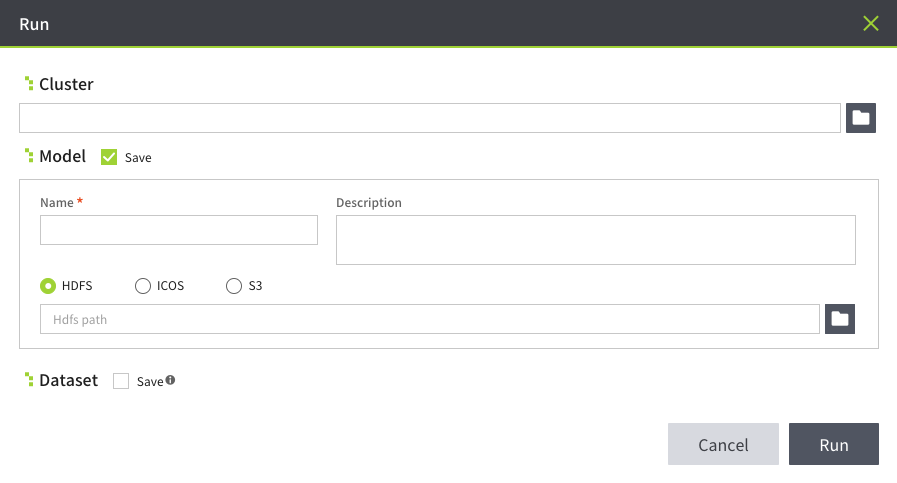

### 클러스터 선택

사용할 클러스터를 선택하고 실행 버튼을 클릭한다.

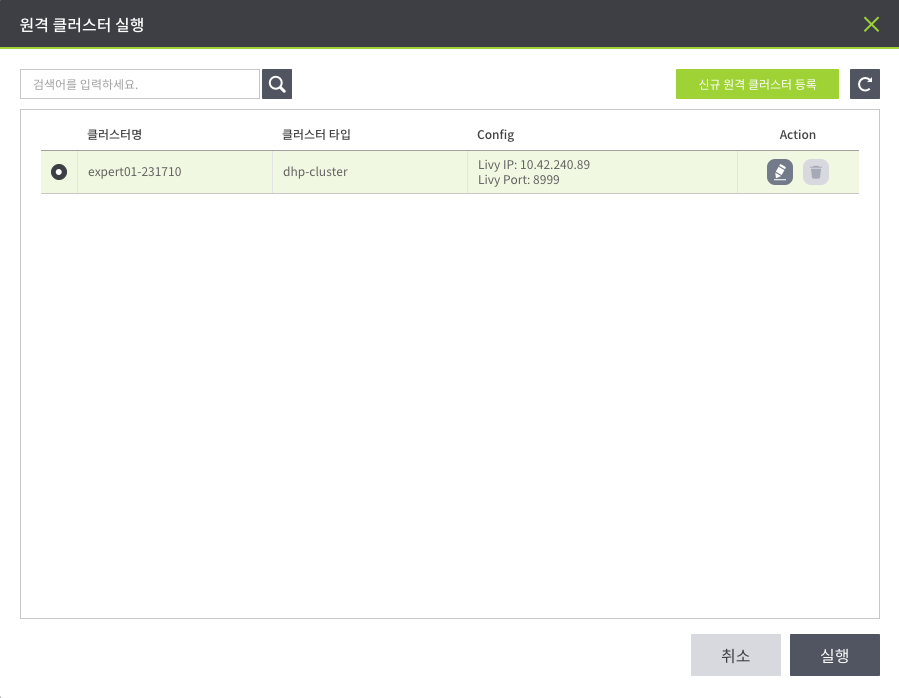

### 실행

모델 실행 결과만 확인하기 위해  
모델과 데이터셋은 생성하지 않고  
파이프라인을 실행한다.

1. Model, Dataset: Save 체크박스 해제
1. Run 버튼 클릭

#### 실행 중

워크스페이스가 비활성화 되며 파이프라인이 실행된다.

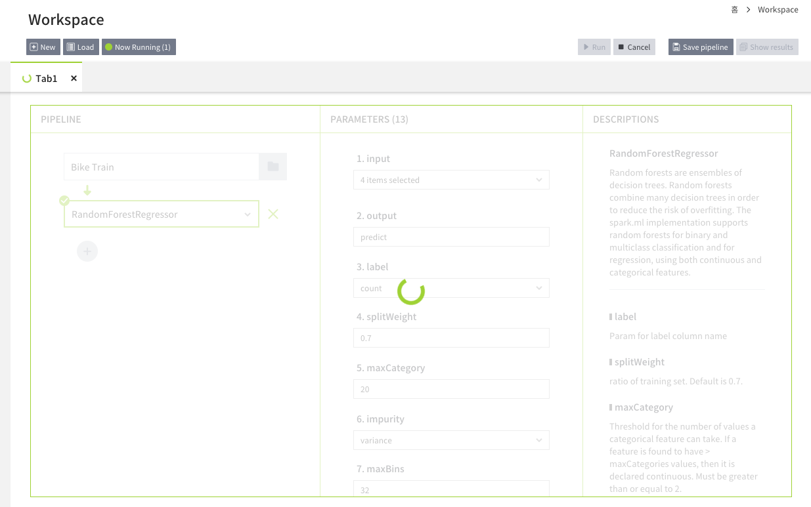

## 실행 결과 확인

실행이 완료 되면 `우측 상단 → Show results` 버튼을 클릭힌다.

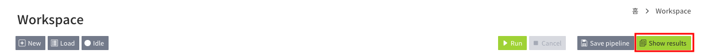

실행 결과로 다음 3가지 정보를 볼 수 있다.

- Training Result: 훈련 결과
- Model Description: 모델 설명
- Spark ML code: 코드로 변환된 ML Modeler

### Training Result

**Regression Evaluator**

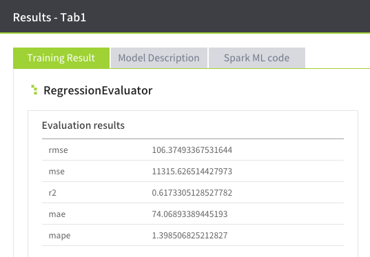

| Evaluation | Result |
|---|---|
| RSME | 106.37493367531644 |
| MSE | 11315.626514427973 |
| R2 | 0.6173305128527782 |
| MAE | 74.06893389445193 |
| MAPE | 1.398506825212827 |

### Model Description

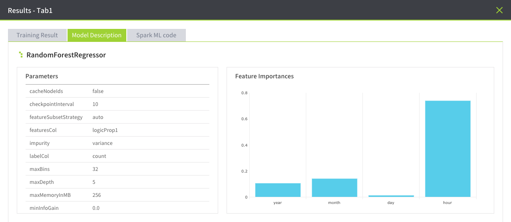

### Spark ML code

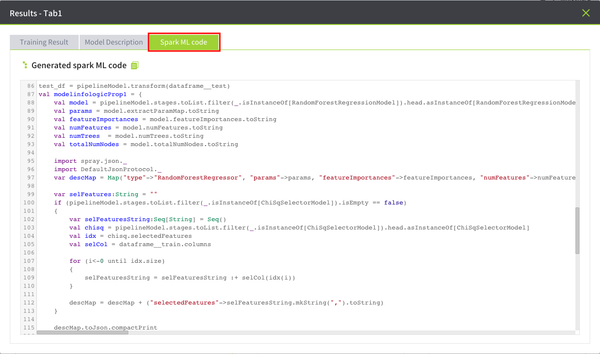

---

다음: [모델 2 생성](2.model.md)