# 모델 테스트

## 차례

1. [데이터셋 추가](README.md)
1. [모델 1 생성](1.model.md)
1. [모델 2 생성](2.model.md)
1. [모델 3 생성 및 저장](3.model.md)
1. **모델 테스트**

---

## 테스트 데이터셋 추가

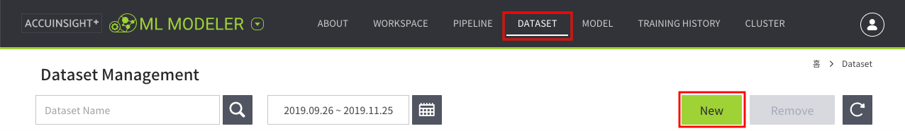

1. `상단 메뉴 → DATASET`
1. `New` 버튼 클릭

### 데이터셋 정보 설정

1. `ICOS` 선택 → `파일 불러오기` 버튼 클릭
   - Storage: `IBMOSC1146611-6`
   - Bucket: `handson-bucket`
   - 경로: `/ML/Bike/test/test.csv`
1. 정보 입력
   - Dataset Name: `Bike Test`
   - Header exists: `TRUE`
   - Delimiter: `,`
   - Description: `테스트 데이터`

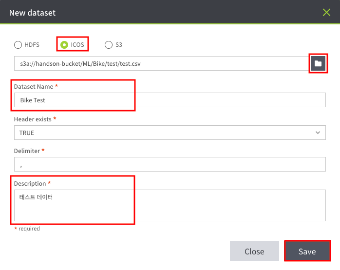

### 원격 클러스터 실행

원격 클러스터를 선택한다.

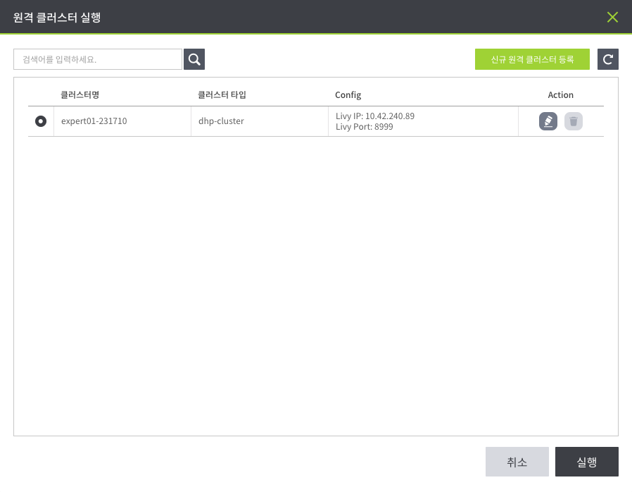

### 저장

추가된 데이터셋을 목록에서 확인한다.

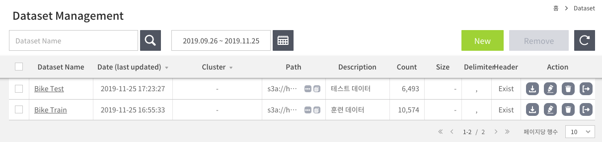

---

### 데이터 수정

One Hot Encoder를 사용하기 전, 데이터의 자료 형식을 수정해야한다.

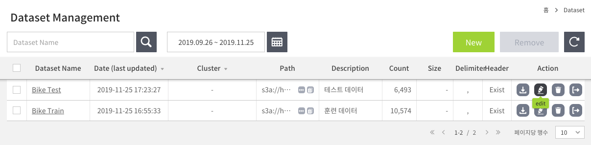

Bike Test 데이터셋의 수정 버튼을 클릭한다.

#### 형식 변경

몇가지 컬럼들을 정수형에서 문자열로 바꿔준다.

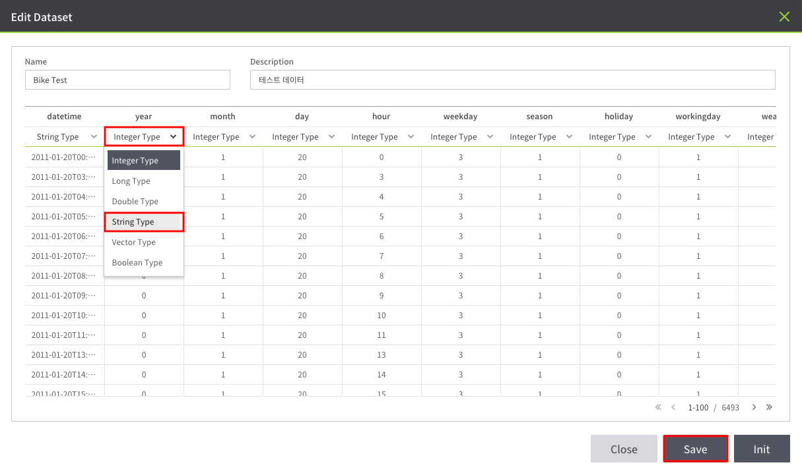

1. 컬럼 형식 변경: `Integer Type` → `String Type`
   - year
   - month
   - day
   - hour
   - weekday
   - season
   - holiday
   - workingday
   - weather
1. Save 버튼 클릭

---

## 예측

이전에 생성한 모델을 이용해서 예측한다.

1. `상단 메뉴 → MODEL`
1. Bike Model 선택
1. `Predict` 버튼 클릭

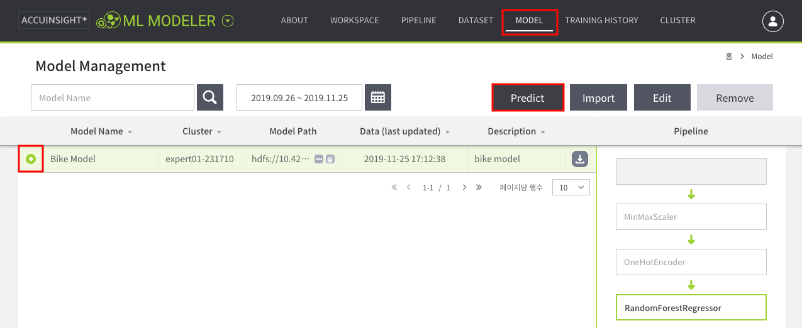

### Predict

Predict 창에서 `Select Dataset` 버튼을 클릭한다.

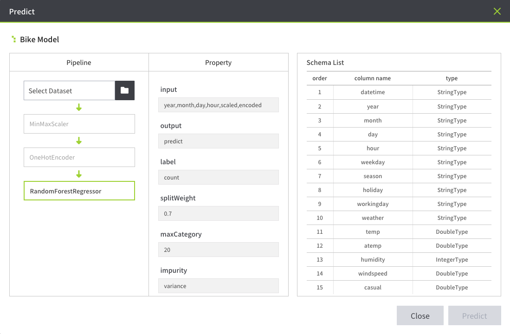

### 테스트 데이터셋 선택

`Bike Test` 데이터셋을 선택하고 `Confirm` 버튼 클릭한다.

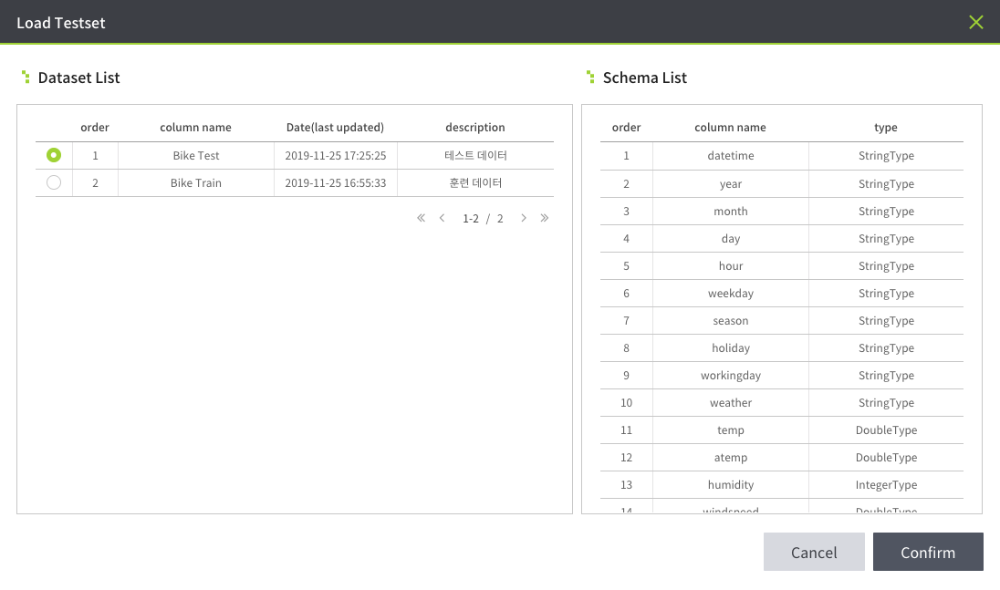

### 예측 모델 확인

테스트 데이터가 Scale과 Encode 과정을 거친 후 회귀 분석까지 이루어지는 과정을 확인한다.  
`Predict` 버튼을 클릭한다.

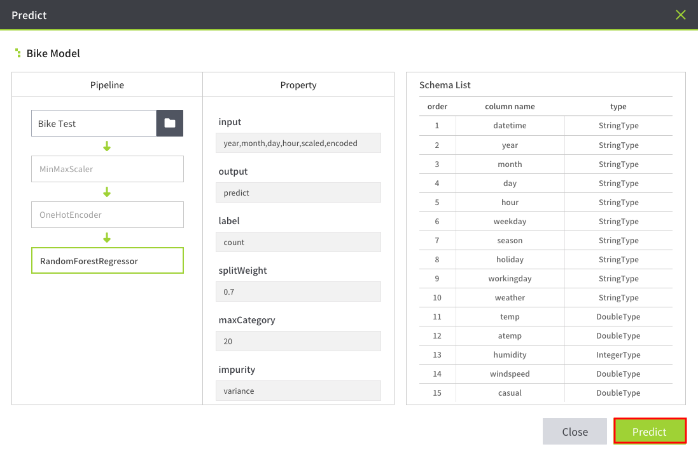

### 결과 데이터 설정

예측 후에 저장할 결과 데이터 정보와 컬럼 정보를 설정한다.
`Save` 버튼 클릭하여 예측을 실행한다.  
예측 작업이 끝나면 닫기 버튼을 클릭한다.

- Dataset Info
   - Name: `submission`
   - Description: `bike submission`
   - HDFS 경로: `/tmp/bikedata`
- Column List
   1. datatime
   1. predict

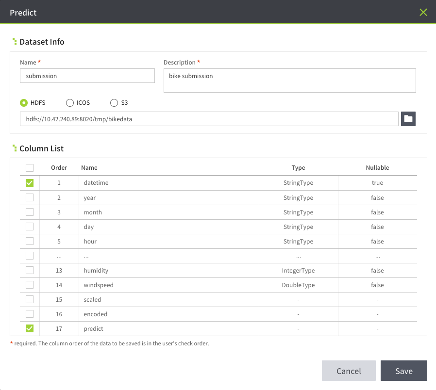

#### HDFS File Browser

결과 데이터의 경로는 `/tmp/bikedata`로 설정한다.

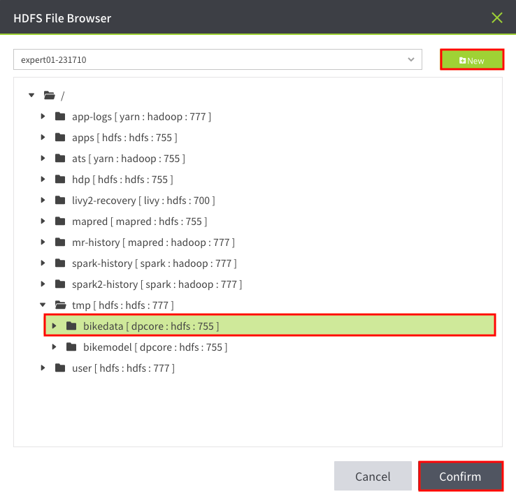

---

## 결과 데이터 확인

생성된 submssion 데이터셋을 확인한다.

1. `상단 메뉴 → DATASET`
1. `bike submission` 클릭

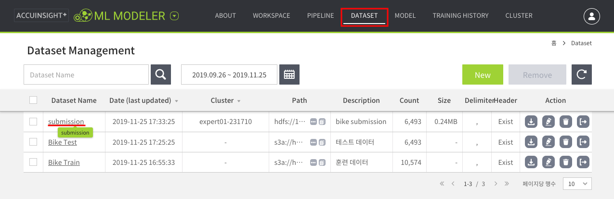

### 결과 데이터 통계 정보

결과 데이터에 대해 간단한 통계 정보를 확인한다.

1. `predict: <DoubleType>` 선택
1. Statistics 버튼 클릭

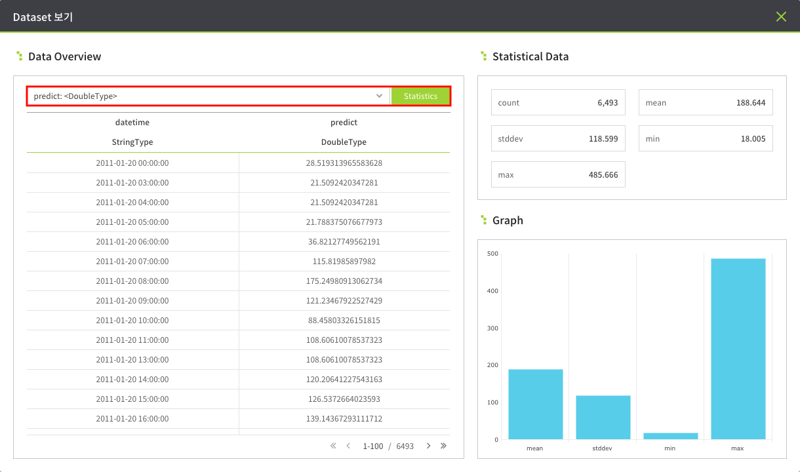

### 결과 데이터 다운로드

데이터셋을 다운 받을 수 있다.

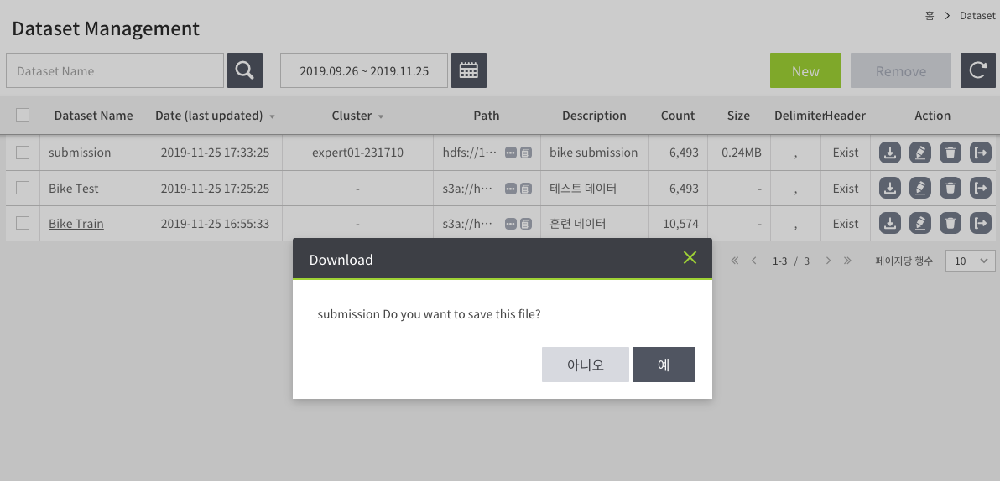

| datetime | predict |
|---|---|
| 2011-01-20 00:00:00 | 28.519313965583600 |
| 2011-01-20 03:00:00 | 21.5092420347281 |
| 2011-01-20 04:00:00 | 21.5092420347281 |
| 2011-01-20 05:00:00 | 21.788375076678000 |
| 2011-01-20 06:00:00 | 36.82127749562190 |
| ... | ... |

---

## Kaggle 제출

결과 데이터에서 `predict` 컬럼 이름을 `count`로 바꾼 후 [Kaggle](https://www.kaggle.com/c/bike-sharing-demand)에 제출할 수 있다.

---

돌아가기: [자전거 수요 예측 모델 생성](README.md)