# 자전거 수요 예측 모델 생성

[Kaggle: Bike Sharing Demand](https://www.kaggle.com/c/bike-sharing-demand/overview)

---

## 데이터

2년 동안 1시간 단위로 측정한 자전거 수요 데이터

- `train.csv`: 1일부터 19일가지 자전거 렌탈 정보.
- `test.csv`: 20일부터 월말까지 자전거 렌탈 정보.

### 데이터 필드

| datetime | season | holiday | workingday | weather | temp | atemp | humidity | windspeed | casual | registered | count |
|---|---|---|---|---|---|---|---|---|---|---|---|
| 시간 | 계절 | 휴일 여부 | 근무일 여부 | 날씨 | 기온 | 체감 기온 | 습도 | 풍속 | 비회원 렌탈 수 | 회원 렌탈 수 | 전체 렌탈 수 |

- season: 1. 봄, 2. 여름, 3. 가을, 4. 겨울
- weather: 1. 맑음, 2. 구름, 3. 눈, 4. 비

### 예측 형식

| datetime | count |
|---|---|
| 시간 | 전체 렌탈 수 |

---

## Feature Engineering

1. datetime 컬럼 분할 -> year, month, day, hour, weekday(요일: 0 ~ 6)
1. RandomForestRegressor를 이용해 windspeed 데이터 채우기
1. outlier 제거

**feature engineering 전**

| datetime | season | holiday | workingday | weather | temp | atemp | humidity | windspeed | casual | registered | count |
|---|---|---|---|---|---|---|---|---|---|---|---|
|	2011-01-01 00:00:00 |	1 |	0 |	0 |	1 |	9.84 |	14.395 | 81 |	0.0000 | 3 |	13 |	16 |
|	2011-01-01 01:00:00 |	1 |	0 |	0 |	1 |	9.02 |	13.635 | 80 |	0.0000 | 8 |	32 |	40 |

**feature engineering 후**

| datetime | year | month | day | hour | weekday | season | holiday | workingday | weather | temp | atemp | humidity | windspeed | casual | registered | count |
|---|---|---|---|---|---|---|---|---|---|---|---|---|---|---|---|---|
| 2011-01-01 05:00:00 | 0 | 01 | 01 | 05 | 5 | 1 | 0 | 0 | 2 | 9.84 | 12.880 | 75 | 6.003200 | 0.0 | 1.0 | 1.0 |
| 2011-01-01 10:00:00 | 0 | 01 | 01 | 10 | 5 | 1 | 0 | 0 | 1 | 15.58 | 19.695 | 76 | 16.997900 | 12.0 | 24.0 | 36.0 |

---

## 데이터셋 추가

1. `상단 메뉴 → DATASET`
1. `New` 버튼 클릭

### New dataset

1. `ICOS` 선택 → `파일 불러오기` 버튼 클릭

- Storage: `IBMOSC1146611-6`
- Bucket: `handson-bucket`
- 경로: `/ML/Bike/train/train.csv`

- Dataset Name: `Bike Train`
- Header exists: `TRUE`
- Delimiter: `,`
- Description: `훈련 데이터`

### 원격 클러스터 실행

클러스터를 선택한다.

### 저장

---

## 모델 1

요약
1. 데이터셋 추가
1. Random Forest Regressor
1. 파이프라인 실행
1. 결과 확인

### 파이프라인 생성

`상단 메뉴 → WORKSPACE`

### 데이터셋 불러오기

`Apply` 버튼 클릭.

### Regressor 선택

**Random Forest Regressor**

1. input
   - `year`
   - `month`
   - `day`
   - `hour`
1. output: `predict`
1. label: `count`

### Run

Run 버튼 클릭

#### 클러스터 선택

#### 실행

1. Model, Dataset: Save 체크박스 해제
1. Run 버튼 클릭

파이프라인이 실행 중이다.

### 실행 결과 확인

Show results 버튼 클릭

#### Training Result 1

**Regression Evaluator**

| Evaluation | Result |
|---|---|
| RSME | 106.37493367531644 |
| MSE | 11315.626514427973 |
| R2 | 0.6173305128527782 |
| MAE | 74.06893389445193 |
| MAPE | 1.398506825212827 |

#### Model Description

#### Spark ML code

---

## 모델 2

요약
1. 데이터셋 추가
1. Min Max Scaler
1. Random Forest Regressor
1. 파이프라인 실행
1. 결과 확인

### 알고리즘 제거

Random Forest Regressor 제거

### 알고리즘 추가

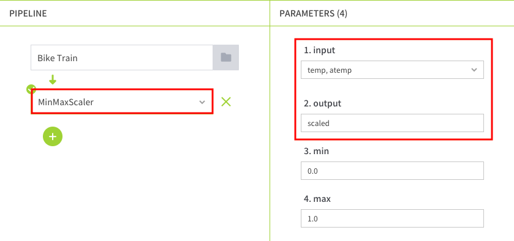

**Min Max Scaler**

1. input: 
   - `temp`
   - `atemp`
1. output: `scaled`
1. min: `0.0`
1. max: `1.0`

### Regressor 선택

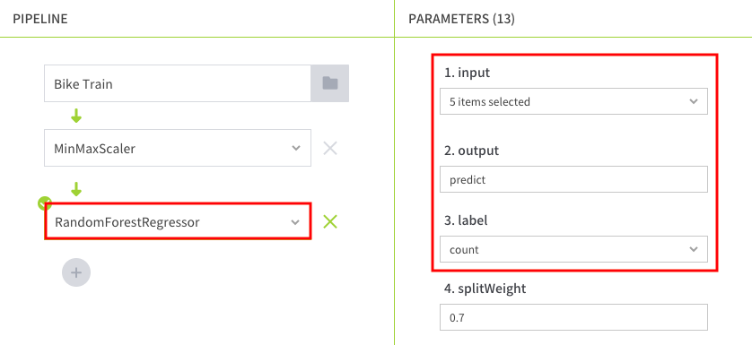

**Random Forest Regressor**

1. input
   - `year`
   - `month`
   - `day`
   - `hour`
   - **`scaled`**: 추가
1. output: `predict`
1. label: `count`

### Run

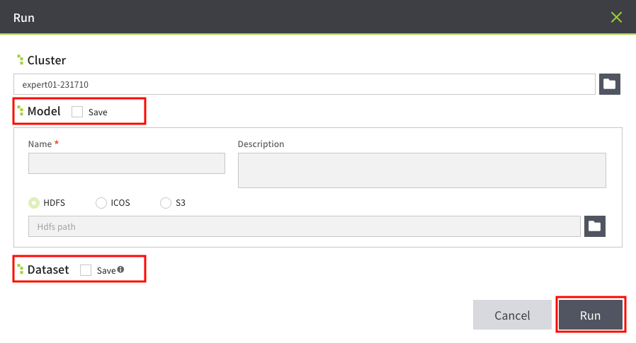

1. Cluster: 선택
1. Model, Dataset: Save 체크박스 해제
1. Run 버튼 클릭

### 실행 결과 확인

Show results 버튼 클릭

#### Training Result

**Regression Evaluator**

| Evaluation | Result |
|---|---|
| RSME | 108.67087878501626 |
| MSE | 11809.359895907695 |
| R2 | 0.6006335407816865 |
| MAE | 78.68235550274728 |
| MAPE | 1.6815973931482804 |

#### Model Description

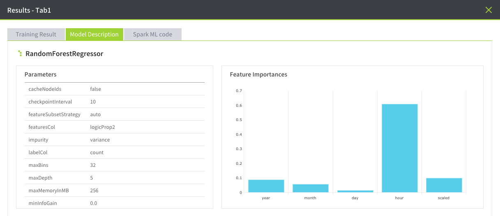

---

## 모델 3

요약
1. 데이터셋 수정
1. 데이터셋 추가
1. Min Max Scaler
1. One Hot Encoder
1. Random Forest Regressor
1. 파이프라인 저장
1. 모델 저장
1. 파이프라인 실행
1. 결과 확인

### 데이터셋 수정

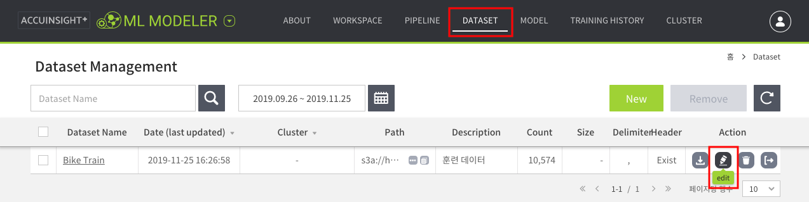

1. `상단 메뉴 → DATASET`
1. 수정 버튼 클릭

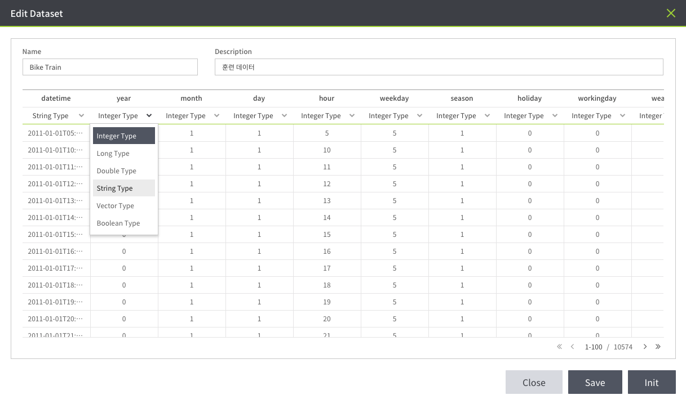

1. 컬럼 형식 변경: `Integer Type` → `String Type`
   - year
   - month
   - day
   - hour
   - weekday
   - season
   - holiday
   - workingday
   - weather
1. Save 버튼 클릭

### 알고리즘 제거

1. `상단 메뉴 → WORKSPACE`
1. Random Forest Regressor 제거

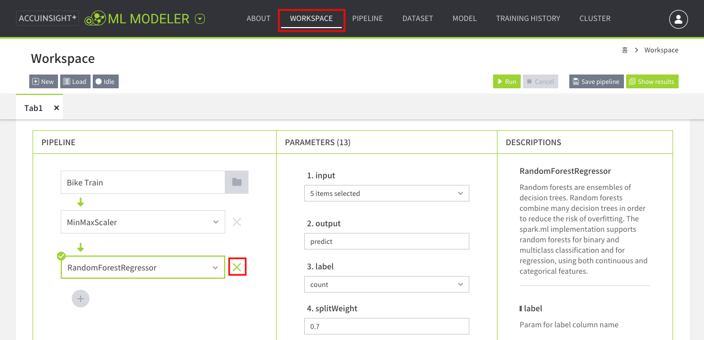

### 알고리즘 선택

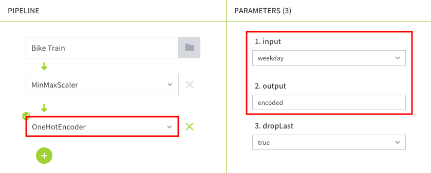

**One Hot Encoder**

1. input: `weekday`
1. output: `encoded`
1. dropLast: `true`

### Regressor 선택

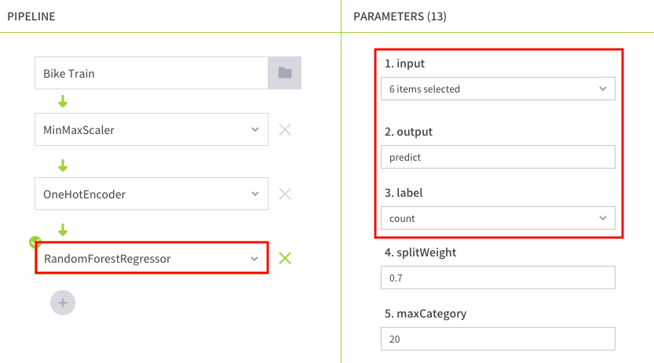

**Random Forest Regressor**

1. input
   - `year`
   - `month`
   - `day`
   - `hour`
   - `scaled`
   - **`encoded`**: 추가
1. output: `predict`
1. label: `count`

### 파이프라인 저장

1. Save pipeline 버튼 클릭
1. 파이프라인 정보 입력
   - Name: `Bike`
   - Description: `bike pipeline`
1. Save 버튼 클릭

### Run

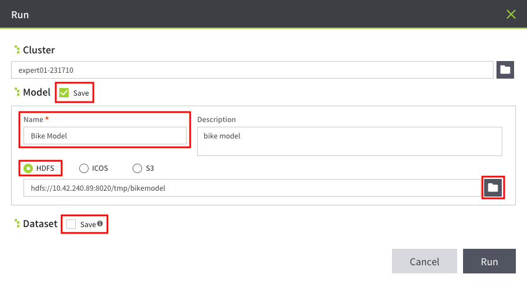

1. Cluster: 선택
1. Model: Save 체크
   - Name: `Bike Model`
   - Description: `bike model`
   - HDFS 경로 선택: `/tmp/bikemodel`

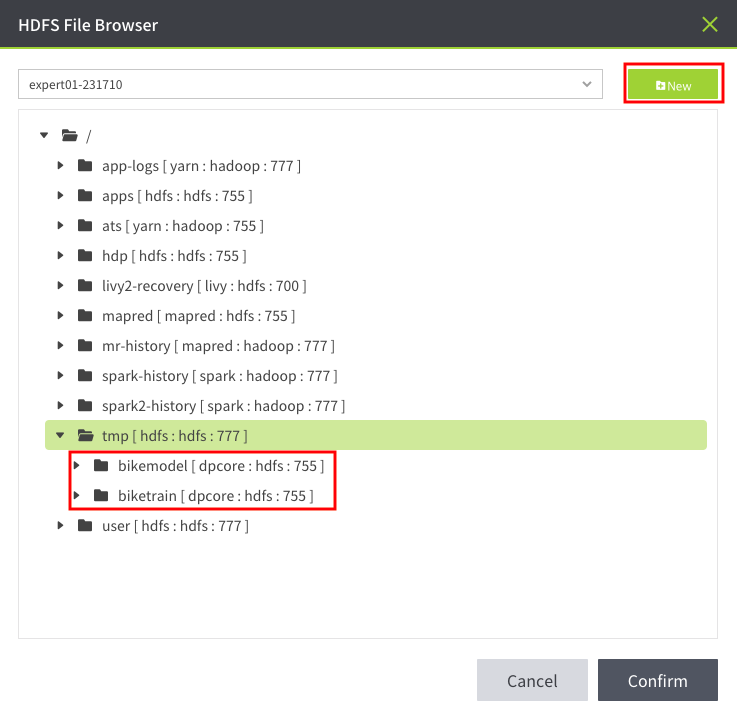

새 폴더를 만들어서 모델 저장 경로를 선택한다.

1. Dataset: Save 체크박스 해제
1. Run 버튼 클릭

### 실행 결과 확인

Show results 버튼 클릭

#### Training Result

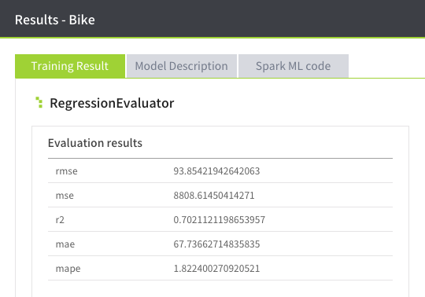

**Regression Evaluator**

| Evaluation | Result |
|---|---|
| RSME | 92.77540130251586 |
| MSE | 8607.275086842861 |
| R2 | 0.7089209741044797 |
| MAE | 66.00612898381644 |
| MAPE | 1.4832416305525595 |

#### Model Description

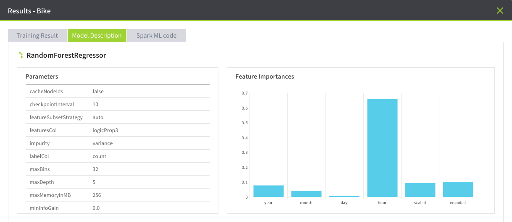

---

## 파이프라인 확인

`상단 메뉴 → PIPELINE`

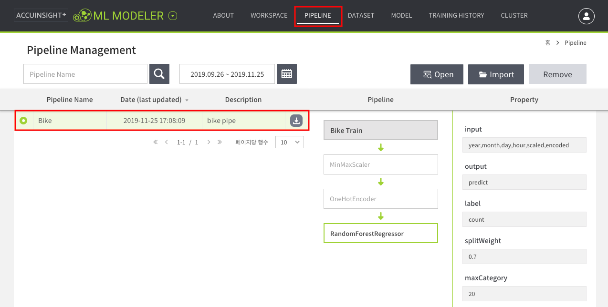

---

## 훈련 기록 확인

`상단 메뉴 → TRAINING HISTORY`

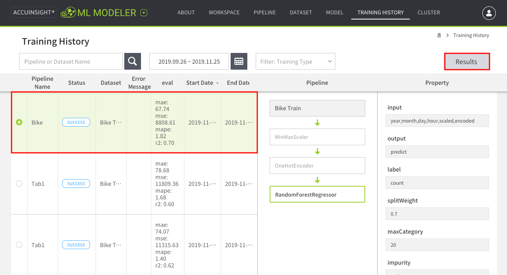

---

## 모델 테스트

1. `상단 메뉴 → DATASET`
1. `New` 버튼 클릭

#### New dataset

1. `ICOS` 선택 → `파일 불러오기` 버튼 클릭
   - Storage: `IBMOSC1146611-6`
   - Bucket: `handson-bucket`
   - 경로: `/ML/Bike/test/test.csv`

- Dataset Name: `Bike Test`
- Header exists: `TRUE`
- Delimiter: `,`
- Description: `테스트 데이터`

#### 원격 클러스터 실행

클러스터를 선택한다.

#### 저장

#### 데이터 수정

수정 버튼 클릭

1. 컬럼 형식 변경: `Integer Type` → `String Type`
   - year
   - month
   - day
   - hour
   - weekday
   - season
   - holiday
   - workingday
   - weather
1. Save 버튼 클릭

### 예측

1. `상단 메뉴 → MODEL`
1. Bike Model 선택
1. `Predict` 버튼 클릭

데이터셋 선택: `Bike Test`

Confirm 버튼 클릭

Predict 클릭

1. Dataset Info
   - Name: `submission`
   - Description: `bike submission`
   - HDFS 경로: `/tmp/bikedata`

1. Column List
   1. datatime
   1. predict
1. Save 버튼 클릭
1. 완료 후 닫기

### 결과 데이터 확인

1. `상단 메뉴 → DATASET`
1. `bike submission` 클릭

1. `predict: <DoubleType>` 선택
1. Statistics 버튼 클릭

#### 결과 데이터 다운로드

| datetime | predict |
|---|---|
| 2011-01-20 00:00:00 | 28.519313965583600 |
| 2011-01-20 03:00:00 | 21.5092420347281 |
| 2011-01-20 04:00:00 | 21.5092420347281 |
| 2011-01-20 05:00:00 | 21.788375076678000 |
| 2011-01-20 06:00:00 | 36.82127749562190 |
| ... | ... |