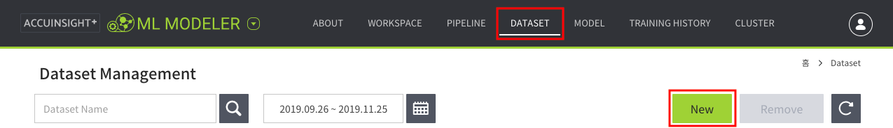
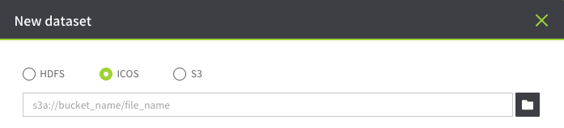
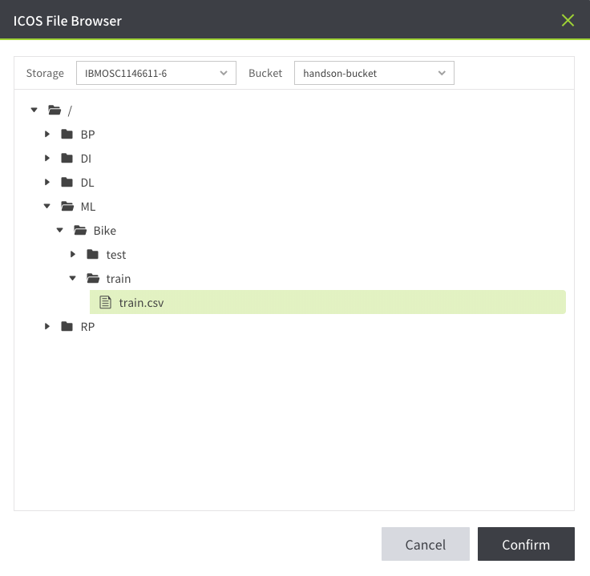
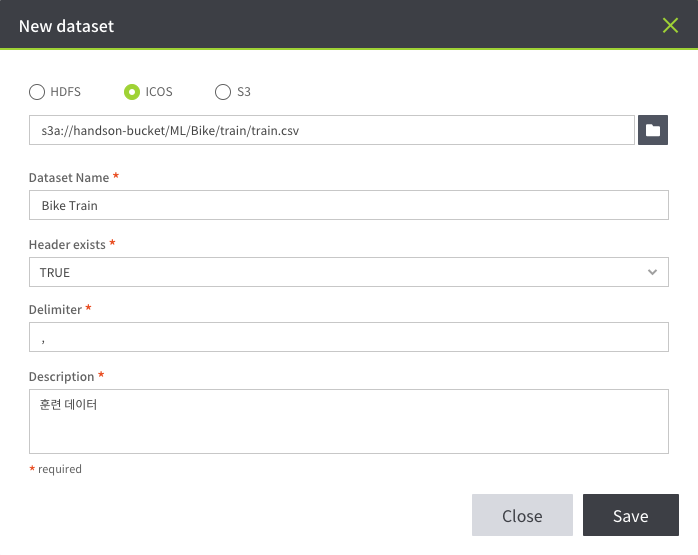
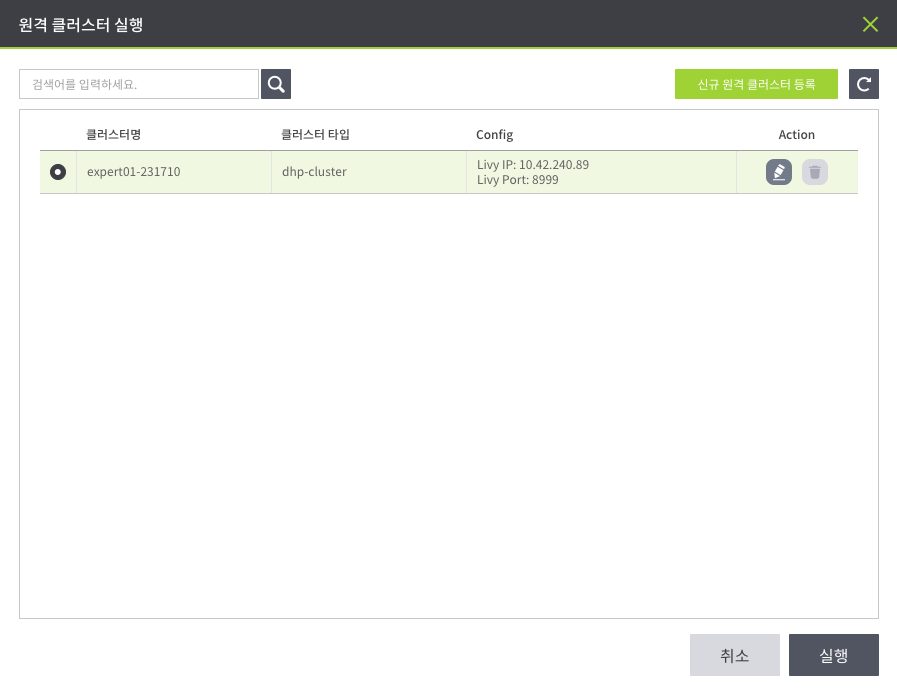
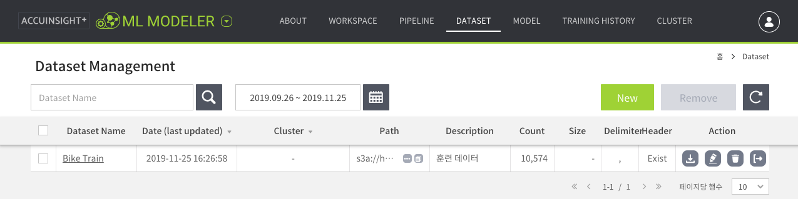

# 자전거 수요 예측 모델 생성

[Kaggle: Bike Sharing Demand](https://www.kaggle.com/c/bike-sharing-demand/overview)

## 차례

1. **데이터셋 추가**
1. [모델 1 생성](1.model.md)
1. [모델 2 생성](2.model.md)
1. [모델 3 생성 및 저장](3.model.md)
1. [모델 테스트](4.test.md)

---

## 데이터

2년 동안 1시간 단위로 측정한 자전거 수요 데이터

- `train.csv`: 1일부터 19일가지 자전거 렌탈 정보.
- `test.csv`: 20일부터 월말까지 자전거 렌탈 정보.

### 데이터 필드

| datetime | season | holiday | workingday | weather | temp | atemp | humidity | windspeed | casual | registered | count |
|---|---|---|---|---|---|---|---|---|---|---|---|
| 시간 | 계절 | 휴일 여부 | 근무일 여부 | 날씨 | 기온 | 체감 기온 | 습도 | 풍속 | 비회원 렌탈 수 | 회원 렌탈 수 | 전체 렌탈 수 |

- season: 1. 봄, 2. 여름, 3. 가을, 4. 겨울
- weather: 1. 맑음, 2. 구름, 3. 눈, 4. 비

### 예측 결과 데이터 형식

| datetime | count |
|---|---|
| 시간 | 전체 렌탈 수 |

---

## Feature Engineering

모델 생성을 편하게 하기 위해 feature engineering 작업을 미리 수행한다.

1. **datetime** 컬럼 분할 → **year**, **month**, **day**, **hour**, **weekday**(요일: 0 ~ 6)
1. **RandomForestRegressor**를 이용해 **windspeed** 데이터 채우기
1. **outlier** 제거

**feature engineering 전**

| datetime | season | holiday | workingday | weather | temp | atemp | humidity | windspeed | casual | registered | count |
|---|---|---|---|---|---|---|---|---|---|---|---|
|	2011-01-01 00:00:00 |	1 |	0 |	0 |	1 |	9.84 |	14.395 | 81 |	0.0000 | 3 |	13 |	16 |
|	2011-01-01 01:00:00 |	1 |	0 |	0 |	1 |	9.02 |	13.635 | 80 |	0.0000 | 8 |	32 |	40 |

**feature engineering 후**

| datetime | year | month | day | hour | weekday | season | holiday | workingday | weather | temp | atemp | humidity | windspeed | casual | registered | count |
|---|---|---|---|---|---|---|---|---|---|---|---|---|---|---|---|---|
| 2011-01-01 05:00:00 | 0 | 01 | 01 | 05 | 5 | 1 | 0 | 0 | 2 | 9.84 | 12.880 | 75 | 6.003200 | 0.0 | 1.0 | 1.0 |
| 2011-01-01 10:00:00 | 0 | 01 | 01 | 10 | 5 | 1 | 0 | 0 | 1 | 15.58 | 19.695 | 76 | 16.997900 | 12.0 | 24.0 | 36.0 |

---

## 데이터셋 추가

1. `상단 메뉴 → DATASET`
1. `New` 버튼 클릭

### New dataset

ICOS에 저장된 데이터 파일을 선택한다.  
`ICOS` 선택 → `파일 불러오기` 버튼 클릭

#### ICOS File Browser

훈련에 사용할 데이터(`train.csv`)를 불러온다.

- Storage: `IBMOSC1146611-6`
- Bucket: `handson-bucket`
- 경로: `/ML/Bike/train/train.csv`

#### 데이터 정보 설정

훈련 데이터에 대한 정보를 입력한다.

- Dataset Name: `Bike Train`
- Header exists: `TRUE`
- Delimiter: `,`
- Description: `훈련 데이터`

### 원격 클러스터 실행

원격 클러스터를 선택한다.

### 저장

추가된 데이터셋을 목록에서 확인한다.

---

다음: [모델 1 생성](1.model.md)